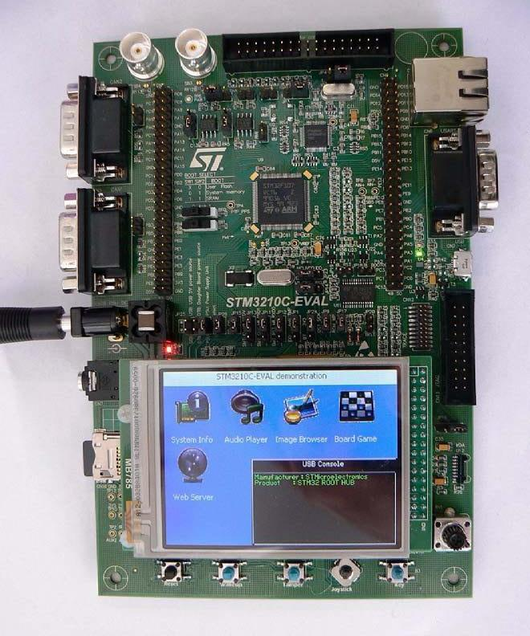
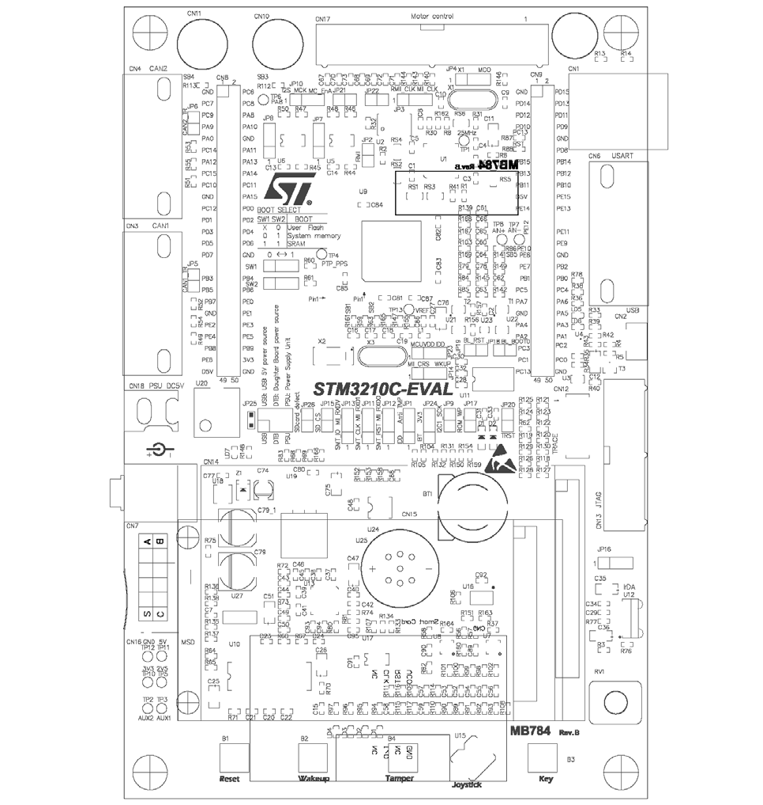

.. _stm3210c_eval_board:

STM3210C-EVAL
#############

Overview
********
The STM3210C-EVAL evaluation board is a complete development platform for STMicroelectronic's 
ARM Cortex-M3 core-based STM32F107VCT microcontroller.

The range of hardware features on the board help you to evaluate all peripherals
(USB-OTG FS, ethernet, motor control, CAN, microSD CardTM, smartcard, USART, 
audio DAC, MEMS, EEPROM and more) and develop your own applications.

Extension headers make it easy to connect a daughterboard or wrapping board for your specific
application.

More information about the board can be found at the `STM3210C-EVAL website`_.

Hardware
********

STM3210C-EVAL provides the following hardware components:

- Three 5 V power supply options:
    - Power jack
    - USB connector
    - daughterboard
- Boot from user Flash, system memory or SRAM.
- I2S audio DAC, stereo audio jack.
- 2 GByte (or more) microSD CardTM.
- Both type A and B smartcard support.
- I2C compatible serial interface 64 Kbit EEPROM, MEMS and I/O expander.
- RS-232 communication.
- IrDA transceiver.
- USB-OTG full speed, USB microAB connector.
- IEEE-802.3-2002 compliant ethernet connector.
- Two channels of CAN2.0A/B compliant connection.
- Inductor motor control connector.
- JTAG and trace debug support.
- 3.2" 240x320 TFT color LCD with touch screen.
- Joystick with 4-direction control and selector.
- Reset, Wakeup, Tamper and User button.
- 4 color LEDs.
- RTC with backup battery.
- MCU consumption measurement circuit.
- Extension connector for daughterboard or wrapping board.

More information about STM32F107VCT can be found here:
       - `STM32F107VCT reference manual`_

Supported Features
==================

The Zephyr stm3210c_eval board configuration supports the following hardware features:

+-----------+------------+-------------------------------------+
| Interface | Controller | Driver/Component                    |
+===========+============+=====================================+
| NVIC      | on-chip    | nested vector interrupt controller  |
+-----------+------------+-------------------------------------+
| UART      | on-chip    | serial port-polling;                |
|           |            | serial port-interrupt               |
+-----------+------------+-------------------------------------+
| PINMUX    | on-chip    | pinmux                              |
+-----------+------------+-------------------------------------+
| GPIO      | on-chip    | gpio                                |
+-----------+------------+-------------------------------------+
| CLOCK     | on-chip    | reset and clock control             |
+-----------+------------+-------------------------------------+
| FLASH     | on-chip    | flash memory                        |
+-----------+------------+-------------------------------------+
| IWDG      | on-chip    | independent watchdog                |
+-----------+------------+-------------------------------------+

Other hardware features are not yet supported in this Zephyr port.

The default configuration can be found in the defconfig file:
``boards/arm/stm3210c_eval/stm3210c_eval_defconfig``

Connections and IOs
===================

Each of the GPIO pins can be configured by software as output (push-pull or open-drain), as
input (with or without pull-up or pull-down), or as peripheral alternate function. Most of the
GPIO pins are shared with digital or analog alternate functions. All GPIOs are high current
capable except for analog inputs.

Board connectors:
-----------------

Default Zephyr Peripheral Mapping:
----------------------------------
- UART_2_TX : PD5
- UART_2_RX : PD6
- USER_PB   : PB9
- LED2      : PD13

Programming and Debugging
*************************

Flashing
========

STM3210C-EVAL board includes an ST-LINK/V2-1 embedded debug tool interface.
At power-on, the board is in firmware-upgrade mode (also called DFU for
"Device Firmware Upgrade"), allowing the firmware to be updated through the USB.
This interface is supported by the openocd version included in Zephyr SDK.

Flashing an application to STM3210C-EVAL
----------------------------------------

The sample application `blinky` is being used in this tutorial:

.. code-block:: console

   $<zephyr_root_path>/samples/basic/blinky

To build the Zephyr kernel and application, enter:

.. code-block:: console

   $ cd <zephyr_root_path>
   $ source zephyr-env.sh
   $ cd $ZEPHYR_BASE/samples/basic/blinky
   $ make BOARD=stm3210c_eval

Connect the STM3210C-EVAL to your host computer using the USB port.
Then, enter the following command:

.. code-block:: console

   $ make BOARD=stm3210c_eval flash

Run a serial host program to connect with your STM3210C-EVAL board:

.. code-block:: console

   $ minicom -D /dev/ttyACM0

You will see the LED blinking every second.

Debugging
=========

Access gdb with the following make command:

.. code-block:: console

   $ make BOARD=stm3210c_eval debug

References
**********

.. target-notes::

.. _STM3210C-EVAL website:
   http://www.st.com/en/evaluation-tools/stm3210c-eval.html

.. _STM32F107VCT reference manual:
   http://www.st.com/resource/en/reference_manual/CD00171190.pdf

