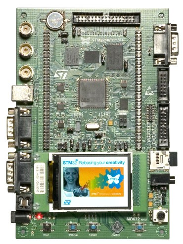
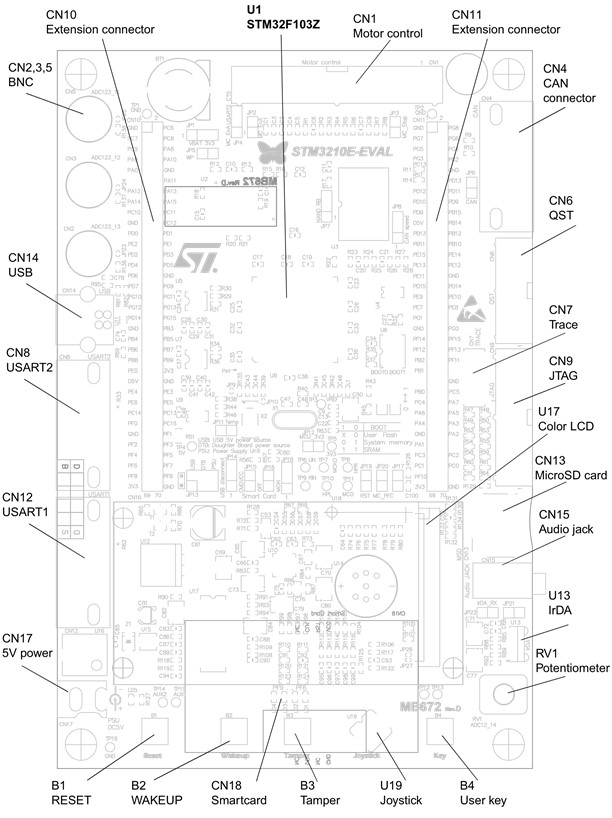

.. _stm3210e_eval_board:

STM3210E-EVAL
#############

Overview
********
The STM3210E-EVAL evaluation board is a complete development platform for
STMicroelectronic's ARM Cortex-M3 core-based STM32F103ZGT6 microcontroller.

The range of hardware features on the board help you to evaluate all
peripherals (LCD, SPI Flash, USART, IrDA, USB, audio, CAN bus, smartcard,
MicroSD Card, NOR Flash, NAND Flash, SRAM, temperature sensor,
audio DAC and motor control) and develop your own applications.

Extension headers make it easy to connect a daughterboard or wrapping board for
your specific application.

More information about the board can be found at the `STM3210E-EVAL website`_.

Hardware
********

STM3210E-EVAL provides the following hardware components:

- I2C/SMBus compatible serial interface temperature sensor.
- RTC with backup battery.
- 64 or 128 Mbit serial Flash.
- 512 K x 16bit SRAM.
- 512 Mbit or 1 Gbit NAND Flash.
- 128 Mbit NOR Flash.
- 4 color LEDs.
- IrDA transceiver.
- Two RS-232 channels with RTS/CTS handshake support on one channel.
- CAN 2.0A/B compliant connection daughterboard.
- USB 2.0 full speed connection.
- JTAG and trace debug support.
- Inductor motor control connector.
- 240x320 TFT color LCD.
- 128 Mbyte MicroSD Card or bigger.
- I2S audio DAC, stereo audio jack.
- Three 5 V power supply options: Boot from user Flash, system memory or SRAM.
- Both A and B type smartcard support.
- Reset, wakeup, tamper and user buttons.
- Joystick with 4-direction control and selector.

More information about STM32F103ZGT6 can be found here:
       - `STM32F103ZGT6 reference manual`_

Supported Features
==================

The Zephyr stm3210e_eval board configuration supports the following
 hardware features:

+-----------+------------+-------------------------------------+
| Interface | Controller | Driver/Component                    |
+===========+============+=====================================+
| NVIC      | on-chip    | nested vector interrupt controller  |
+-----------+------------+-------------------------------------+
| UART      | on-chip    | serial port-polling;                |
|           |            | serial port-interrupt               |
+-----------+------------+-------------------------------------+
| PINMUX    | on-chip    | pinmux                              |
+-----------+------------+-------------------------------------+
| GPIO      | on-chip    | gpio                                |
+-----------+------------+-------------------------------------+
| CLOCK     | on-chip    | reset and clock control             |
+-----------+------------+-------------------------------------+
| FLASH     | on-chip    | flash memory                        |
+-----------+------------+-------------------------------------+
| IWDG      | on-chip    | independent watchdog                |
+-----------+------------+-------------------------------------+

Other hardware features are not yet supported in this Zephyr port.

The default configuration can be found in the defconfig file:

.. code-block:: console

   $<zephyr_root_path>/boards/arm/stm3210e_eval/stm3210e_eval_defconfig

Connections and IOs
===================

Each of the GPIO pins can be configured by software as output (push-pull or
open-drain), as input (with or without pull-up or pull-down),
or as peripheral alternate function.
Most of the GPIO pins are shared with digital or analog alternate functions.
All GPIOs are high current capable except for analog inputs.

Board connectors:
-----------------

Default Zephyr Peripheral Mapping:
----------------------------------
- UART_2_TX : PA2
- UART_2_RX : PA3
- USER_PB   : PG8
- LED1      : PF6 GREEN

Programming and Debugging
*************************

Flashing
========

STM3210E-EVAL board includes an ST-LINK/V2-1 debug tool interface.
At power-on, the board is in firmware-upgrade mode (also called DFU for
"Device Firmware Upgrade"), allowing the firmware to be updated through the USB.
This interface is supported by the openocd version included in Zephyr SDK.

Flashing an application to STM3210E-EVAL
----------------------------------------

This sample application is being used in this tutorial:

.. code-block:: console

   $<zephyr_root_path>/samples/basic/blinky

To build the Zephyr kernel and application, enter:

.. code-block:: console

   $ cd <zephyr_root_path>
   $ source zephyr-env.sh
   $ cd $ZEPHYR_BASE/samples/basic/blinky
   $ make BOARD=stm3210e_eval

Connect the STM3210E-EVAL to your host computer using the USB port.
Then, enter the following command:

.. code-block:: console

   $ make BOARD=stm3210e_eval flash

Run a serial host program to connect with your STM3210E-EVAL board:

.. code-block:: console

   $ minicom -D /dev/ttyACM0

You will see the LED blinking every second.

Debugging
=========

Access gdb with the following make command:

.. code-block:: console

   $ make BOARD=stm3210e_eval debug

References
**********

.. target-notes::

.. _STM3210E-EVAL website:
   http://www.st.com/en/evaluation-tools/stm3210e-eval.html

.. _STM32F103ZGT6 reference manual:
   http://www.st.com/resource/en/reference_manual/CD00171190.pdf

