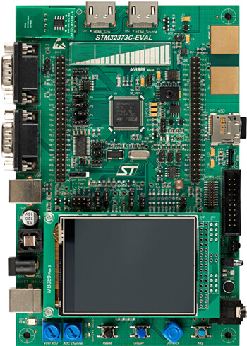

.. _stm32373c_eval_board:

ST STM32373C Evaluation
#######################

Overview
********
The STM32373C-EVAL evaluation board is designed as a complete demonstration and development platform for STMicroelectronics ARM Cortex-M4 core-based STM32F373VCT6 microcontroller.

The full range of hardware features on the board can help the user evaluate all peripherals (USB FS, USART, audio DAC, microphone ADC, dot-matrix LCD, IrDA, LDR, MicroSD card, HDMI CEC, ECG, pressure sensor, CAN, IR transmitter and receiver, EEPROM, touch slider, temperature sensor, etc.) and develop their own applications.

Extension headers make it possible to easily connect a daughter board or wrapping board for a specific application.

More information about the board can be found at the `STM32373C-EVAL website`_.

Hardware
********

STM32373C-EVAL provides the following hardware components:

- STM32F373VCT6 microcontroller
- Four 5 V power supply options:
    - Power jack
    - ST-LINK/V2 USB connector
    - User USB connector
    - Daughter board
- Audio jack connected to I2 S DAC
- Microphone connected to ADC through an amplifier
- 2-GByte (or more) MicroSD card on SPI
- Three components on I2 C bus: temperature sensor, EEPROM and dual interface RF EEPROM
- RS-232 communication configurable for communication of Flash loader
- IrDA transceiver
- 240x320 TFT color LCD connected to SPI interface
- Joystick with 4-direction control and selector
- Reset, Wakeup or Tamper, and Key buttons
- 4 color user LEDs
- 2 LEDs for MCU power range indicator
- ECG, pressure sensor and PT100 temperature sensor connected to the 16-bit Sigma Delta ADC of STM32F373VCT6
- Extension connectors for daughter board or wrapping board
- MCU voltage: 3.3 V or adjustable 2.0 V - 3.6 V
- USB FS connector
- Touch slider
- RTC with backup battery
- CAN 2.0 A/B compliant connection
- Light dependent resistor (LDR)
- Two HDMI connectors with DDC and CEC
- IR transmitter and receiver
- Two ADC & DAC input and output signal connectors and one Sigma Delta ADC input signal connector
- Potentiometer
- JTAG/SWD and ETM trace debug support
- Embedded ST-LINK/V2

More information about STM32F373VCT6 can be found here:
       - `STM32F373VCT6 reference manual`_

Supported Features
==================

The Zephyr stm32373c_eval board configuration supports the following hardware features:

+-----------+------------+-------------------------------------+
| Interface | Controller | Driver/Component                    |
+===========+============+=====================================+
| NVIC      | on-chip    | nested vector interrupt controller  |
+-----------+------------+-------------------------------------+
| UART      | on-chip    | serial port-polling;                |
|           |            | serial port-interrupt               |
+-----------+------------+-------------------------------------+
| PINMUX    | on-chip    | pinmux                              |
+-----------+------------+-------------------------------------+
| GPIO      | on-chip    | gpio                                |
+-----------+------------+-------------------------------------+
| CLOCK     | on-chip    | reset and clock control             |
+-----------+------------+-------------------------------------+
| FLASH     | on-chip    | flash memory                        |
+-----------+------------+-------------------------------------+
| WATCHDOG  | on-chip    | independent watchdog                |
+-----------+------------+-------------------------------------+

Other hardware features are not yet supported in this Zephyr port.

The default configuration can be found in the defconfig file
:zephyr_file:`boards/arm/stm32373c_eval/stm32373c_eval_defconfig`

Connections and IOs
===================

Each of the GPIO pins can be configured by software as output (push-pull or open-drain), as
input (with or without pull-up or pull-down), or as peripheral alternate function. Most of the
GPIO pins are shared with digital or analog alternate functions. All GPIOs are high current
capable except for analog inputs.

Board connectors:
-----------------
.. image:: img/stm32373c_eval_connectors.jpg
     :align: center
     :alt: STM32373C_EVAL connectors

Default Zephyr Peripheral Mapping:
----------------------------------
- UART_2_TX : PD5
- UART_2_RX : PD6
- USER_PB   : PA2
- LED2      : PC1

Programming and Debugging
*************************

Applications for the ``stm32373c_eval`` board configuration can be built and
flashed in the usual way (see :ref:`build_an_application` and
:ref:`application_run` for more details).

Flashing
========

STM32373C-EVAL board includes an ST-LINK/V2-1 embedded debug tool interface.
At power-on, the board is in firmware-upgrade mode (also called DFU for
"Device Firmware Upgrade"), allowing the firmware to be updated through the USB.
This interface is supported by the openocd version included in Zephyr SDK.

Flashing an application to STM32373C-EVAL
-----------------------------------------

Here is an example for the :ref:`blinky-sample` application.

.. zephyr-app-commands::
   :zephyr-app: samples/basic/blinky
   :board: stm32373c_eval
   :goals: build flash

You will see the LED blinking every second.

Debugging
=========

You can debug an application in the usual way.  Here is an example for the
:ref:`blinky-sample` application.

.. zephyr-app-commands::
   :zephyr-app: samples/basic/blinky
   :board: stm32373c_eval
   :maybe-skip-config:
   :goals: debug

References
**********

.. target-notes::

.. _STM32373C-EVAL website:
   http://www.st.com/en/evaluation-tools/stm32373c-eval.html

.. _STM32F373VCT6 reference manual:
   http://www.st.com/resource/en/reference_manual/dm00041563.pdf
