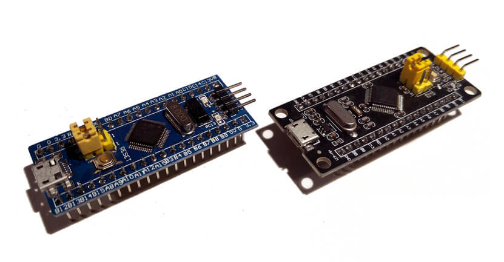

.. _stm32_min_dev:

STM32 Minimum Development Board
###############################

Overview
********

The STM32 Minimum Development Board, is a popular and inexpensive
breadboard-friendly breakout board for the `STM32F103x8`_ CPU. Zephyr
applications use the stm32_min_dev board configuration to run on these boards.

     STM32 Minimum Development Board

As the name suggests, these boards have the bare minimum components required to
power on the CPU. For practical use, you'll need to add additional components
and circuits using a breadboard, for example.

Pin Mapping
===========

This port is a starting point for your own customizations and not a complete
port for a specific board. Most of the GPIOs on the STM32 SoC has been exposed
in the external header with silk screen labels that match the SoC's pin names.

Each board vendor has their own variations in pin mapping on their boards'
external connectors and placement of components. Many vendors use port PB12 for
connecting an LED, so only this device is supported by our Zephyr port.
Additional device support is left for the user to implement.

More information on hooking up peripherals and lengthy how to articles can be
found at `EmbedJournal`_.

STLinkV2 connection:
====================

The board can be flashed by using STLinkV2 with the following connections.

+--------+---------------+
| Pin    | STLINKv2      |
+========+===============+
| G      | GND           |
+--------+---------------+
| CLK    | Clock         |
+--------+---------------+
| IO     | SW IO         |
+--------+---------------+
| V3     | VCC           |
+--------+---------------+

Boot Configuration
==================

The boot configuration for this board is configured through jumpers on B0 (Boot 0)
and B1 (Boot 1). The pins B0 and B1 are present in between logic 0 and 1 lines. The
silk screen on the PCB reads BX- or BX+ to indicate 0 and 1 logic lines for B0 and B1
respectively.

+--------+--------+-------------------+---------------------------------------------+
| Boot 1 | Boot 0 | Boot Mode         | Aliasing                                    |
+========+========+===================+=============================================+
| X      | 0      | Main Flash Memory | Main flash memory is selected as boot space |
+--------+--------+-------------------+---------------------------------------------+
| 0      | 1      | System Memory     | System memory is selected as boot space     |
+--------+--------+-------------------+---------------------------------------------+
| 1      | 1      | Embedded SRAM     | Embedded SRAM is selected as boot space     |
+--------+--------+-------------------+---------------------------------------------+

Supported Features
==================

The on-board 8Mhz crystal is used to produce a 72Mhz system clock with PLL.
The stm32_min_dev board configuration supports the following hardware features:

+-----------+------------+----------------------+
| Interface | Controller | Driver/Component     |
+===========+============+======================+
| NVIC      | on-chip    | nested vectored      |
|           |            | interrupt controller |
+-----------+------------+----------------------+
| SYSTICK   | on-chip    | system clock         |
+-----------+------------+----------------------+
| UART      | on-chip    | serial port          |
+-----------+------------+----------------------+
| GPIO      | on-chip    | gpio                 |
+-----------+------------+----------------------+

Other hardware features are not supported by the Zephyr kernel.

Programming and Debugging
*************************

Applications for the ``stm32_min_dev`` board configuration can be built and
flashed in the usual way (see :ref:`build_an_application` and
:ref:`application_run` for more details).

Flashing
========

Here is an example for the :ref:`blinky-sample` application.

.. zephyr-app-commands::
   :zephyr-app: samples/basic/blinky
   :board: stm32_min_dev
   :goals: build flash

Debugging
=========

You can debug an application in the usual way.  Here is an example for the
:ref:`hello_world` application.

.. zephyr-app-commands::
   :zephyr-app: samples/hello_world
   :board: stm32_min_dev
   :maybe-skip-config:
   :goals: debug

.. _STM32F103x8:
        http://www.st.com/resource/en/datasheet/stm32f103c8.pdf
.. _EmbedJournal:
        https://embedjournal.com/tag/stm32-min-dev/
