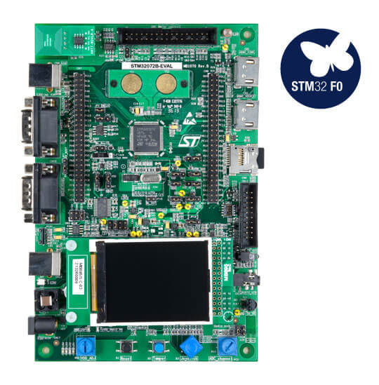

.. _stm32f072_eval_board:

ST STM32F072 Evaluation
#######################

Overview
********

The STM32F072-EVAL Discovery kit features an ARM Cortex-M0 based STM32F072VBT6 MCU
with a wide range of connectivity support and configurations.
Here are some highlights of the STM32F072-EVAL board:

- Four 5 V power supply options: power jack, ST-LINK/V2 USB connector, user USB connector, or daughter board
- Stereo audio jack, which supports a headset with microphone connected to DAC and ADC of STM32F072VBT6.
- 2G Byte (or more) SPI interface MicroSD card
- I2C compatible serial interface temperature sensor
- RF E2PROM
- RS232 and RS485 communication
- IrDA transceiver
- IR LED and IR receiver
- SWD debug support, ST-LINK/V2 embedded
- 240x320 TFT color LCD connected to SPI interface of STM32F072VBT6
- Joystick with 4-direction control and selector
- Reset and tamper buttons
- Four color user LEDs and two LEDs as MCU low power alarm
- Extension connector for daughter board or wrapping board
- MCU voltage choice: fixed 3.3 V or adjustable from 1.65 V to 3.6 V
- USB full-speed connector
- Touch sensing buttons
- RTC with backup battery
- CAN2.0A/B compliant connector
- Light Dependent Resistor (LDR)
- Potentiometer
- Two HDMI connectors with DDC and CEC
- Smart Card slot
- Motor control connector

Hardware
********

STM32F072-EVAL Discovery kit provides the following hardware components:

- STM32F072VBT6 in LQFP100 package
- ARM |reg| 32-bit Cortex |reg| -M0 CPU
- 48 MHz max CPU frequency
- VDD from 2.0 V to 3.6 V
- 128 KB Flash
- 16 KB SRAM with HW parity
- GPIO with external interrupt capability
- one 12-bit ADC with 16 channels
- one 12-bit D/A converters with 2 channels
- RTC
- Advanced-control Timer
- General Purpose Timers (8)
- Watchdog Timers (2)
- USART (4)
- I2C (2)
- SPI (2)
- CAN
- USB 2.0 OTG FS with on-chip PHY
- CRC calculation unit
- DMA Controller
- HDMI CEC Controller
- 24 capacitive sensing channels for touchkey, linear, and rotary touch sensors
- Up to 87 fast I/Os: 68 I/Os with 5V tolerant capability and 19 with independent supply

More information about STM32F072VB can be found here:
       - `STM32F072VB on www.st.com`_
       - `STM32F072 reference manual`_

Supported Features
==================

The Zephyr stm32f072_eval board configuration supports the following hardware features:

+-----------+------------+-------------------------------------+
| Interface | Controller | Driver/Component                    |
+===========+============+=====================================+
| NVIC      | on-chip    | nested vector interrupt controller  |
+-----------+------------+-------------------------------------+
| UART      | on-chip    | serial port-polling;                |
|           |            | serial port-interrupt               |
+-----------+------------+-------------------------------------+
| PINMUX    | on-chip    | pinmux                              |
+-----------+------------+-------------------------------------+
| GPIO      | on-chip    | gpio                                |
+-----------+------------+-------------------------------------+
| PWM       | on-chip    | pwm                                 |
+-----------+------------+-------------------------------------+
| CLOCK     | on-chip    | reset and clock control             |
+-----------+------------+-------------------------------------+
| WATCHDOG  | on-chip    | independent watchdog                |
+-----------+------------+-------------------------------------+

Other hardware features are not yet supported on this Zephyr porting.

The default configuration can be found in the defconfig file:

	``boards/arm/stm32f072_eval/stm32f072_eval_defconfig``

Pin Mapping
===========

STM32F072-EVAL Discovery kit has 6 GPIO controllers. These controllers are responsible for pin muxing,
input/output, pull-up, etc.

For mode details please refer to STM32F072-EVAL board User Manual.

Default Zephyr Peripheral Mapping:
----------------------------------
- UART_2_TX : PD5
- UART_2_RX : PD6
- TAMPER_PB : PC13
- JOYSTICK_RIGHT_PB : PE3
- JOYSTICK_LEFT_PB : PF2
- JOYSTICK_UP_PB : PF9
- JOYSTICK_DOWN_PB : PF10
- JOYSTICK_SEL_PB : PA0
- LD1 : PD8
- LD2 : PD9
- LD3 : PD10
- LD4 : PD11

System Clock
============

STM32F072-EVAL System Clock could be driven by an internal or external oscillator,
as well as the main PLL clock. By default the System clock is driven by the PLL clock at 48MHz,
driven by an 8MHz high speed internal clock.

Serial Port
===========

STM32F072-EVAL Discovery kit has up to 4 UARTs. The Zephyr console output is assigned to UART2.
Default settings are 115200 8N1.

Programming and Debugging
*************************

Applications for the ``stm32f072_eval`` board configuration can be built and
flashed in the usual way (see :ref:`build_an_application` and
:ref:`application_run` for more details).

Flashing
========

STM32F072-EVAL Discovery kit includes an ST-LINK/V2 embedded debug tool interface.
This interface is supported by the openocd version included in Zephyr SDK.

Flashing an application to STM32F072-EVAL
-------------------------------------------

Here is an example for the :zephyr:code-sample:`blinky` application.

.. zephyr-app-commands::
   :zephyr-app: samples/basic/blinky
   :board: stm32f072_eval
   :goals: build flash

You will see the LED blinking every second.

Debugging
=========

You can debug an application in the usual way.  Here is an example for the
:zephyr:code-sample:`blinky` application.

.. zephyr-app-commands::
   :zephyr-app: samples/basic/blinky
   :board: stm32f072_eval
   :maybe-skip-config:
   :goals: debug

.. _STM32F072VB on www.st.com:
   https://www.st.com/en/microcontrollers/stm32f072vb.html

.. _STM32F072 reference manual:
   https://www.st.com/resource/en/reference_manual/dm00031936.pdf
