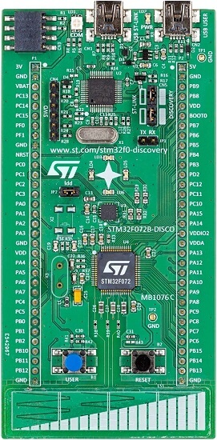

.. _stm32f072b_disco_board:

ST STM32F072B Discovery
#######################

Overview
********

The STM32F072B-DISCO Discovery kit features an ARM Cortex-M0 based STM32F072RB
MCU with everything required for beginners and experienced users to get
started quickly. Here are some highlights of the STM32F072B-DISCO board:

- STM32 microcontroller in LQFP64 package
- Extension header for LQFP64 I/Os for a quick connection to the prototyping
  board and easy probing
- On-board ST-LINK/V2, debugger/programmer with SWD connector
- Board power supply: through USB bus or from an external 5 V supply voltage
- External application power supply: 3 V and 5 V

- Six LEDs:

  - LD1 (red/green) for USB communication
  - LD2 (red) for 3.3 V power on
  - Four user LEDs: LD3 (orange), LD4 (green), LD5 (red) and LD6 (blue)

- Two push-buttons: USER and RESET
- USB USER with Mini-B connector
- L3GD20, ST MEMS motion sensor, 3-axis digital output gyroscope
- One linear touch sensor or four touch keys
- RF EEprom daughter board connector

More information about the board can be found at the
`STM32F072B-DISCO website`_.

Hardware
********

STM32F072B-DISCO Discovery kit provides the following hardware components:

- STM32F072RBTT6 in LQFP64 package
- ARM |reg| 32-bit Cortex |reg| -M0 CPU
- 48 MHz max CPU frequency
- VDD from 2.0 V to 3.6 V
- 128 KB Flash
- 16 KB SRAM
- GPIO with external interrupt capability
- 12-bit ADC with 39 channels
- 12-bit D/A converters
- RTC
- General Purpose Timers (12)
- USART/UART (4)
- I2C (2)
- SPI (2)
- CAN
- USB 2.0 full speed interface
- DMA Controller
- 24 capacitive sensing channels for touchkey, linear and rotary touch sensors

More information about STM32F072RB can be found here:
       - `STM32F072RB on www.st.com`_
       - `STM32F072xB reference manual`_

Supported Features
==================

The Zephyr stm32f072b_disco board configuration supports the following hardware
features:

+-----------+------------+-------------------------------------+
| Interface | Controller | Driver/Component                    |
+===========+============+=====================================+
| NVIC      | on-chip    | nested vector interrupt controller  |
+-----------+------------+-------------------------------------+
| UART      | on-chip    | serial port-polling;                |
|           |            | serial port-interrupt               |
+-----------+------------+-------------------------------------+
| PINMUX    | on-chip    | pinmux                              |
+-----------+------------+-------------------------------------+
| GPIO      | on-chip    | gpio                                |
+-----------+------------+-------------------------------------+
| CLOCK     | on-chip    | reset and clock control             |
+-----------+------------+-------------------------------------+
| WATCHDOG  | on-chip    | independent watchdog                |
+-----------+------------+-------------------------------------+
| I2C       | on-chip    | i2c controller                      |
+-----------+------------+-------------------------------------+
| SPI       | on-chip    | SPI controller                      |
+-----------+------------+-------------------------------------+
| CAN       | on-chip    | CAN controller                      |
+-----------+------------+-------------------------------------+

.. note:: CAN feature requires CAN transceiver, such as `SK Pang CAN breakout board`_.

Other hardware features are not yet supported in this Zephyr port.

The default configuration can be found in the defconfig file:

	``boards/arm/stm32f072b_disco/stm32f072b_disco_defconfig``

Pin Mapping
===========

STM32F072B-DISCO Discovery kit has 6 GPIO controllers. These controllers are
responsible for pin muxing, input/output, pull-up, etc.

For mode details please refer to `STM32F072B-DISCO board User Manual`_.

Default Zephyr Peripheral Mapping:
----------------------------------
- UART_1_TX : PB6
- UART_1_RX : PB7
- I2C1_SCL : PB8
- I2C1_SDA : PB9
- I2C2_SCL : PB10
- I2C2_SDA : PB11
- SPI1_SCK : PB3
- SPI1_MISO : PB4
- SPI1_MOSI : PB5
- USER_PB : PA0
- LD3 : PC6
- LD4 : PC8
- LD5 : PC9
- LD6 : PC7
- CAN_RX : PB8
- CAN_TX : PB9

System Clock
============

STM32F072B-DISCO System Clock could be driven by internal or external
oscillator, as well as main PLL clock. By default System clock is driven
by PLL clock at 72 MHz, driven by internal 8 MHz oscillator.

Serial Port
===========

STM32F072B-DISCO Discovery kit has up to 4 UARTs. The Zephyr console output
is assigned to UART 1. Default settings are 115200 8N1.

Programming and Debugging
*************************

Applications for the ``stm32f072b_disco`` board configuration can be built and
flashed in the usual way (see :ref:`build_an_application` and
:ref:`application_run` for more details).

Flashing
========

STM32F072B-DISCO board includes an ST-LINK/V2 embedded debug tool interface.
This interface is supported by the openocd version included in the Zephyr SDK.

Flashing an application to STM32F072B-DISCO
-------------------------------------------

First, connect the STM32F072B-DISCO Discovery kit to your host computer using
the USB port to prepare it for flashing. Then build and flash your application.

Here is an example for the :ref:`hello_world` application.

.. zephyr-app-commands::
   :zephyr-app: samples/hello_world
   :board: stm32f072b_disco
   :goals: build flash

Run a serial host program to connect with your board. A TTL(3.3V) serial
adapter is required.

.. code-block:: console

   $ minicom -D /dev/<tty device>

Replace <tty_device> with the port where the serial adapter can be found.
For example, under Linux, /dev/ttyUSB0.

You should see the following message on the console:

.. code-block:: console

   Hello World! arm

Debugging
=========

You can debug an application in the usual way.  Here is an example for the
:ref:`hello_world` application.

.. zephyr-app-commands::
   :zephyr-app: samples/hello_world
   :board: stm32f072b_disco
   :goals: debug

References
**********

.. target-notes::

.. _STM32F072B-DISCO website:
   http://www.st.com/en/evaluation-tools/32f072bdiscovery.html

.. _STM32F072B-DISCO board User Manual:
   http://www.st.com/resource/en/user_manual/dm00099401.pdf

.. _STM32F072RB on www.st.com:
   http://www.st.com/en/microcontrollers/stm32f072rb.html

.. _STM32F072xB reference manual:
   http://www.st.com/resource/en/reference_manual/dm00031936.pdf

.. _SK Pang CAN breakout board:
   https://www.skpang.co.uk/products/can-bus-can-fd-breakout-board-5v-supply-and-5v-logic
