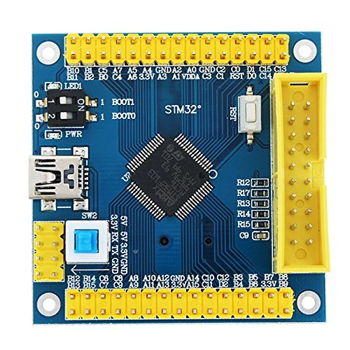
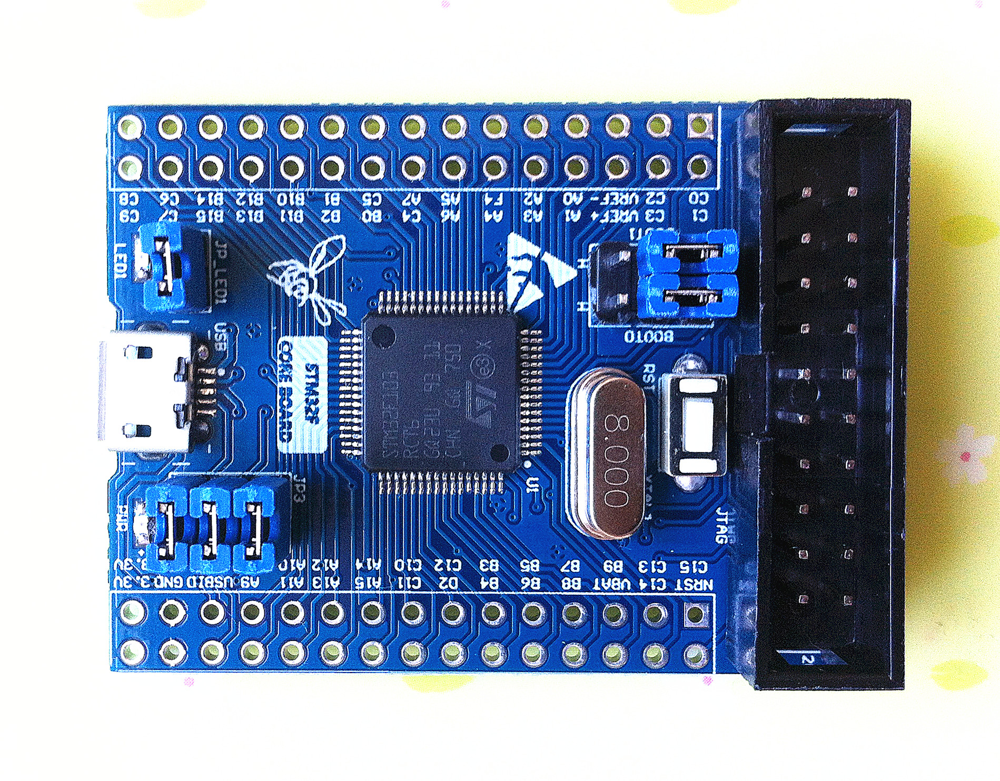
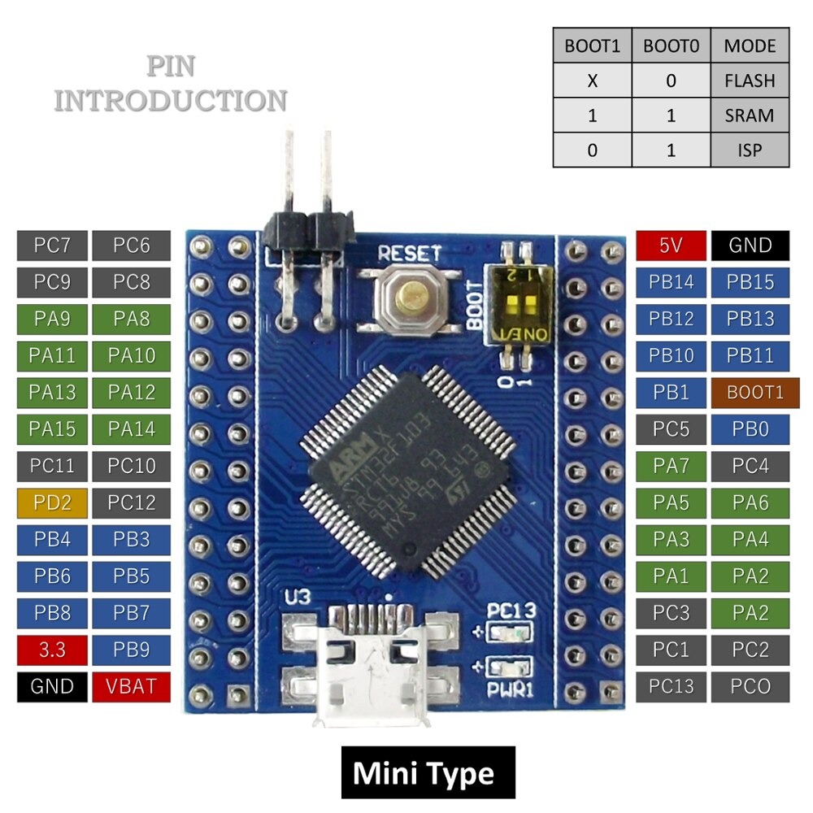

.. _stm32f103_mini_board:

STM32F103 Mini
################

Overview
********

The STM32F103_MINI board features an ARM Cortex-M3 based STM32F103RC MCU
with a wide range of connectivity support and configurations. There are
multiple version of this board like ``stm32f103_mini``.

Hardware
********
STM32F103 Mini provides the following hardware components:

- STM32 microcontroller in QFP64 package

- Flexible board power supply:

  - USB VBUS or external source (3.3V, 5V, 7 - 12V)
  - Power management access point

- Two LEDs:

  - User LED (LD1), power LED (LD2)

- USB re-enumeration capability:

  - Mass storage

More information about STM32F103RC can be found here:

- `STM32F103 reference manual`_
- `STM32F103 data sheet`_

Supported Features
==================

The Zephyr stm32f103_mini board configuration supports the following hardware features:

+-----------+------------+-------------------------------------+
| Interface | Controller | Driver/Component                    |
+===========+============+=====================================+
| NVIC      | on-chip    | nested vector interrupt controller  |
+-----------+------------+-------------------------------------+
| UART      | on-chip    | serial port-polling;                |
|           |            | serial port-interrupt               |
+-----------+------------+-------------------------------------+
| PINMUX    | on-chip    | pinmux                              |
+-----------+------------+-------------------------------------+
| GPIO      | on-chip    | gpio                                |
+-----------+------------+-------------------------------------+
| CLOCK     | on-chip    | reset and clock control             |
+-----------+------------+-------------------------------------+
| FLASH     | on-chip    | flash memory                        |
+-----------+------------+-------------------------------------+
| WATCHDOG  | on-chip    | independent watchdog                |
+-----------+------------+-------------------------------------+
| ADC       | on-chip    | ADC Controller                      |
+-----------+------------+-------------------------------------+
| PWM       | on-chip    | pwm                                 |
+-----------+------------+-------------------------------------+
| SPI       | on-chip    | spi                                 |
+-----------+------------+-------------------------------------+
| USB       | on-chip    | USB device                          |
+-----------+------------+-------------------------------------+
| COUNTER   | on-chip    | rtc                                 |
+-----------+------------+-------------------------------------+
| RTC       | on-chip    | rtc                                 |
+-----------+------------+-------------------------------------+

Other hardware features are not yet supported in this Zephyr port.

The default configuration can be found in the defconfig file:
``boards/arm/stm32f103_mini/stm32f103_mini_defconfig``

Connections and IOs
===================

Each of the GPIO pins can be configured by software as output (push-pull or open-drain), as
input (with or without pull-up or pull-down), or as peripheral alternate function. Most of the
GPIO pins are shared with digital or analog alternate functions. All GPIOs are high current
capable except for analog inputs.

Board connectors:
-----------------

Default Zephyr Peripheral Mapping:
----------------------------------

- UART_1 TX/RX: PA9/PA10
- UART_2 TX/RX: PA2/PA3 (ST-Link Virtual COM Port)
- SPI1 NSS/SCK/MISO/MOSI: PA4/PA5/PA6/PA7
- SPI2 NSS/SCK/MISO/MOSI: PB12/PB13/PB14/PB15
- I2C1 SDA/SCL: PB9/PB8
- PWM1_CH1: PA8
- USER_PB: PC13
- LD1: PA5
- USB_DC DM/DP: PA11/PA12

System Clock
------------

The on-board 8MHz crystal is used to produce a 72MHz system clock with PLL.

Programming and Debugging
*************************

Applications for the ``stm32f103_mini`` board configuration can be built and
flashed in the usual way (see :ref:`build_an_application` and
:ref:`application_run` for more details).

Flashing
========

There are 2 main entry points for flashing STM32F1X SoCs, one using the ROM
bootloader, and another by using the SWD debug port (which requires additional
hardware such as ST-Link). Flashing using the ROM bootloader requires a special activation
pattern, which can be triggered by using the BOOT0 pin.

Flashing an application to stm32f103 mini
-----------------------------------------

Here is an example for the :ref:`blinky-sample` application.

.. zephyr-app-commands::
   :zephyr-app: samples/basic/blinky
   :board: stm32f103_mini
   :goals: build flash

You will see the LED blinking every second.

Debugging
=========

You can debug an application in the usual way.  Here is an example for the
:ref:`blinky-sample` application.

.. zephyr-app-commands::
   :zephyr-app: samples/basic/blinky
   :board: stm32f103_mini
   :maybe-skip-config:
   :goals: debug

References
**********

.. target-notes::

.. _STM32F103 reference manual:
   http://www.st.com/resource/en/reference_manual/cd00171190.pdf

.. _STM32F103 data sheet:
   http://www.st.com/resource/en/datasheet/stm32f103rc.pdf
