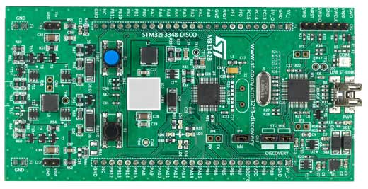

.. _stm32f334_disco_board:

ST STM32F334 DISCOVERY
######################

Overview
********

The STM32F344DISCOVERY kit features an ARM Cortex-M4 based STM32F334C8
MCU with everything required for beginners and experienced users to get
started quickly.

- STM32 microcontroller in LQFP48 package (64K Flash, 16K RAM)
- Extension header for all I/Os for quick connection to prototyping
  board and easy probing
- On-board, ST-LINK/V2 for PCB version A or B or ST-LINK/V2-B for PCB version
  C and newer, debugger/programmer with SWD connector
- Board power supply: through USB bus or from an external 3 V or 5 V supply
  voltage
- External application power supply: 3 V and 5 V
- high brightness LED with PWM controlled buck power supply (the STM32F334 part
  is in fact intended for use in accurate switch mode control applications).

- Six LEDs:

       - 3.3 V power on (LD1)
       - USB communication (LD2)
       - Four user LEDs: red, orange, green, bue (LD3, LD4, LD, LD6)

- Two push-buttons: USER and RESET
- USB USER with Mini-B connector

More information about the board can be found at the
`STM32F344DISCOVERY website`_.

Hardware
********

- STM32F334C8 in LQFP48 package
- ARM 32 bit Cortex M4 CPU with FPU etc
- 72MHz max clock frequency
- 64K Flash, 16K RAM
- 37 GPIOs
- 6 timers
- 26 PWM channels
- 1 SPI
- 1 I2C
- 1 CAN
- 2 USARTS
- 2 12 bit ADC's
- operates from 2 to 3.6V

See device data sheet for the full run down.

Serial Comms
************
USART 2 can be connected to the host system via USB virtual port
if solder bridges SB 14 and 16 are made. By default they are not fitted
(in this case the USART could be connected to a non-virtual seria port).

Programming and Debugging
*************************

Flashing
========

STM32F3DISCOVERY Discovery kit includes a ST-LINK/V2 or ST-LINK/V2-B embedded
debug tool interface.

Applications for the ``stm32f3_disco`` board configuration can be built and
flashed in the usual way (see :ref:`build_an_application` and
:ref:`application_run` for more details).

Flashing an application to STM32F3DISCOVERY
-------------------------------------------

First, connect the STM32F3DISCOVERY Discovery kit to your host computer using
the USB port to prepare it for flashing. Then build and flash your application.

Here is an example for the :ref:`hello_world` application.

.. zephyr-app-commands::
   :zephyr-app: samples/hello_world
   :board: stm32f3_disco
   :goals: build flash

Run a serial host program to connect with your board. For PCB version A or B a
TTL(3.3V) serial adapter is required. For PCB version C and newer a Virtual Com
Port (VCP) is available on the  USB ST-LINK port.

.. code-block:: console

   $ minicom -D /dev/<tty device>

Replace <tty_device> with the port where the STM32F3DISCOVERY board can be
found. For example, under Linux, /dev/ttyUSB0.

You should see the following message on the console:

.. code-block:: console

   Hello World! arm

Debugging
=========

You can debug an application in the usual way.  Here is an example for the
:ref:`hello_world` application.

.. zephyr-app-commands::
   :zephyr-app: samples/hello_world
   :board: stm32f334_disco
   :goals: debug

.. _STM32F334DISCOVERY website:
   http://www.st.com/en/evaluation-tools/stm32f3348discovery.html

.. _STM32F334 on www.st.com:
   http://www.st.com/en/microcontrollers-microprocessors/stm32f334.html

