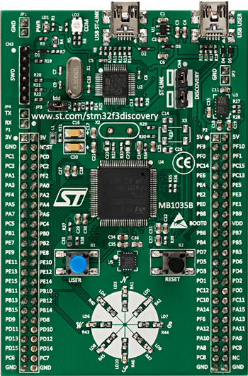

.. _stm32f3_disco_board:

ST STM32F3DISCOVERY
###################

Overview
********

The STM32F3DISCOVERY Discovery kit features an ARM Cortex-M4 based STM32F303VC
MCU with everything required for beginners and experienced users to get
started quickly. Here are some highlights of the STM32F3DISCOVERY board:

- STM32 microcontroller in LQFP100 package
- Extension header for all LQFP100 I/Os for quick connection to prototyping
  board and easy probing
- On-board, ST-LINK/V2 for PCB version A or B or ST-LINK/V2-B for PCB version
  C and newer, debugger/programmer with SWD connector
- Board power supply: through USB bus or from an external 3 V or 5 V supply
  voltage
- External application power supply: 3 V and 5 V

- Ten LEDs:

       - 3.3 V power on (LD1)
       - USB communication (LD2)
       - Eight user LEDs: red (LD3/LD10), blue (LD4/LD9), orange (LD5/LD9)
         and green (LD6/LD7)

- Two push-buttons: USER and RESET
- USB USER with Mini-B connector
- L3GD20, ST MEMS motion sensor, 3-axis digital output gyroscope
- LSM303DLHC, ST MEMS system-in-package featuring a 3D digital linear
  acceleration sensor and a 3D digital magnetic sensor

More information about the board can be found at the
`STM32F3DISCOVERY website`_.

Hardware
********

STM32F3DISCOVERY Discovery kit provides the following hardware components:

- STM32F303VCT6 in LQFP100 package
- ARM |reg| 32-bit Cortex |reg| -M4 CPU with FPU
- 72 MHz max CPU frequency
- VDD from 2.0 V to 3.6 V
- 256 KB Flash
- 40 KB SRAM
- Routine booster: 8 Kbytes of SRAM on instruction and data bus
- GPIO with external interrupt capability
- 4x12-bit ADC with 39 channels
- 2x12-bit D/A converters
- RTC
- General Purpose Timers (13)
- USART/UART (5)
- I2C (2)
- SPI (3)
- CAN
- USB 2.0 full speed interface
- Infrared transmitter
- DMA Controller

More information about STM32F303VC can be found here:
       - `STM32F303VC on www.st.com`_
       - `STM32F303xC reference manual`_

Supported Features
==================

The Zephyr stm32f3_disco board configuration supports the following hardware
features:

+-----------+------------+-------------------------------------+
| Interface | Controller | Driver/Component                    |
+===========+============+=====================================+
| NVIC      | on-chip    | nested vector interrupt controller  |
+-----------+------------+-------------------------------------+
| UART      | on-chip    | serial port-polling;                |
|           |            | serial port-interrupt               |
+-----------+------------+-------------------------------------+
| PINMUX    | on-chip    | pinmux                              |
+-----------+------------+-------------------------------------+
| GPIO      | on-chip    | gpio                                |
+-----------+------------+-------------------------------------+
| I2C       | on-chip    | i2c                                 |
+-----------+------------+-------------------------------------+

Other hardware features are not yet supported on Zephyr porting.

The default configuration can be found in the defconfig file:

	``boards/arm/stm32f3_disco/stm32f3_disco_defconfig``

Pin Mapping
===========

STM32F3DISCOVERY Discovery kit has 6 GPIO controllers. These controllers are
responsible for pin muxing, input/output, pull-up, etc.

For mode details please refer to `STM32F3DISCOVERY board User Manual`_.

Default Zephyr Peripheral Mapping:
----------------------------------
- UART_1_TX : PC4
- UART_1_RX : PC5
- UART_2_TX : PA2
- UART_2_RX : PA3
- I2C1_SCL : PB6
- I2C1_SDA : PB7
- I2C2_SCL : PA9
- I2C2_SDA : PA10
- USER_PB : PA0
- LD3 : PE9
- LD4 : PE8
- LD5 : PE10
- LD6 : PE15
- LD7 : PE11
- LD8 : PE14
- LD9 : PE12
- LD10 : PE13

System Clock
============

STM32F3DISCOVERY System Clock could be driven by internal or external
oscillator, as well as main PLL clock. By default System clock is driven
by PLL clock at 72 MHz, driven by 8 MHz MCO from the ST Link.

Serial Port
===========

STM32F3DISCOVERY Discovery kit has up to 5 UARTs. The Zephyr console output
is assigned to UART1. Default settings are 115200 8N1.

I2C
===

STM32F3DISCOVERY has up to 2 I2Cs. I2C1 is connected to the LSM303DLHC and is
an ultra-compact low-power system-in-package featuring a 3D digital linear
acceleration sensor and a 3D digital magnetic sensor.

Programming and Debugging
*************************

Flashing
========

STM32F3DISCOVERY Discovery kit includes a ST-LINK/V2 or ST-LINK/V2-B embedded
debug tool interface.

Applications for the ``stm32f3_disco`` board configuration can be built and
flashed in the usual way (see :ref:`build_an_application` and
:ref:`application_run` for more details).

Flashing an application to STM32F3DISCOVERY
-------------------------------------------

First, connect the STM32F3DISCOVERY Discovery kit to your host computer using
the USB port to prepare it for flashing. Then build and flash your application.

Here is an example for the :ref:`hello_world` application.

.. zephyr-app-commands::
   :zephyr-app: samples/hello_world
   :board: stm32f3_disco
   :goals: build flash

Run a serial host program to connect with your board. For PCB version A or B a
TTL(3.3V) serial adapter is required. For PCB version C and newer a Virtual Com
Port (VCP) is available on the  USB ST-LINK port.

.. code-block:: console

   $ minicom -D /dev/<tty device>

Replace <tty_device> with the port where the STM32F3DISCOVERY board can be
found. For example, under Linux, /dev/ttyUSB0.

You should see the following message on the console:

.. code-block:: console

   Hello World! arm

Debugging
=========

You can debug an application in the usual way.  Here is an example for the
:ref:`hello_world` application.

.. zephyr-app-commands::
   :zephyr-app: samples/hello_world
   :board: stm32f3_disco
   :goals: debug

.. _STM32F3DISCOVERY website:
   http://www.st.com/en/evaluation-tools/stm32f3discovery.html

.. _STM32F3DISCOVERY board User Manual:
   http://www.st.com/resource/en/user_manual/dm00063382.pdf

.. _STM32F303VC on www.st.com:
   http://www.st.com/en/microcontrollers/stm32f303vc.html

.. _STM32F303xC reference manual:
   http://www.st.com/resource/en/reference_manual/dm00043574.pdf
