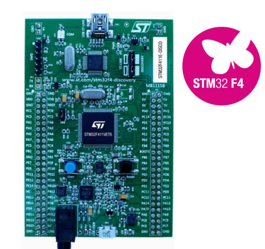

.. _stm32f411e_disco_board:

ST STM32F411E Discovery
#######################

Overview
********

The STM32F411E Discovery kit features an ARM Cortex-M4 based STM32F411VE MCU
with a wide range of connectivity support and configurations.
Here are some highlights of the STM32F411E-DISCO board:

- STM32F411VET6 microcontroller featuring 512 KB of Flash memory, 128 KB of RAM in an LQFP100 package
- On-board ST-LINK/V2 with selection mode switch to use the kit as a standalone STLINK/V2 (with SWD connector for programming and debugging)
- Board power supply: through USB bus or from an external 5 V supply voltage
- External application power supply: 3 V and 5 V
- L3GD20, ST MEMS motion sensor, 3-axis digital output gyroscope.
- LSM303DLHC, ST MEMS system-in-package featuring a 3D digital linear acceleration sensor and a 3D digital magnetic sensor.
- MP45DT02, ST MEMS audio sensor, omnidirectional digital microphone
- CS43L22, audio DAC with integrated class D speaker driver
- Eight LEDs:
    - LD1 (red/green) for USB communication
    - LD2 (red) for 3.3 V power on
    - Four user LEDs:
        LD3 (orange), LD4 (green), LD5 (red) and LD6 (blue)
    - Two USB OTG LEDs:
        LD7 (green) VBus and LD8 (red) over-current
- Two pushbuttons (user and reset)
- USB OTG with micro-AB connector
- Extension header for LQFP100 I/Os for a quick connection to the prototyping board and an easy probing

More information about the board can be found at the `32F411EDISCOVERY website`_.

Hardware
********

STM32F411E-DISCO Discovery kit provides the following hardware components:

- STM32F411VET6 in LQFP100 package
- ARM |reg| 32-bit Cortex |reg| -M4 CPU with FPU
- 100 MHz max CPU frequency
- VDD from 1.7 V to 3.6 V
- 512 KB Flash
- 128 KB SRAM
- GPIO with external interrupt capability
- 1x12-bit, 2.4 MSPS ADC with 16 channels
- DMA Controller
- Up to 11 Timers (six 16-bit, two 32-bit, two watchdog timers and a SysTick timer)
- USART/UART (3)
- I2C (3)
- SPI/I2S (5)
- SDIO
- USB 2.0 full-speed device/host/OTG controller with on-chip PHY
- CRC calculation unit
- 96-bit unique ID
- RTC

More information about STM32F411VE can be found here:
       - `STM32F411VE website`_
       - `STM32F411x reference manual`_

Supported Features
==================

The Zephyr stm32f411e_disco board configuration supports the following
hardware features:

+-----------+------------+-------------------------------------+
| Interface | Controller | Driver/Component                    |
+===========+============+=====================================+
| NVIC      | on-chip    | nested vector interrupt controller  |
+-----------+------------+-------------------------------------+
| UART      | on-chip    | serial port-polling;                |
|           |            | serial port-interrupt               |
+-----------+------------+-------------------------------------+
| PINMUX    | on-chip    | pinmux                              |
+-----------+------------+-------------------------------------+
| GPIO      | on-chip    | gpio                                |
+-----------+------------+-------------------------------------+
| PWM       | on-chip    | pwm                                 |
+-----------+------------+-------------------------------------+

Other hardware features are not yet supported on Zephyr porting.

The default configuration can be found in the defconfig file
:zephyr_file:`boards/arm/stm32f411e_disco/stm32f411e_disco_defconfig`

Pin Mapping
===========

STM32F411E-DISCO Discovery kit has 5 GPIO controllers. These controllers are
responsible for pin muxing, input/output, pull-up, etc.

For mode details please refer to `32F411EDISCOVERY board User Manual`_.

Default Zephyr Peripheral Mapping:
----------------------------------
- UART_2_TX : PA2
- UART_2_RX : PA3
- LD3 : PD13
- LD4 : PD12 (PWM4 CH1)
- LD5 : PD14
- LD6 : PD15

System Clock
============

STM32F411E-DISCO System Clock could be driven by an internal or external
oscillator, as well as the main PLL clock. By default, the System clock is
driven by the PLL clock at 100MHz, driven by the internal oscillator.

Serial Port
===========

The STM32F411G Discovery kit has up to 3 UARTs. The Zephyr console output is
assigned to UART2. Default settings are 115200 8N1.

Programming and Debugging
*************************

Applications for the ``stm32f411e_disco`` board configuration can be built and
flashed in the usual way (see :ref:`build_an_application` and
:ref:`application_run` for more details).

Flashing
========

STM32F411E-DISCO Discovery kit includes an ST-LINK/V2 embedded debug tool
interface. This interface is supported by the openocd version included in
Zephyr SDK.

Flashing an application to STM32F411E-DISCO
-------------------------------------------

Connect the STM32F411E-DISCO Discovery kit to your host computer using the
USB port. Then build and flash an application.

Here is an example for the :ref:`blinky-sample` application.

.. zephyr-app-commands::
   :zephyr-app: samples/basic/blinky
   :board: stm32f411e_disco
   :goals: build flash

You should see the orange led (LD3) blinking every second.

Debugging
=========

You can debug applications in the usual way. Here is an example for
the :ref:`blinky-sample` application.

.. zephyr-app-commands::
   :zephyr-app: samples/basic/blinky
   :board: stm32f411e_disco
   :maybe-skip-config:
   :goals: debug

References
**********

.. target-notes::

.. _32F411EDISCOVERY website:
   http://www.st.com/en/evaluation-tools/32f411ediscovery.html

.. _32F411EDISCOVERY board User Manual:
   http://www.st.com/resource/en/user_manual/dm00148985.pdf

.. _STM32F411VE website:
   http://www.st.com/en/microcontrollers/stm32f411ve.html

.. _STM32F411x reference manual:
   http://www.st.com/resource/en/reference_manual/dm00119316.pdf
