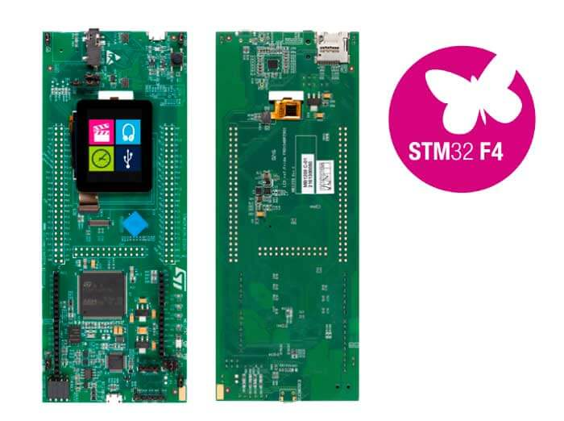

.. _stm32f412g_disco_board:

ST STM32F412G Discovery
#######################

Overview
********

The STM32F412 Discovery kit features an ARM Cortex-M4 based STM32F412ZG MCU
with a wide range of connectivity support and configurations Here are
some highlights of the STM32F412G-DISCO board:

- STM32F412ZGT6 microcontroller featuring 1 Mbyte of Flash memory and 256 Kbytes of RAM in an LQFP144 package
- On-board ST-LINK/V2-1 SWD debugger supporting USB re-enumeration capability:

       - USB virtual COM port
       - mass storage
       - debug port

- 1.54 inch 240x240 pixel TFT color LCD with parallel interface and capacitive touchscreen
- I2S Audio CODEC, with a stereo headset jack, including analog microphone input and a loudspeaker output
- Stereo digital MEMS microphones
- MicroSD card connector extension
- I2C extension connector
- 128 Mbit Quad-SPI Nor Flash
- Reset button and Joystick
- Four color user LEDs.
- USB OTG FS with Micro-AB connector
- Four power supply options:

       - ST-LINK/V2-1 USB connector
       - User USB FS connector
       - VIN from Arduino* connectors
       - + 5 V from Arduino* connectors

- Two power supplies for MCU: 2.0 V and 3.3 V
- Compatible with Arduino(tm) Uno revision 3 connectors
- Extension connector for direct access to various features of STM32F412ZGT6 MCU
- Comprehensive free software including a variety of examples, part of STM32Cube package

More information about the board can be found at the `32F412GDISCOVERY website`_.

Hardware
********

STM32F469I-DISCO Discovery kit provides the following hardware components:

- STM32F412ZGT6 in LQFP144 package
- ARM |reg| 32-bit Cortex |reg| -M4 CPU with FPU
- 100 MHz max CPU frequency
- VDD from 1.7 V to 3.6 V
- 1 MB Flash
- 256 KB SRAM
- GPIO with external interrupt capability
- LCD parallel interface, 8080/6800 modes
- 1x12-bit ADC with 16 channels
- RTC
- Advanced-control Timer
- General Purpose Timers (12)
- Watchdog Timers (2)
- USART/UART (4)
- I2C (4)
- SPI (5)
- SDIO
- 2xCAN
- CRC calculation unit
- True random number generator
- DMA Controller

More information about STM32F412ZG can be found here:
       - `STM32F412ZG on www.st.com`_
       - `STM32F412 reference manual`_

Supported Features
==================

The Zephyr stm32f412g_disco board configuration supports the following hardware features:

+-----------+------------+-------------------------------------+
| Interface | Controller | Driver/Component                    |
+===========+============+=====================================+
| NVIC      | on-chip    | nested vector interrupt controller  |
+-----------+------------+-------------------------------------+
| UART      | on-chip    | serial port-polling;                |
|           |            | serial port-interrupt               |
+-----------+------------+-------------------------------------+
| PINMUX    | on-chip    | pinmux                              |
+-----------+------------+-------------------------------------+
| GPIO      | on-chip    | gpio                                |
+-----------+------------+-------------------------------------+
| I2C       | on-chip    | i2c                                 |
+-----------+------------+-------------------------------------+
| SPI       | on-chip    | spi                                 |
+-----------+------------+-------------------------------------+
| QSPI NOR  | on-chip    | off-chip flash                      |
+-----------+------------+-------------------------------------+

Other hardware features are not yet supported on Zephyr porting.

The default configuration can be found in the defconfig file:

	``boards/arm/stm32f412g_disco/stm32f412g_disco_defconfig``

Pin Mapping
===========

STM32F412G-DISCO Discovery kit has 8 GPIO controllers. These controllers are responsible for pin muxing,
input/output, pull-up, etc.

For mode details please refer to `32F412GDISCOVERY board User Manual`_.

Default Zephyr Peripheral Mapping:
----------------------------------
- UART_2_TX : PA2
- UART_2_RX : PA3
- LD1 : PE0
- LD2 : PE1
- LD3 : PE2
- LD4 : PE3

System Clock
============

STM32F412G-DISCO System Clock could be driven by internal or external oscillator,
as well as main PLL clock. By default System clock is driven by PLL clock at 100MHz,
driven internal oscillator.

Serial Port
===========

The STM32F412G Discovery kit has up to 4 UARTs. The Zephyr console output is assigned to UART2.
Default settings are 115200 8N1.

Programming and Debugging
*************************

Applications for the ``stm32f412g_disco`` board configuration can be built and
flashed in the usual way (see :ref:`build_an_application` and
:ref:`application_run` for more details).

Flashing
========

STM32F412G-DISCO Discovery kit includes an ST-LINK/V2 embedded debug tool interface.
This interface is supported by the openocd version included in Zephyr SDK.

Flashing an application to STM32F412G-DISCO
-------------------------------------------

Connect the STM32F412G-DISCO Discovery kit to your host computer using
the USB port, then run a serial host program to connect with your
board:

.. code-block:: console

   $ minicom -D /dev/ttyACM0

Then build and flash an application. Here is an example for the
:ref:`hello_world` application.

.. zephyr-app-commands::
   :zephyr-app: samples/hello_world
   :board: stm32f412g_disco
   :goals: build flash

You should see the following message on the console:

.. code-block:: console

   Hello World! arm

Debugging
=========

You can debug an application in the usual way.  Here is an example for the
:ref:`hello_world` application.

.. zephyr-app-commands::
   :zephyr-app: samples/hello_world
   :board: stm32f412g_disco
   :maybe-skip-config:
   :goals: debug

.. _32F412GDISCOVERY website:
   http://www.st.com/en/evaluation-tools/32f412gdiscovery.html

.. _32F412GDISCOVERY board User Manual:
   http://www.st.com/resource/en/user_manual/dm00275919.pdf

.. _STM32F412ZG on www.st.com:
   http://www.st.com/en/microcontrollers/stm32f412zg.html

.. _STM32F412 reference manual:
   http://www.st.com/resource/en/reference_manual/dm00180369.pdf
