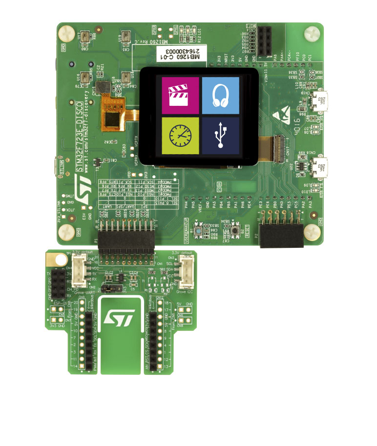

.. _stm32f723e_disco_board:

ST STM32F723E Discovery
########################

Overview
********

The STM32F723 Discovery board features an ARM Cortex-M7 based STM32L723IE MCU
with a wide range of connectivity support and configurations. Here are
some highlights of the STM32F723E Discovery board:

- STM32F723IEK6 microcontroller featuring 512 Kbytes of Flash memory and 176+16 Kbytes of RAM, in BGA176 package
- 1.54 inch 240 x 240 pixel-TFT color LCD with parallel interface
- SAI Audio CODEC, with a stereo headset jack, including analog microphone input
- Stereo digital MEMS microphones
- 8 Mbit-PSRAM
- 512 Mbit-Quad-SPI Flash
- USB OTG HS with Micro-AB connector
- USB OTG FS with Micro-AB connector
- Three types of extension resources:

       - STMod+ and PMOD connectors
       - Compatible Arduino™ Uno V3 connectors
       - Compatible ESP-01 Wi-Fi module connectors

- On-board ST-LINK/V2-1 debugger/programmer with SWD connector
- 5 source options for power supply

       - ST-LINK/V2-1 USB connector
       - User USB FS connector
       - VIN from Arduino™ connector
       - 5 V from Arduino™ connector
       - USB charger
       - USB VBUS or external source(3.3V, 5V, 7 - 12V)
       - Power management access point

- 8 LEDs
- 2 push-buttons (user and reset)

More information about the board can be found at the `STM32F723E Discovery website`_.

Hardware
********

The STM32F723IE SoC provides the following hardware capabilities:

- Core: ARM® 32-bit Cortex® -M7 CPU with FPU, adaptive real-time accelerator (ART Accelerator™) and L1-cache: 8 Kbytes of data cache and 8 Kbytes of instruction cache, allowing 0-wait state execution from embedded Flash memory and external memories, frequency up to 216 MHz, MPU, 462 DMIPS/2.14 DMIPS/MHz (Dhrystone 2.1) and DSP instructions.
- Clock Sources:

        - 4 to 26 MHz crystal oscillator
        - 32 kHz crystal oscillator for RTC (LSE)
        - Internal 16 MHz factory-trimmed RC (±1%)
        - 3 PLLs for system clock, USB, audio

- RTC with HW calendar, alarms and calibration
- 18x timers:

        - 2x 32-bit and 15x 16-bit general purpose
        - 2x 16-bit basic
        - 1x low-power 16-bit timers (available in Stop mode)
        - 2x watchdogs
        - SysTick timer

- Up to 136 fast I/Os up to 108MHz, 138 5 V-tolerant I/Os
- Memories

        - Up to 512 KB Flash, read and write protection, proprietary code readout protection
        - 528 bytes of OTP memory
        - 256 KB of SRAM (including 64 KB of data TCM RAM for critical real-time data) 16 KB of instruction TCM RAM (for critical real-time routines) + 5 KB of backup SRAM (available in the lowest power modes)
        - Flexible external memory controller with up to 32-bit data bus: SRAM, PSRAM, SDRAM?LPSDR SDRAM, NOR, and NAND memories
        - Dual mode Quad SPI memory interface

- 21x communication interfaces

        - 3x I2C, SMBus/PMBus
        - 4x USARTs / 4x UARTs (27 Mbit/s, ISO7816 interfac, LIN, IrDA, modem)
        - 5x SPIs (up to 54 Mbit/s)
        - 2x SAIs (serial audio interface))
        - 1x CAN (2.0B Active)
        - 2x SDMMCs
        - USB OTG 2.0 full-speed with on-chip PHY
        - USB OTG 2.0 high-speed/full-speed with dedicated DMA, on-chip full-speed PHY and on-chip Hi-speed PHY or ULPI depending on the part number

- 16-channel DMA controller
- True random number generator
- CRC calculation unit, 96-bit unique ID
- Development support: serial wire debug (SWD), JTAG, Cortex®-M7 Trace Macrocell™
- 3×12-bit, 2.4 MSPS ADC: up to 24 channels and 7.2 MSPS in triple interleaved mode
- 2×12-bit D/A converters

More information about STM32F723IE can be found here:
       - `STM32F723IE on www.st.com`_
       - `STM32F723 reference manual`_

Supported Features
==================

The Zephyr stm32f723e_disco board configuration supports the following hardware features:

+-----------+------------+-------------------------------------+
| Interface | Controller | Driver/Component                    |
+===========+============+=====================================+
| NVIC      | on-chip    | nested vector interrupt controller  |
+-----------+------------+-------------------------------------+
| UART      | on-chip    | serial port-polling;                |
|           |            | serial port-interrupt               |
+-----------+------------+-------------------------------------+
| PINMUX    | on-chip    | pinmux                              |
+-----------+------------+-------------------------------------+
| GPIO      | on-chip    | gpio                                |
+-----------+------------+-------------------------------------+

Other hardware features are not yet supported on this Zephyr port.

The default configuration can be found in the defconfig file:

	``boards/arm/stm32f723e_disco/stm32f723e_disco_defconfig``

Connections and IOs
===================

STM32F723E Discovery Board has 9 GPIO controllers. These controllers are responsible for pin muxing,
input/output, pull-up, etc.

For mode details please refer to `STM32F723IE Discovery board User Manual`_.

Default Zephyr Peripheral Mapping:
----------------------------------

- UART_6_TX : PC6
- UART_6_RX : PC7

System Clock
------------

STM32F723E Discovery System Clock could be driven by internal or external oscillator,
as well as main PLL clock. By default System clock is driven by PLL clock at 216MHz,
driven by 16MHz high speed internal oscillator.

Serial Port
-----------

STM32F723E Discovery board has 8 U(S)ARTs. The Zephyr console output is assigned to UART6.
Default settings are 115200 8N1.

Programming and Debugging
*************************

Flashing
========

STM32F723E Discovery board includes an ST-LINK/V2-1 embedded debug tool interface.
This interface is not supported by the openocd version 0.9 included by the Zephyr SDK v0.9,
use openocd v0.10.0 from the openocd-stm32 project on GitHub to get the minimum set of scripts
needed to flash and debug STM32 development boards.

.. code-block:: console

   $ git clone  https://github.com/erwango/openocd-stm32.git

Then follow instructions in README.md

Flashing an application to STM32F723E Discovery
-----------------------------------------------

The sample application :ref:`hello_world` is being used in this tutorial:

To build the Zephyr kernel and application, enter:

.. code-block:: console

   $ cd <zephyr_root_path>
   $ source zephyr-env.sh
   $ cd $ZEPHYR_BASE/samples/hello_world/
   $ make BOARD=stm32f723e_disco

Connect the STM32F723E Discovery to your host computer using the USB port.
Then, enter the following command:

.. code-block:: console

   $ cd <openocd-stm32_path>
   $ stm32_flsh f7 $ZEPHYR_BASE/samples/hello_world/outdir/stm32f723e_disco/zephyr.bin

Run a serial host program to connect with your Discovery board.

.. code-block:: console

   $ minicom -D /dev/ttyACM0

You should see the following message:

.. code-block:: console

   $ Hello World! arm

Debugging
=========

Access gdb with the following make command:

.. code-block:: console

   $ cd <openocd-stm32_path>
   $ stm32_dbg f7 $ZEPHYR_BASE/samples/hello_world/outdir/stm32f723e_disco/zephyr.elf

.. _STM32F723E Discovery website:
   http://www.st.com/en/evaluation-tools/32f723ediscovery.html

.. _STM32F723IE Discovery board User Manual:
   http://www.st.com/resource/en/user_manual/dm00342318.pdf

.. _STM32F723IE on www.st.com:
   http://www.st.com/en/microcontrollers/stm32f723ie.html

.. _STM32F723 reference manual:
   http://www.st.com/resource/en/reference_manual/DM00305990.pdf
