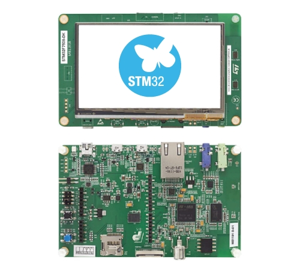

.. _stm32f7508_dk_board:

ST STM32F7508-DK Discovery Kit
##############################

Overview
********

The discovery kit enables a wide diversity of applications taking benefit
from audio, multi-sensor support, graphics, security, security, video,
and high-speed connectivity features. Important board features include:

- STM32F750N8H6 microcontroller featuring 64 Kbytes of Flash memory and 340 Kbytes of RAM, in BGA216 package
- On-board ST-LINK/V2-1 supporting USB re-enumeration capability
- Five power supply options:

  - ST LINK/V2-1
  - USB FS connector
  - USB HS connector
  - VIN from Arduino connector
  - External 5 V from connector

- Two pushbuttons (user and reset)
- USB functions: virtual COM port, mass storage, debug port
- 4.3-inch 480x272 color LCD-TFT with capacitive touch screen
- SAI audio codec
- Audio line in and line out jack
- Two ST MEMS microphones
- SPDIF RCA input connector
- 128-Mbit Quad-SPI Flash memory
- 128-Mbit SDRAM (64 Mbits accessible)
- Connector for microSD card
- USB OTG HS with Micro-AB connectors
- USB OTG FS with Micro-AB connectors
- Ethernet connector compliant with IEEE-802.3-2002

More information about the board can be found at the `32F7508-DK website`_.

Hardware
********

The STM32F7508-DK Discovery kit provides the following hardware components:

- STM32F750N8H6 in BGA216 package
- ARM |reg| 32-bit Cortex |reg| -M7 CPU with FPU
- 216 MHz max CPU frequency
- 64 KB Flash
- 320+16+4 KB SRAM
- GPIO with external interrupt capability
- 4.3-inch 480x272 color LCD-TFT with capacitive touch screen
- 3x12-bit ADC
- 2x12-bit D/A converters
- RTC
- Advanced-control Timer
- General Purpose Timers (17)
- Watchdog Timers (2)
- USART/UART (8)
- I2C (4)
- SPI (6)
- 2xSAI (serial audio interface)
- 2xCAN
- USB 2.0 OTG FS with on-chip PHY
- USB 2.0 OTG HS/FS with dedicated DMA, on-chip full-speed PHY and ULPI
- 10/100 Ethernet MAC with dedicated DMA
- 8- to 14-bit parallel camera
- CRC calculation unit
- True random number generator
- DMA Controller

More information about STM32F750x8 can be found here:

- `STM32F750x8 on www.st.com`_
- `STM32F74xxx reference manual`_

Supported Features
==================

The Zephyr stm32f7508_dk board configuration supports the following hardware features:

+-----------+------------+-------------------------------------+
| Interface | Controller | Driver/Component                    |
+===========+============+=====================================+
| NVIC      | on-chip    | nested vector interrupt controller  |
+-----------+------------+-------------------------------------+
| UART      | on-chip    | serial port-polling;                |
|           |            | serial port-interrupt               |
+-----------+------------+-------------------------------------+
| PINMUX    | on-chip    | pinmux                              |
+-----------+------------+-------------------------------------+
| GPIO      | on-chip    | gpio                                |
+-----------+------------+-------------------------------------+
| FLASH     | on-chip    | flash memory                        |
+-----------+------------+-------------------------------------+
| ETHERNET  | on-chip    | Ethernet                            |
+-----------+------------+-------------------------------------+
| PWM       | on-chip    | pwm                                 |
+-----------+------------+-------------------------------------+
| I2C       | on-chip    | i2c                                 |
+-----------+------------+-------------------------------------+
| USB       | on-chip    | usb                                 |
+-----------+------------+-------------------------------------+
| SDMMC     | on-chip    | disk access                         |
+-----------+------------+-------------------------------------+
| SPI       | on-chip    | spi                                 |
+-----------+------------+-------------------------------------+
| QSPI NOR  | on-chip    | off-chip flash                      |
+-----------+------------+-------------------------------------+
| FMC       | on-chip    | memc (SDRAM)                        |
+-----------+------------+-------------------------------------+
| LTDC      | on-chip    | display                             |
+-----------+------------+-------------------------------------+

Other hardware features are not yet supported on Zephyr porting.

The default configuration can be found in the defconfig file:
``boards/arm/stm32f7508_dk/stm32f7508_dk_defconfig``

Pin Mapping
===========

STM32F7508-DK Discovery kit has 9 GPIO controllers. These controllers are responsible for pin muxing,
input/output, pull-up, etc.

For mode details please refer to `32F7508-DK board User Manual`_.

Default Zephyr Peripheral Mapping:
----------------------------------

The STM32F7508 Discovery kit features an Arduino Uno V3 connector. Board is
configured as follows

- UART_1 TX/RX : PA9/PB7 (ST-Link Virtual Port Com)
- UART_6 TX/RX : PC6/PC7 (Arduino Serial)
- I2C1 SCL/SDA : PB8/PB9 (Arduino I2C)
- SDMMC_1 D0/D1/D2/D3/CK/CD/CMD: PC8/PC9/PC10/PC11/PC12/PC13/PD2
- SPI2 NSS/SCK/MISO/MOSI : PA8/PI1/PB14/PB15 (Arduino SPI)
- PWM_3_CH1 : PB4
- ETH : PA1, PA2, PA7, PC1, PC4, PC5, PG11, PG13, PG14
- USER_PB : PI11
- LD1 : PI1
- USB DM : PA11
- USB DP : PA12
- FMC SDRAM :

   - D0-D15 : PD14/PD15/PD0/PD1/PE7/PE8/PE9/PE10/PE11/PE12/PE13/PE14/PE15/PD8/PD9/PD10
   - A0-A11 : PF0/PF1/PF2/PF3/PF4/PF5/PF12/PF13/PF14/PF15/PG0/PG1
   - A14/A15 : PG4/PG5
   - SDNRAS/SDNCAS : PF11/PG15
   - NBL0/NBL1 : PE0/PE1
   - SDCLK/SDNWE/SDCKE0/SDNE0 : PG8/PH5/PC3/PH3

- LTDC :

   - R0-R7 : PI15/PJ0/PJ1/PJ2/PJ3/PJ4/PJ5/PJ6
   - G0-G7 : PJ7/PJ8/PJ9/PJ10/PJ11/PK0/PK1/PK2
   - B0-B7 : PJ12/PK13/PJ14/PJ15/PK3/PK4/PK5/PK6
   - DE/CLK/HSYNC/VSYNC : PK7/PI14/PI12/PI13

System Clock
============

The STM32F7508 System Clock can be driven by an internal or external oscillator,
as well as by the main PLL clock. By default, the System clock is driven by the PLL
clock at 216MHz, driven by a 25MHz high speed external clock.

Serial Port
===========

The STM32F7508-DK Discovery kit has up to 8 UARTs. The Zephyr console output is assigned to UART1
which connected to the onboard ST-LINK/V2 Virtual COM port interface. Default communication
settings are 115200 8N1.

Programming and Debugging
*************************

Applications for the ``stm32f7508_dk`` board configuration can be built and
flashed in the usual way (see :ref:`build_an_application` and
:ref:`application_run` for more details).

Flashing
========

STM32F7508-DK Discovery kit includes an ST-LINK/V2 embedded debug tool interface.
This interface is supported by the openocd version included in the Zephyr SDK.

Flashing an application to STM32F7508-DK
-------------------------------------------

First, connect the STM32F746G Discovery kit to your host computer using
the USB port to prepare it for flashing. Then build and flash your application.

Here is an example for the :ref:`hello_world` application.

.. zephyr-app-commands::
   :zephyr-app: samples/hello_world
   :board: stm32f7508_dk
   :goals: build flash

Run a serial host program to connect with your board:

.. code-block:: console

   $ minicom -D /dev/ttyACM0

You should see the following message on the console:

.. code-block:: console

   Hello World! arm

Debugging
=========

You can debug an application in the usual way.  Here is an example for the
:ref:`hello_world` application.

.. zephyr-app-commands::
   :zephyr-app: samples/hello_world
   :board: stm32f7508_dk
   :goals: debug

.. _32F7508-DK website:
   https://www.st.com/en/evaluation-tools/stm32f7508-dk.html

.. _32F7508-DK board User Manual:
   https://www.st.com/resource/en/user_manual/dm00537062-discovery-kit-for-stm32f7-series-with-stm32f750n8-mcu-stmicroelectronics.pdf

.. _STM32F750x8 on www.st.com:
   https://www.st.com/resource/en/datasheet/stm32f750z8.pdf

.. _STM32F74xxx reference manual:
   https://www.st.com/resource/en/reference_manual/dm00124865.pdf
