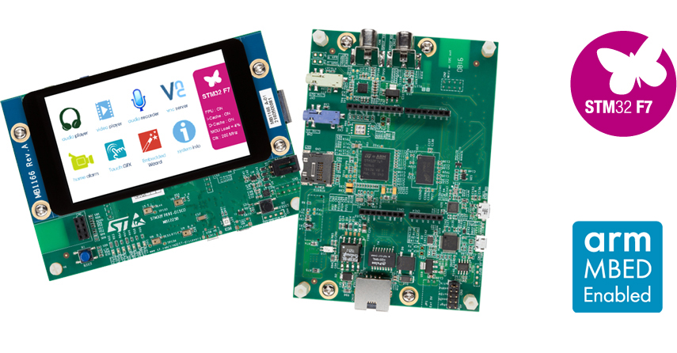

.. _stm32f769i_disco_board:

ST STM32F769I Discovery
#######################

Overview
********

The STM32F769 Discovery kit features an ARM Cortex-M4 based STM32F769NI MCU
with a wide range of connectivity support and configurations Here are
some highlights of the STM32F769I-DISCO board:

- STM32F769NIH6 microcontroller featuring 2 Mbytes of Flash memory and 512+16+4 Kbytes of RAM, in BGA216 package
- On-board ST-LINK/V2-1 supporting USB reenumeration capability
- USB ST-LINK functions: virtual COM port, mass storage, debug port
- 4" capacitive touch LCD display with MIPI |reg|  DSI connector (on STM32F769I-DISCO only)
- SAI audio codec
- Two audio line jacks, one for input and one for output
- Stereo speaker outputs
- Four ST MEMS microphones on DFSDM inputs
- Two SPDIF RCA input and output connectors
- Two push-buttons (user and reset)
- 512-Mbit Quad-SPI Flash memory
- 128-Mbit SDRAM
- Connector for microSD card
- Wi-Fi or Ext-EEP daughterboard connector
- USB OTG HS with Micro-AB connector
- Ethernet connector compliant with IEEE-802.3-2002
- Five power supply options:

       - ST LINK/V2-1
       - USB HS connector
       - 5 V from RJ45 (Power Over Ethernet)
       - 5 V from Arduino or external connector
       - USB charger

- Power Over Ethernet based on IEEE 802.3af (Powered Device, 48 V to 5 V, 3 W)
- Power supply output for external applications: 3.3 V or 5 V
- Arduino? Uno V3 connectors
- Comprehensive free software including a variety of examples, part of the STM32Cube package
- Supported by a wide choice of integrated development environments

More information about the board can be found at the `32F769IDISCOVERY website`_.

Hardware
********

STM32F769I-DISCO Discovery kit provides the following hardware components:

- ARM |reg| 32-bit Cortex |reg| -M7 CPU with DPFPU, ART Accelerator and L1-cache: 16 Kbytes I/D cache, allowing 0-wait state execution from embedded Flash and external memories, up to 216 MHz, MPU, 462 DMIPS/2.14 DMIPS/MHz (Dhrystone 2.1), and DSP instructions.
- Memories
       - Up to 2 Mbytes of Flash memory organized into two banks allowing read-while-write
       - SRAM: 512 Kbytes (including 128 Kbytes of data TCM RAM for critical real-time data) + 16 Kbytes of instruction TCM RAM (for critical real-time routines) + 4 Kbytes of backup SRAM
       - Flexible external memory controller with up to 32-bit data bus: SRAM, PSRAM, SDRAM/LPSDR SDRAM, NOR/NAND memories
- Dual mode Quad-SPI
- Graphics
       - Chrom-ART Accelerator (DMA2D), graphical hardware accelerator enabling enhanced graphical user interface
       - Hardware JPEG codec
       - LCD-TFT controller supporting up to XGA resolution
       - MIPI |reg| DSI host controller supporting up to 720p 30 Hz resolution
- Clock, reset and supply management
       - 1.7 V to 3.6 V application supply and I/Os
       - POR, PDR, PVD and BOR
       - Dedicated USB power
       - 4-to-26 MHz crystal oscillator
       - Internal 16 MHz factory-trimmed RC (1% accuracy)
       - 32 kHz oscillator for RTC with calibration
       - Internal 32 kHz RC with calibration
- Low-power
       - Sleep, Stop and Standby modes
       - VBAT supply for RTC, 32¡Á32 bit backup registers + 4 Kbytes backup SRAM
- 3¡Á12-bit, 2.4 MSPS ADC: up to 24 channels
- Digital filters for sigma delta modulator (DFSDM), 8 channels / 4 filters
- 2¡Á12-bit D/A converters
- General-purpose DMA: 16-stream DMA controller with FIFOs and burst support
- Up to 18 timers: up to thirteen 16-bit (1x low- power 16-bit timer available in Stop mode) and two 32-bit timers, each with up to 4 IC/OC/PWM or pulse counter and quadrature (incremental) encoder input. All 15 timers running up to 216 MHz. 2x watchdogs, SysTick timer
- Debug mode
       - SWD & JTAG interfaces
       - Cortex |reg| -M7 Trace Macrocell
- Up to 168 I/O ports with interrupt capability
       - Up to 164 fast I/Os up to 108 MHz
       - Up to 166 5 V-tolerant I/Os
- Up to 28 communication interfaces
       - Up to 4 I2 C interfaces (SMBus/PMBus)
       - Up to 4 USARTs/4 UARTs (12.5 Mbit/s, ISO7816 interface, LIN, IrDA, modem control)
       - Up to 6 SPIs (up to 54 Mbit/s), 3 with muxed simplex I2 S for audio
       - 2 x SAIs (serial audio interface)
       - 3 ¡Á CANs (2.0B Active) and 2x SDMMCs
       - SPDIFRX interface
       - HDMI-CEC
       - MDIO slave interface
- Advanced connectivity
       - USB 2.0 full-speed device/host/OTG controller with on-chip PHY
       - USB 2.0 high-speed/full-speed device/host/OTG controller with dedicated DMA, on-chip full-speed PHY and ULPI
       - 10/100 Ethernet MAC with dedicated DMA: supports IEEE 1588v2 hardware, MII/RMII
- 8- to 14-bit camera interface up to 54 Mbyte/s
- True random number generator
- CRC calculation unit
- RTC: subsecond accuracy, hardware calendar
- 96-bit unique ID

More information about STM32F769NI can be found here:
       - `STM32F769NI on www.st.com`_
       - `STM32F769 reference manual`_

Supported Features
==================

The Zephyr stm32f769i_disco board configuration supports the following hardware features:

+-----------+------------+-------------------------------------+
| Interface | Controller | Driver/Component                    |
+===========+============+=====================================+
| NVIC      | on-chip    | nested vector interrupt controller  |
+-----------+------------+-------------------------------------+
| UART      | on-chip    | serial port-polling;                |
|           |            | serial port-interrupt               |
+-----------+------------+-------------------------------------+
| PINMUX    | on-chip    | pinmux                              |
+-----------+------------+-------------------------------------+
| GPIO      | on-chip    | gpio                                |
+-----------+------------+-------------------------------------+
| PWM       | on-chip    | pwm                                 |
+-----------+------------+-------------------------------------+

Other hardware features are not yet supported on Zephyr porting.

The default configuration can be found in the defconfig file:

	``boards/arm/stm32f769i_disco/stm32f769i_disco_defconfig``

Pin Mapping
===========

STM32F769I-DISCO Discovery kit has 5 GPIO controllers. These controllers are responsible for pin muxing,
input/output, pull-up, etc.

For mode details please refer to `32F769IDISCOVERY board User Manual`_.

Default Zephyr Peripheral Mapping:
----------------------------------
- UART_1_TX : PA9
- UART_1_RX : PA10
- USER_PB : PA0
- LD1 : PJ13
- LD2 : PJ5

System Clock
============

STM32F769I-DISCO System Clock could be driven by internal or external oscillator,
as well as main PLL clock. By default System clock is driven by PLL clock at 216MHz,
driven by 25MHz high speed external clock.

Serial Port
===========

The STM32F769 Discovery kit has up to 8 UARTs. The Zephyr console output is assigned to UART1.
Default settings are 115200 8N1.

Programming and Debugging
*************************

Applications for the ``stm32f769i_disco`` board configuration can be built and
flashed in the usual way (see :ref:`build_an_application` and
:ref:`application_run` for more details).

Flashing
========

STM32F769I-DISCO Discovery kit includes an ST-LINK/V2 embedded debug tool interface.
This interface is supported by the openocd version included in Zephyr SDK.

Flashing an application to STM32F769I-DISCO
-------------------------------------------

First, connect the STM32F769I-DISCO Discovery kit to your host computer using
the USB port to prepare it for flashing. Then build and flash your application.

Here is an example for the :ref:`hello_world` application.

.. zephyr-app-commands::
   :zephyr-app: samples/hello_world
   :board: stm32f769i_disco
   :goals: build flash

Run a serial host program to connect with your board:

.. code-block:: console

   $ minicom -D /dev/ttyACM0

You should see the following message on the console:

.. code-block:: console

   Hello World! arm

Debugging
=========

You can debug an application in the usual way.  Here is an example for the
:ref:`hello_world` application.

.. zephyr-app-commands::
   :zephyr-app: samples/hello_world
   :board: stm32f769i_disco
   :goals: debug

.. _32F769IDISCOVERY website:
   http://www.st.com/en/evaluation-tools/32f769idiscovery.html

.. _32F769IDISCOVERY board User Manual:
   http://www.st.com/resource/en/user_manual/dm00276577.pdf

.. _STM32F769NI on www.st.com:
   http://www.st.com/en/microcontrollers/stm32f769ni.html

.. _STM32F769 reference manual:
   http://www.st.com/resource/en/reference_manual/dm00224583.pdf
