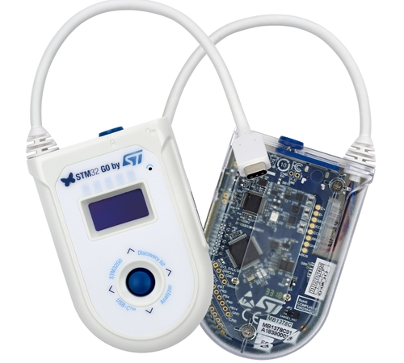

.. _stm32g071b_disco_board:

ST STM32G071B Discovery
#######################

Overview
********
The STM32G071B-DISCO Discovery board is a demonstration and development platform
for the STMicroelectronics Arm® Cortex® -M0+ core-based STM32G071RB USB Type-C™
and Power Delivery microcontroller. The STM32G071B-DISCO Discovery board is
presented with all necessary interfaces for easy connection and
interoperability with other USB Type-C™ devices. The STM32G071B-DISCO Discovery
board is intended for discovery and display of USB Type-C™ port characteristics
such as data role, power role, VBUS and IBUS monitoring. It offers an advanced
user mode when associated with the STM32CubeMonUCPD software GUI and can be used
as a USB Type-C™ and Power Delivery analyzer.

- STM32G071RBT6 microcontroller featuring 128 Kbytes of Flash memory and
  32 Kbytes of RAM in LQFP64 package
- Plastic case
- 1” 128 x 64 pixels OLED LCD module with SPI interface
- USB Type-C™ interface plug cable and receptacle connector accessible by door
  with reed sensor detection
- 3 bidirectional current and power monitors with I2C interface to measure VBUS,
  CC1 and CC2 protected and isolated lines
- On-board DC/DC converter to sustain power supply with VBUS varying from 3 V to
  20 V (+/- 5 %)
- 4 user status LEDs about USB Type-C™ configuration
- 3 LEDs for power and ST-LINK communication
- 4-way joystick with selection button
- 1 reset push-button
- Board external connectors:
    - USB Type-C™ plug cable
    - USB Type-C™ receptacle connector
    - 8-pin user extension connector including ADC, SPI, USART and
      I2C communication signals
    - USB with Micro-AB (ST-LINK)
- Board internal connectors:
    - 2 x 8-pin GPIOs free pins from microcontroller
	  (accessible internally when case is removed)
    - USB Type-C™ test points for main signals
- Flexible power-supply options: ST-LINK USB VBUS or USB Type-C™ VBUS
- On-board ST-LINK/V2-1 debugger/programmer with USB enumeration capability:
  mass storage, Virtual COM port and debug port

More information about the board can be found at the `STM32G071B-DISCO website`_.

More information about STM32G071RB can be found here:
- `G071RB on www.st.com`_
- `STM32G071 reference manual`_

Supported Features
==================

The Zephyr stm32g071b_disco board configuration supports the following hardware features:

+-----------+------------+-------------------------------------+
| Interface | Controller | Driver/Component                    |
+===========+============+=====================================+
| NVIC      | on-chip    | nested vector interrupt controller  |
+-----------+------------+-------------------------------------+
| UART      | on-chip    | serial port-polling;                |
|           |            | serial port-interrupt               |
+-----------+------------+-------------------------------------+
| I2C       | on-chip    | i2c                                 |
+-----------+------------+-------------------------------------+
| UCPD      | on-chip    | ucpd                                |
+-----------+------------+-------------------------------------+
| GPIO      | on-chip    | gpio                                |
+-----------+------------+-------------------------------------+
| WATCHDOG  | on-chip    | independent watchdog                |
+-----------+------------+-------------------------------------+

Other hardware features are not yet supported in this Zephyr port.

The default configuration can be found in the defconfig file:
``boards/arm/stm32g071b_disco/stm32g071b_disco_defconfig``

Connections and IOs
===================

Each of the GPIO pins can be configured by software as output (push-pull or open-drain), as
input (with or without pull-up or pull-down), or as peripheral alternate function. Most of the
GPIO pins are shared with digital or analog alternate functions. All GPIOs are high current
capable except for analog inputs.

Default Zephyr Peripheral Mapping:
----------------------------------

- UART_3 TX/RX       : PC10/PC11 (ST-Link Virtual Port Com)
- UCPD1              : PA8/PB15
- BUTTON (JOY_SEL)   : PC0
- BUTTON (JOY_LEFT)  : PC1
- BUTTON (JOY_DOWN)  : PC2
- BUTTON (JOY_RIGHT) : PC3
- BUTTON (JOY_UP)    : PC4
- LED (TO_REC)       : PD9
- LED (TO_PLUG)      : PD8
- LED (SINK_SPY)     : PD5
- LED (SOURCE)       : PC12
- ENCC1              : PB10 (Enable CC1)
- ENCC2              : PB11 (Enable CC2)
- RDCC1              : PB12 (Enable Door Sense on CC1)

For mode details please refer to `STM32G0 Discovery board User Manual`_.

Programming and Debugging
*************************

Applications for the ``stm32g071b_disco`` board configuration can be built and
flashed in the usual way (see :ref:`build_an_application` and
:ref:`application_run` for more details).

Flashing
========

The STM32G071B Discovery board includes an ST-LINK/V2-1 embedded debug tool interface.

.. code-block:: console

   $ west flash

Flashing an application to the STM32G071B_DISCO
-----------------------------------------------

Here is an example for the :ref:`blinky-sample` application.

.. zephyr-app-commands::
   :zephyr-app: samples/basic/blinky
   :board: stm32g071b_disco
   :goals: build flash

You will see the LED blinking every second.

Debugging
=========

You can debug an application in the usual way.  Here is an example for the
:ref:`hello_world` application.

.. zephyr-app-commands::
   :zephyr-app: samples/hello_world
   :board: stm32g071b_disco
   :maybe-skip-config:
   :goals: debug

References
**********

.. target-notes::

.. _STM32G071B-DISCO website:
   https://www.st.com/en/evaluation-tools/stm32g071b-disco.html

.. _STM32G071 reference manual:
   http://www.st.com/resource/en/reference_manual/dm00371828.pdf

.. _STM32G0 Discovery board User Manual:
   https://www.st.com/resource/en/user_manual/dm00496511.pdf

.. _G071RB on www.st.com:
   http://www.st.com/en/microcontrollers/stm32g071rb.html
