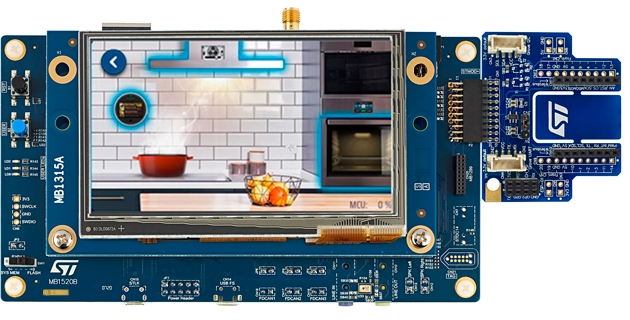

.. _stm32h735g_disco_board:

ST STM32H735G Discovery
#######################

Overview
********

The STM32H735G-DK Discovery kit is a complete demonstration and development
platform for Arm® Cortex®-M7 core-based STM32H735IGK6U microcontroller, with
1 Mbyte of Flash memory and 564 Kbytes of SRAM.

The STM32H735G-DK Discovery kit is used as a reference design for user
application development before porting to the final product, thus simplifying
the application development.

The full range of hardware features available on the board helps users to enhance
their application development by an evaluation of all the peripherals (such as
USB OTG FS, Ethernet, microSD™ card, USART, CAN FD, SAI audio DAC stereo with
audio jack input and output, MEMS digital microphone, HyperRAM™,
Octo-SPI Flash memory, RGB interface LCD with capacitive touch panel, and others).
ARDUINO® Uno V3, Pmod™ and STMod+ connectors provide easy connection to extension
shields or daughterboards for specific applications.

STLINK-V3E is integrated into the board, as the embedded in-circuit debugger and
programmer for the STM32 MCU and USB Virtual COM port bridge. STM32H735G-DK board
comes with the STM32CubeH7 MCU Package, which provides an STM32 comprehensive
software HAL library as well as various software examples.

More information about the board can be found at the `STM32H735G-DISCO website`_.
More information about STM32H735 can be found here:

- `STM32H725/735 on www.st.com`_
- `STM32H735xx reference manual`_
- `STM32H735xx datasheet`_

Supported Features
==================

The current Zephyr stm32h735g_disco board configuration supports the following hardware features:

+-----------+------------+-------------------------------------+
| Interface | Controller | Driver/Component                    |
+===========+============+=====================================+
| NVIC      | on-chip    | nested vector interrupt controller  |
+-----------+------------+-------------------------------------+
| UART      | on-chip    | serial port-polling;                |
|           |            | serial port-interrupt               |
+-----------+------------+-------------------------------------+
| PINMUX    | on-chip    | pinmux                              |
+-----------+------------+-------------------------------------+
| GPIO      | on-chip    | gpio                                |
+-----------+------------+-------------------------------------+
| FLASH     | on-chip    | flash memory                        |
+-----------+------------+-------------------------------------+
| ETHERNET  | on-chip    | ethernet                            |
+-----------+------------+-------------------------------------+
| RNG       | on-chip    | True Random number generator        |
+-----------+------------+-------------------------------------+
| FMC       | on-chip    | memc (SDRAM)                        |
+-----------+------------+-------------------------------------+

Other hardware features are not yet supported on Zephyr porting.

The default configuration per core can be found in the defconfig file:
``boards/arm/stm32h735g_disco/stm32h735g_disco_defconfig``

Pin Mapping
===========

For mode details please refer to `STM32H735G-DISCO website`_.

Default Zephyr Peripheral Mapping:
----------------------------------

- UART_3 TX/RX : PD8/PD9 (ST-Link Virtual Port Com)
- UART_7 TX/RX : PF7/PF6 (Arduino Serial)
- LD1 : PC2
- LD2 : PC3

System Clock
============

The STM32H735G System Clock can be driven by an internal or external oscillator,
as well as by the main PLL clock. By default, the System clock
is driven by the PLL clock at 550MHz. PLL clock is feed by a 25MHz high speed external clock.

Serial Port
===========

The STM32H735G Discovery kit has up to 6 UARTs.
The Zephyr console output is assigned to UART3 which connected to the onboard ST-LINK/V3.0. Virtual
COM port interface. Default communication settings are 115200 8N1.

Programming and Debugging
*************************

See :ref:`build_an_application` for more information about application builds.

Flashing
========

Flashing operation will depend on the target to be flashed and the SoC
option bytes configuration.
It is advised to use `STM32CubeProgrammer`_ to check and update option bytes
configuration and flash the ``stm32h735g_disco`` target.

Debugging
=========

You can debug an application in the usual way.  Here is an example for the
:ref:`hello_world` application.

.. zephyr-app-commands::
   :zephyr-app: samples/hello_world
   :board: stm32h735g_disco
   :goals: debug

.. _STM32H735G-DISCO website:
   https://www.st.com/en/evaluation-tools/stm32h735g-dk.html

.. _STM32H725/735 on www.st.com:
   https://www.st.com/en/microcontrollers-microprocessors/stm32h725-735.html

.. _STM32H735xx reference manual:
   https://www.st.com/resource/en/reference_manual/dm00603761-stm32h723733-stm32h725735-and-stm32h730-value-line-advanced-armbased-32bit-mcus-stmicroelectronics.pdf

.. _STM32H735xx datasheet:
   https://www.st.com/resource/en/datasheet/stm32h735ag.pdf

.. _STM32CubeProgrammer:
   https://www.st.com/en/development-tools/stm32cubeprog.html
