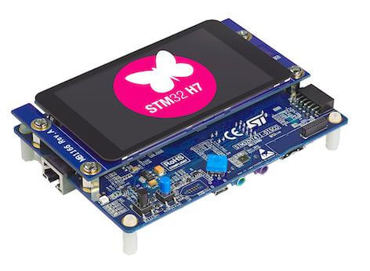
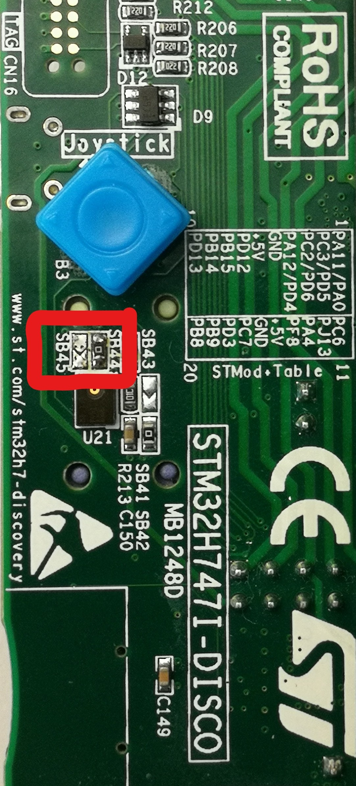
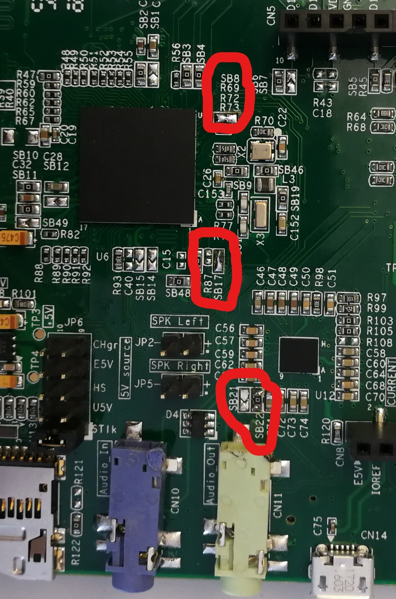

.. _stm32h747i_disco_board:

ST STM32H747I Discovery
#######################

Overview
********

The discovery kit enables a wide diversity of applications taking benefit
from audio, multi-sensor support, graphics, security, video,
and high-speed connectivity features.

The board includes an STM32H747XI SoC with a high-performance DSP, Arm Cortex-M7 + Cortex-M4 MCU,
with 2MBytes of Flash memory, 1MB RAM, 480 MHz CPU, Art Accelerator, L1 cache, external memory interface,
large set of peripherals, SMPS, and MIPI-DSI.

Additionally, the board features:

- On-board ST-LINK/V3E supporting USB reenumeration capability
- USB ST-LINK functions: virtual COM port, mass storage, debug port
- Flexible power-supply options:

  - ST-LINK USB VBUS, USB OTG HS connector, or external sources

- 4” capacitive touch LCD display module with MIPI® DSI interface
- Ethernet compliant with IEEE802.3-2002
- USB OTG HS
- Stereo speaker outputs
- ST-MEMS digital microphones
- 256-Mbit SDRAM
- 4 color user LEDs
- 1 user and reset push-button
- 4-direction joystick with selection button
- Arduino Uno V3 connectors



More information about the board can be found at the `STM32H747I-DISCO website`_.
More information about STM32H747XIH6 can be found here:

- `STM32H747XI on www.st.com`_
- `STM32H747xx reference manual`_
- `STM32H747xx datasheet`_

Supported Features
==================

The current Zephyr stm32h747i_disco board configuration supports the following hardware features:

+-----------+------------+-------------------------------------+
| Interface | Controller | Driver/Component                    |
+===========+============+=====================================+
| NVIC      | on-chip    | nested vector interrupt controller  |
+-----------+------------+-------------------------------------+
| UART      | on-chip    | serial port-polling;                |
|           |            | serial port-interrupt               |
+-----------+------------+-------------------------------------+
| PINMUX    | on-chip    | pinmux                              |
+-----------+------------+-------------------------------------+
| GPIO      | on-chip    | gpio                                |
+-----------+------------+-------------------------------------+
| ETHERNET  | on-chip    | ethernet  (*)                       |
+-----------+------------+-------------------------------------+
| RNG       | on-chip    | True Random number generator        |
+-----------+------------+-------------------------------------+
| FMC       | on-chip    | memc (SDRAM)                        |
+-----------+------------+-------------------------------------+

(*) From UM2411 Rev 4:
   With the default setting, the Ethernet feature is not working because of
   a conflict between ETH_MDC and SAI4_D1 of the MEMs digital microphone.
   Make sure you have SB8 closed and SB21 open to get Ethernet working.

Other hardware features are not yet supported on Zephyr porting.

The default configuration per core can be found in the defconfig files:
``boards/arm/stm32h747i_disco/stm32h747i_disco_defconfig_m7`` and
``boards/arm/stm32h747i_disco/stm32h747i_disco_defconfig_m4``

Pin Mapping
===========

STM32H747I Discovery kit has 9 GPIO controllers. These controllers are responsible for pin muxing,
input/output, pull-up, etc.

For mode details please refer to `STM32H747I-DISCO website`_.

Default Zephyr Peripheral Mapping:
----------------------------------

- UART_1 TX/RX : PA9/PA10 (ST-Link Virtual Port Com)
- UART_8 TX/RX : PJ8/PJ9 (Arduino Serial)
- LD1 : PI12
- LD2 : PI13
- LD3 : PI14
- LD4 : PI15
- W-UP : PC13
- J-CENTER : PK2
- J-DOWN : PK3
- J-LEFT : PK4
- J-RIGHT : PK5
- J-UP : PK6

System Clock
============

The STM32H747I System Clock can be driven by an internal or external oscillator,
as well as by the main PLL clock. By default, the CPU1 (Cortex-M7) System clock
is driven by the PLL clock at 400MHz, and the CPU2 (Cortex-M4) System clock
is driven at 200MHz. PLL clock is feed by a 25MHz high speed external clock.

Serial Port
===========

The STM32H747I Discovery kit has up to 8 UARTs.
Default configuration assigns USART1 and UART8 to the CPU1. The Zephyr console
output is assigned to UART1 which connected to the onboard ST-LINK/V3.0. Virtual
COM port interface. Default communication settings are 115200 8N1.

Ethernet
========

**Disclaimer:** This section is mostly copy-paste of corresponding
`DISCO_H747I modifications for Ethernet`_ mbed blog post. The author of this
article sincerely allowed to use the images and his knowledge about necessary
HW modifications to get Ethernet working with this board.

To get Ethernet working following HW modifications are required:

- **SB21**, **SB45** and **R87** should be opened
- **SB22**, **SB44**, **SB17** and **SB8** should be closed

Following two images shows necessary changes on the board marked:





Resources sharing
=================

The dual core nature of STM32H747 SoC requires sharing HW resources between the
two cores. This is done in 3 ways:

- **Compilation**: Clock configuration is only accessible to M7 core. M4 core only
  has access to bus clock activation and deactivation.
- **Static pre-compilation assignment**: Peripherals such as a UART are assigned in
  devicetree before compilation. The user must ensure peripherals are not assigned
  to both cores at the same time.
- **Run time protection**: Interrupt-controller and GPIO configurations could be
  accessed by both cores at run time. Accesses are protected by a hardware semaphore
  to avoid potential concurrent access issues.

Programming and Debugging
*************************

Applications for the ``stm32h747i_disco`` board should be built per core target,
using either ``stm32h747i_disco_m7`` or ```stm32h747i_disco_m4`` as the target.
See :ref:`build_an_application` for more information about application builds.

.. note::

   If using OpenOCD you will need a recent development version as the last
   official release does not support H7 dualcore yet.
   Also, with OpenOCD, sometimes, flashing is not working. It is necessary to
   erase the flash (with STM32CubeProgrammer for example) to make it work again.
   Debugging with OpenOCD is currently working for this board only with Cortex M7,
   not Cortex M4.


Flashing
========

Flashing operation will depend on the target to be flashed and the SoC
option bytes configuration.
It is advised to use `STM32CubeProgrammer`_ to check and update option bytes
configuration and flash ``stm32h747i_disco_m7`` and ``stm32h747i_disco_m4`` targets.

By default:

  - CPU1 (Cortex-M7) boot address is set to 0x80000000 (OB: BOOT_CM7_ADD0)
  - CPU2 (Cortex-M4) boot address is set to 0x81000000 (OB: BOOT_CM4_ADD0)

Also, default out of the box board configuration enables CM7 and CM4 boot when
board is powered (Option bytes BCM7 and BCM4 are checked).
It is possible to change Option Bytes so that CM7 boots first in stand alone,
and CM7 will wakeup CM4 after clock initialization.
Drivers are able to take into account both Option Bytes configurations
automatically.

Zephyr flash configuration has been set to meet these default settings.

Flashing an application to STM32H747I M7 Core
---------------------------------------------

First, connect the STM32H747I Discovery kit to your host computer using
the USB port to prepare it for flashing. Then build and flash your application.

Here is an example for the :ref:`hello_world` application.

.. zephyr-app-commands::
   :zephyr-app: samples/hello_world
   :board: stm32h747i_disco_m7
   :goals: build

Use the following commands to flash either m7 or m4 target:

.. code-block:: console

   $ ./STM32_Programmer_CLI -c port=SWD mode=UR -w <path_to_m7_binary>  0x8000000
   $ ./STM32_Programmer_CLI -c port=SWD mode=UR -w <path_to_m4_binary>  0x8100000

Alternatively it is possible to flash with OpenOcd but with some restrictions:
Sometimes, flashing is not working. It is necessary to erase the flash
(with STM32CubeProgrammer for example) to make it work again.
Debugging with OpenOCD is currently working for this board only with Cortex M7,
not Cortex M4.

.. zephyr-app-commands::
   :zephyr-app: samples/hello_world
   :board: stm32h747i_disco_m7
   :goals: build flash

Run a serial host program to connect with your board:

.. code-block:: console

   $ minicom -D /dev/ttyACM0

You should see the following message on the console:

.. code-block:: console

   Hello World! stm32h747i_disco_m7

Debugging
=========

You can debug an application in the usual way.  Here is an example for the
:ref:`hello_world` application.

.. zephyr-app-commands::
   :zephyr-app: samples/hello_world
   :board: stm32h747i_disco_m7
   :goals: debug


.. _STM32H747I-DISCO website:
   http://www.st.com/en/evaluation-tools/stm32h747i-disco.html

.. _STM32H747XI on www.st.com:
   https://www.st.com/content/st_com/en/products/microcontrollers-microprocessors/stm32-32-bit-arm-cortex-mcus/stm32-high-performance-mcus/stm32h7-series/stm32h747-757/stm32h747xi.html

.. _STM32H747xx reference manual:
   http://www.st.com/resource/en/reference_manual/dm00176879.pdf

.. _STM32H747xx datasheet:
   https://www.st.com/resource/en/datasheet/stm32h747xi.pdf

.. _STM32CubeProgrammer:
   https://www.st.com/en/development-tools/stm32cubeprog.html

.. _DISCO_H747I modifications for Ethernet:
   https://os.mbed.com/teams/ST/wiki/DISCO_H747I-modifications-for-Ethernet
