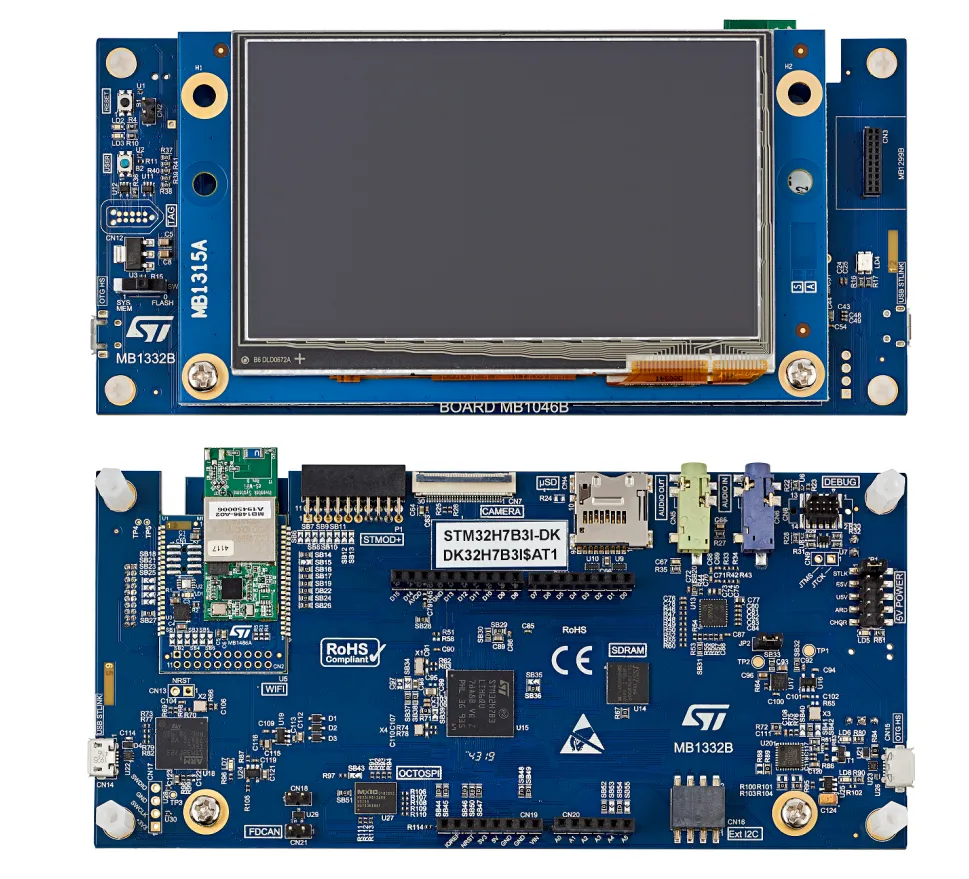

.. _stm32h7b3i_dk_board:

ST STM32H7B3I Discovery Kit
###########################

Overview
********

The STM32H7B3I-DK Discovery kit is a complete demonstration and development
platform for STMicroelectronics Arm® Cortex®-M7 core-based STM32H7B3LIH6QU
microcontroller.

The STM32H7B3I-DK Discovery kit is used as a reference design for user
application development before porting to the final product, thus simplifying
the application development.

The full range of hardware features available on the board helps users enhance
their application development by an evaluation of almost all peripherals (such as
USB OTG_HS, microSD, USART, FDCAN, audio DAC stereo with audio jack input and output,
camera, SDRAM, Octo-SPI Flash memory and RGB interface LCD with capacitive touch
panel). ARDUINO® Uno V3 connectors provide easy connection to extension shields or
daughterboards for specific applications.

STLINK-V3E is integrated into the board, as an embedded in-circuit debugger and
programmer for the STM32 MCU and the USB Virtual COM port bridge. The STM32H7B3I-DK
board comes with the STM32CubeH7 MCU Package, which provides an STM32 comprehensive
software HAL library as well as various software examples.

More information about the board can be found at the `STM32H7B3I-DK website`_.
More information about STM32H7B3 can be found here:

- `STM32H7A3/7B3 on www.st.com`_
- `STM32H7A3/7B3/7B0 reference manual`_
- `STM32H7B3xI datasheet`_

Supported Features
==================

The current Zephyr stm32h7b3i_dk board configuration supports the following hardware features:

+-----------+------------+-------------------------------------+
| Interface | Controller | Driver/Component                    |
+===========+============+=====================================+
| NVIC      | on-chip    | nested vector interrupt controller  |
+-----------+------------+-------------------------------------+
| UART      | on-chip    | serial port-polling;                |
|           |            | serial port-interrupt               |
+-----------+------------+-------------------------------------+
| PINMUX    | on-chip    | pinmux                              |
+-----------+------------+-------------------------------------+
| GPIO      | on-chip    | gpio                                |
+-----------+------------+-------------------------------------+
| I2C       | on-chip    | i2c                                 |
+-----------+------------+-------------------------------------+
| FLASH     | on-chip    | flash memory                        |
+-----------+------------+-------------------------------------+
| FMC       | on-chip    | memc (SDRAM)                        |
+-----------+------------+-------------------------------------+
| LTDC      | on-chip    | display                             |
+-----------+------------+-------------------------------------+
| CANFD     | on-chip    | can                                 |
+-----------+------------+-------------------------------------+

Other hardware features have not been enabled yet for this board.

The default configuration per core can be found in the defconfig file:
``boards/arm/stm32h7b3i_dk/stm32h7b3i_dk_defconfig``

Pin Mapping
===========

For mode details please refer to `STM32H7B3I-DK website`_.

Default Zephyr Peripheral Mapping:
----------------------------------

- UART_1 TX/RX : PA9/PA10 (ST-Link Virtual Port Com)
- UART_4 TX/RX : PH13/PH14 (Arduino Serial)
- I2C4 SCL/SDA : PD12/PD13 (Arduino I2C, Touchscreen FT5336 with PH2 Interrupt Pin)
- SPI2 SCK/MISO/MOSI/NSS : PA12/PB14/PB15/PI0 (Arduino SPI)
- LD1 : PG11
- LD2 : PG2
- USER_PB : PC13
- SDMMC D0/D1/D2/D3/CK/CMD/CD : PC8/PC9/PC10/PC11/PC12/PD2/PI8
- CANFD RX/TX/WAKE [#]_ : PA11/PA12/PH8
- FMC SDRAM :

    - D0-D15 : PD14/PD15/PD0/PD1/PE7/PE8/PE9/PE10/PE11/PE12/PE13/PE14/PE15/PD8/PD9/PD10
    - A0-A11 : PF0/PF1/PF2/PF3/PF4/PF5/PF12/PF13/PF14/PF15/PG0/PG1
    - A14/A15 : PG4/PG5
    - SDNRAS/SDNCAS : PF11/PG15
    - NBL0/NBL1 : PE0/PE1
    - SDCLK/SDNWE/SDCKE1/SDNE1 : PG8/PH5/PH7/PH6

- LTDC :

    - R0-R7 : PI15/PJ0/PJ1/PJ2/PJ3/PJ4/PJ5/PJ6
    - G0-G7 : PJ7/PJ8/PJ9/PJ10/PJ11/PK0/PK1/PK2
    - B0-B7 : PJ12/PK13/PJ14/PJ15/PK3/PK4/PK5/PK6
    - DE/CLK/HSYNC/VSYNC : PK7/PI14/PI12/PI13

System Clock
============

The STM32H7B3I System Clock can be driven by an internal or external oscillator,
as well as by the main PLL clock. By default, the System clock is driven
by the PLL clock at 280MHz. PLL clock is fed by a 24MHz high speed external clock.

Serial Port
===========

The STM32H7B3I Discovery kit has up to 8 UARTs.
The Zephyr console output is assigned to UART1 which connected to the onboard
ST-LINK/V3.0. Virtual COM port interface. Default communication settings are
115200 8N1.

Programming and Debugging
*************************

See :ref:`build_an_application` for more information about application builds.

Flashing
========

Flashing operation will depend on the target to be flashed and the SoC
option bytes configuration.
It is advised to use `STM32CubeProgrammer`_ to check and update option bytes
configuration and flash the ``stm32h7b3i_dk`` target.

Debugging
=========

You can debug an application in the usual way.  Here is an example for the
:ref:`hello_world` application.

.. zephyr-app-commands::
   :zephyr-app: samples/hello_world
   :board: stm32h7b3i_dk
   :goals: debug

.. _STM32H7B3I-DK website:
   https://www.st.com/en/evaluation-tools/stm32h7b3i-dk.html

.. _STM32H7A3/7B3 on www.st.com:
   https://www.st.com/en/microcontrollers-microprocessors/stm32h7a3-7b3.html

.. _STM32H7A3/7B3/7B0 reference manual:
   https://www.st.com/resource/en/reference_manual/rm0455-stm32h7a37b3-and-stm32h7b0-value-line-advanced-armbased-32bit-mcus-stmicroelectronics.pdf

.. _STM32H7B3xI datasheet:
   https://www.st.com/resource/en/datasheet/stm32h7b3ai.pdf

.. _STM32CubeProgrammer:
   https://www.st.com/en/development-tools/stm32cubeprog.html

.. _STM32H7B3I_DK board schematics:
   https://www.st.com/resource/en/schematic_pack/mb1332-h7b3i-c02_schematic.pdf

.. [#] To use CAN, solder bridges SB3, SB4 and SB5 need to be connected.
       Take note that CANFD pins are shared with STMOD+ connector (P1), so please check
       `STM32H7B3I_DK board schematics`_ for possible collisions if using that connector.
