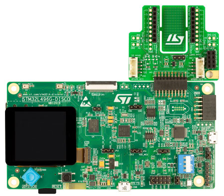

.. _stm32l496g_disco_board:

ST STM32L496G Discovery
########################

Overview
********

The STM32L496G Discovery board features an ARM Cortex-M4 based STM32L496AG MCU
with a wide range of connectivity support and configurations. Here are
some highlights of the STM32L496G Discovery board:

- STM32L496AGI6 microcontroller featuring 1 Mbyte of Flash memory and 320 Kbytes of RAM in an UFBGA169 package
- 1.54 inch 240 x 240 pixel-TFT color LCD with parallel interface
- SAI Audio CODEC, with a stereo headset jack, including analog microphone input
- Stereo digital MEMS microphones
- microSD card connector (card included)
- Camera 8 bit-connector
- 8 Mbit-PSRAM
- IDD measurement
- 64 Mbit-Quad-SPI Flash
- USB OTG FS with Micro-AB connector
- Two types of extension resources:

       - STMod+ and PMOD connectors
       - Compatible Arduino* Uno V3 connectors

- On-board ST-LINK/V2-1 debugger/programmer with SWD connector
- 5 source options for power supply

       - ST-LINK/V2-1 USB connector
       - User USB FS connector
       - VIN from Arduino connector
       - 5 V from Arduino connector
       - USB charger
       - USB VBUS or external source(3.3V, 5V, 7 - 12V)
       - Power management access point

- 8 LEDs
- Reset push button
- 4 direction-joystick with selection

More information about the board can be found at the `STM32L496G Discovery website`_.

Hardware
********

The STM32L496AG SoC provides the following hardware capabilities:

- Ultra-low-power with FlexPowerControl (down to 108 nA Standby mode and 91
  |micro| A/MHz run mode)
- Core: ARM |reg| 32-bit Cortex |reg| -M4 CPU with FPU, frequency up to 80 MHz,
  100DMIPS/1.25DMIPS/MHz (Dhrystone 2.1)
- Clock Sources:

        - 4 to 48 MHz crystal oscillator
        - 32 kHz crystal oscillator for RTC (LSE)
        - Internal 16 MHz factory-trimmed RC ( |plusminus| 1%)
        - Internal low-power 32 kHz RC ( |plusminus| 5%)
        - Internal multispeed 100 kHz to 48 MHz oscillator, auto-trimmed by
          LSE (better than |plusminus| 0.25 % accuracy)
        - Internal 48 MHz with clock recovery
        - 3 PLLs for system clock, USB, audio, ADC

- RTC with HW calendar, alarms and calibration
- LCD 8 x 40 or 4 x 44 with step-up converter
- Up to 24 capacitive sensing channels: support touchkey, linear and rotary touch sensors
- 16x timers:

        - 2x 16-bit advanced motor-control
        - 2x 32-bit and 5x 16-bit general purpose
        - 2x 16-bit basic
        - 2x low-power 16-bit timers (available in Stop mode)
        - 2x watchdogs
        - SysTick timer

- Up to 136 fast I/Os, most 5 V-tolerant, up to 14 I/Os with independent supply down to 1.08 V
- Memories

        - Up to 1 MB Flash, 2 banks read-while-write, proprietary code readout protection
        - 320 KB of SRAM including 64 KB with hardware parity check
        - External memory interface for static memories supporting SRAM, PSRAM, NOR, and NAND memories
        - Quad SPI memory interface

- 4x digital filters for sigma delta modulator
- Rich analog peripherals (independent supply)

        - 3x 12-bit ADC 5 MSPS, up to 16-bit with hardware oversampling, 200
          |micro| A/MSPS
        - 2x 12-bit DAC, low-power sample and hold
        - 2x operational amplifiers with built-in PGA
        - 2x ultra-low-power comparators

- 20x communication interfaces

        - USB OTG 2.0 full-speed, LPM and BCD
        - 2x SAIs (serial audio interface)
        - 4x I2C FM+(1 Mbit/s), SMBus/PMBus
        - 5x USARTs (ISO 7816, LIN, IrDA, modem)
        - 1x LPUART
        - 3x SPIs (4x SPIs with the Quad SPI)
        - 2x CAN (2.0B Active) and SDMMC interface
        - SWPMI single wire protocol master I/F
        - IRTIM (Infrared interface)

- 14-channel DMA controller
- True random number generator
- CRC calculation unit, 96-bit unique ID
- Development support: serial wire debug (SWD), JTAG, Embedded Trace Macrocell*

More information about STM32L496AG can be found here:
       - `STM32L496AG on www.st.com`_
       - `STM32L496 reference manual`_

Supported Features
==================

The Zephyr stm32l496g_disco board configuration supports the following hardware features:

+-----------+------------+-------------------------------------+
| Interface | Controller | Driver/Component                    |
+===========+============+=====================================+
| NVIC      | on-chip    | nested vector interrupt controller  |
+-----------+------------+-------------------------------------+
| UART      | on-chip    | serial port-polling;                |
|           |            | serial port-interrupt               |
+-----------+------------+-------------------------------------+
| PINMUX    | on-chip    | pinmux                              |
+-----------+------------+-------------------------------------+
| GPIO      | on-chip    | gpio                                |
+-----------+------------+-------------------------------------+
| I2C       | on-chip    | i2c                                 |
+-----------+------------+-------------------------------------+
| PWM       | on-chip    | pwm                                 |
+-----------+------------+-------------------------------------+

Other hardware features are not yet supported on this Zephyr port.

The default configuration can be found in the defconfig file:

	``boards/arm/stm32l496g_disco/stm32l496g_disco_defconfig``

Connections and IOs
===================

STM32L496G Discovery Board has 8 GPIO controllers. These controllers are responsible for pin muxing,
input/output, pull-up, etc.

For mode details please refer to `STM32L496G Discovery board User Manual`_.

Default Zephyr Peripheral Mapping:
----------------------------------

- UART_1_TX : PB6
- UART_1_RX : PG10
- UART_2_TX : PA2
- UART_2_RX : PD6
- I2C_1_SCL : PB8
- I2C_1_SDA : PB7
- PWM_2_CH1 : PA0
- LD2 : PB13

System Clock
------------

STM32L496G Discovery System Clock could be driven by internal or external oscillator,
as well as main PLL clock. By default System clock is driven by PLL clock at 80MHz,
driven by 16MHz high speed internal oscillator.

Serial Port
-----------

STM32L496G Discovery board has 5 U(S)ARTs. The Zephyr console output is assigned to UART2.
Default settings are 115200 8N1.

Programming and Debugging
*************************

Flashing
========

STM32L496G Discovery board includes an ST-LINK/V2-1 embedded debug tool interface.
This interface is not supported by the openocd version 0.9 included by the Zephyr SDK v0.9,
use openocd v0.10.0 from the openocd-stm32 project on GitHub to get the minimum set of scripts
needed to flash and debug STM32 development boards.

.. code-block:: console

   $ git clone  https://github.com/erwango/openocd-stm32.git

Then follow instructions in README.md

Flashing an application to STM32L496G Discovery
-----------------------------------------------

The sample application :ref:`hello_world` is being used in this tutorial:

To build the Zephyr kernel and application, enter:

.. code-block:: console

   $ cd <zephyr_root_path>
   $ source zephyr-env.sh
   $ cd $ZEPHYR_BASE/samples/hello_world/
   $ make BOARD=stm32l496g_disco

Connect the STM32L496G Discovery to your host computer using the USB port.
Then, enter the following command:

.. code-block:: console

   $ cd <openocd-stm32_path>
   $ stm32_flsh l4 $ZEPHYR_BASE/samples/hello_world/outdir/stm32l496g_disco/zephyr.bin

Run a serial host program to connect with your Discovery board.

.. code-block:: console

   $ minicom -D /dev/ttyACM0

You should see the following message:

.. code-block:: console

   $ Hello World! arm

Debugging
=========

Access gdb with the following make command:

.. code-block:: console

   $ cd <openocd-stm32_path>
   $ stm32_dbg l4 $ZEPHYR_BASE/samples/hello_world/outdir/stm32l496g_disco/zephyr.elf

.. _STM32L496G Discovery website:
   http://www.st.com/en/evaluation-tools/32l496gdiscovery.html

.. _STM32L496G Discovery board User Manual:
   http://www.st.com/resource/en/user_manual/dm00353127.pdf

.. _STM32L496AG on www.st.com:
   http://www.st.com/en/microcontrollers/stm32l496ag.html

.. _STM32L496 reference manual:
   http://www.st.com/resource/en/reference_manual/DM00083560.pdf
