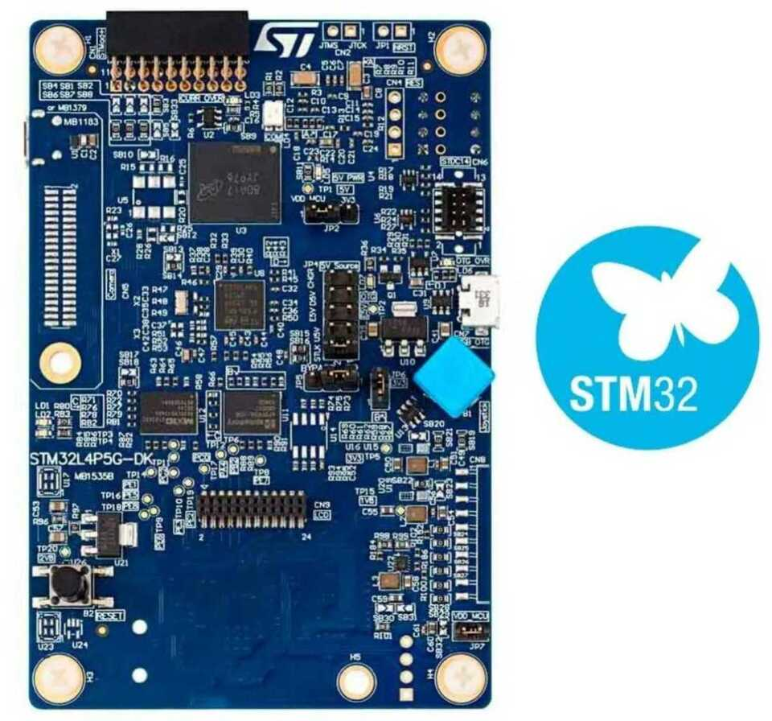

.. _stm32l4p5g_dk_board:

ST STM32L4P5G_DK Discovery kit
##############################

Overview
********

The STM32L4P5G_DK Discovery kit features an ARM Cortex-M4 based STM32L4P5AG MCU
with a wide range of connectivity support and configurations. Here are
some highlights of the STM32L4P5G_DK Discovery kit:

- STM32L4P5AG microcontroller featuring 1 Mbyte of Flash memory, 320 Kbytes of RAM in UFBGA169 package
- On-board ST-LINK/V3 supporting USB re-enumeration capability
- Three different interfaces supported on USB:

    - Virtual com port
    - Mass storage
    - Debug port

- ARDUINO ® Uno V3  and Pmod TM expansion connector
- 2 user LEDs
- one 4-direction joystick with a selection button (user)
- 1 push-buttons (reset)
- USB OTG FS with micro-AB connector
- 1 digital microphone (footprint only)
- 4-Gbyte onboard eMMC
- On-board current measurement
- SAI audio codec (footprint only)
- 512-Mbit Octo-SPI NOR Flash memory with DDR mode
- 64-Mbit Octo-SPI PSRAM memory with DDR mode
- On-board current measurement
- Camera (8-bit) (footprint only)
- 240x240 64-bit color LCD with RGB interface (connector only)
- Stereo headset jack (footprint only)

- Flexible power supply options:
    - ST-LINK/V3
    - USB FS connector
    - External 5 V

More information about the board can be found at the `STM32L4P5G_DK Discovery kit website`_.

Hardware
********

The STM32L4P5AG SoC provides the following hardware features:

- Ultra-low-power with FlexPowerControl (down to 130 nA Standby mode and 100 uA/MHz run mode)
- Core: ARM |reg| 32-bit Cortex |reg|-M4 CPU with FPU, frequency up to 120 MHz, 100DMIPS/1.25DMIPS/MHz (Dhrystone 2.1)
- Clock Sources:
    - 4-48 MHz crystal X3, for main clock generator (Footprint only)
    - 32 kHz crystal oscillator for RTC (LSE)
    - Internal 16 MHz factory-trimmed RC ( |plusminus| 1%)
    - Internal low-power 32 kHz RC ( |plusminus| 5%)
    - Internal multispeed 100 kHz to 48 MHz oscillator, auto-trimmed by
      LSE (better than  |plusminus| 0.25 % accuracy)
    - 3 PLLs for system clock, USB, audio, ADC
- RTC with HW calendar, alarms and calibration
- Up to 24 capacitive sensing channels: support touchkey, linear and rotary touch sensors
- 16x timers:
    - 2x 16-bit advanced control
    - 2x 32-bit and 5x 16-bit general purpose
    - 2x 16-bit basic
    - 2x low-power 16-bit timers (available in Stop mode)
    - 2x watchdogs
    - SysTick timer
- Up to 136 fast I/Os, most 5 V-tolerant
- Memories
    - Up to 1 MB Flash, 2 banks read-while-write, proprietary code readout protection
    - Up to 320 KB of SRAM including 64 KB with hardware parity check
    - External memory interface for static memories supporting SRAM, PSRAM, NOR and NAND memories
    - 2x Octo SPI memory interface
- Rich analog peripherals (independent supply)
    - 2x 12-bit ADC 5 MSPS, up to 16-bit with hardware oversampling, 200 uA/MSPS
    - 2x 12-bit DAC, low-power sample and hold
    - 2x operational amplifiers with built-in PGA
    - 2x ultra-low-power comparators
    - 2x digital filters for sigma delta modulator
    - 1x temperature sensor
- 23x communication interfaces
    - USB OTG 2.0 full-speed, LPM and BCD
    - 2x SAIs (serial audio interface)
    - 4x I2C FM+(1 Mbit/s), SMBus/PMBus
    - 6x USARTs (ISO 7816, LIN, IrDA, modem)
    - 3x SPIs (4x SPIs with the Quad SPI)
    - CAN (2.0B Active)
    - 2x SDMMC I/F
    - 8- to 14-bit camera interface up to 32 MHz (black and white) or 10 MHz (color)
    - 8-/16-bit parallel synchronous data input/output slave interface (PSSI)
- 14-channel DMA controller with multiplex request router
- True random number generator
- CRC calculation unit, 96-bit unique ID
- AES and HASH hardware accelerators
- Development support: serial wire debug (SWD), JTAG, Embedded Trace Macrocell |trade|

More information about STM32L4P5AG can be found here:
       - `STM32L4P5AG on www.st.com`_
       - `STM32L4P5 reference manual`_

Supported Features
==================

The Zephyr stm32l4p5g_dk board configuration supports the following hardware features:

+-----------+------------+-------------------------------------+
| Interface | Controller | Driver/Component                    |
+===========+============+=====================================+
| NVIC      | on-chip    | nested vector interrupt controller  |
+-----------+------------+-------------------------------------+
| UART      | on-chip    | serial port-polling;                |
|           |            | serial port-interrupt               |
+-----------+------------+-------------------------------------+
| PINMUX    | on-chip    | pinmux                              |
+-----------+------------+-------------------------------------+
| GPIO      | on-chip    | gpio                                |
+-----------+------------+-------------------------------------+
| I2C       | on-chip    | i2c                                 |
+-----------+------------+-------------------------------------+
| SPI       | on-chip    | spi                                 |
+-----------+------------+-------------------------------------+
| PWM       | on-chip    | pwm                                 |
+-----------+------------+-------------------------------------+
| WATCHDOG  | on-chip    | independent watchdog                |
+-----------+------------+-------------------------------------+

The default configuration can be found in the defconfig file:

	``boards/arm/stm32l4p5g_dk/stm32l4p5g_dk_defconfig``

Connections and IOs
===================

STM32L4P5G_DK Discovery kit has 9 GPIO controllers (from A to I). These controllers are responsible for pin muxing,
input/output, pull-up, etc.

For mode details please refer to `STM32L4P5G_DK board User Manual`_.

Default Zephyr Peripheral Mapping:
----------------------------------

- UART_2 TX/RX : PA2/PA3 (ST-Link Virtual Port Com)
- UART_3 TX/RX : PB10/PB11 (Arduino Serial)
- I2C4 SCL/SDA : PF14/PF15 (Arduino I2C)
- SPI12 NSS/SCK/MISO/MOSI : PI10/PB13/PB14/PB15 (Arduino SPI)
- PWM_4_CH2 : PD13
- LD1 : PG13
- LD2 : PG14
- JOY_SEL (user button) : PC13
- JOY_DOWN : PI9
- JOY_RIGHT : PI10
- JOY_LEFT : PI11
- JOY_UP : PI8

System Clock
------------

STM32L4P5G_DK Discovery System Clock could be driven by an internal or external oscillator,
as well as the main PLL clock. By default the System clock is driven by the PLL clock at 120MHz,
driven by 16MHz high speed internal oscillator.

Serial Port
-----------

STM32L4P5G_DK Discovery kit has 4 U(S)ARTs. The Zephyr console output is assigned to UART2.
Default settings are 115200 8N1.

Programming and Debugging
*************************

Flashing
========

STM32L4P5G_DK Discovery kit includes an ST-LINK/V3 embedded debug tool interface.
This interface is supported by the openocd version included in Zephyr SDK.

Flashing an application to STM32L4P5G_DK Discovery kit
------------------------------------------------------

Connect the STM32L4P5G_DK Discovery kit to your host computer using the USB
port, then run a serial host program to connect with your Discovery
board. For example:

.. code-block:: console

   $ minicom -D /dev/ttyACM0

Then, build and flash in the usual way. Here is an example for the
:ref:`hello_world` application.

.. zephyr-app-commands::
   :zephyr-app: samples/hello_world
   :board: stm32l4p5g_dk
   :goals: build flash

You should see the following message on the console:

.. code-block:: console

   Hello World! arm

Debugging
=========

You can debug an application in the usual way.  Here is an example for the
:ref:`hello_world` application.

.. zephyr-app-commands::
   :zephyr-app: samples/hello_world
   :board: stm32l4p5g_dk
   :maybe-skip-config:
   :goals: debug

.. _STM32L4P5G_DK Discovery kit website:
   https://www.st.com/en/evaluation-tools/stm32l4p5g_dk.html

.. _STM32L4P5G_DK board User Manual:
   https://www.st.com/resource/en/user_manual/DM00665471.pdf

.. _STM32L4P5AG on www.st.com:
   https://www.st.com/en/microcontrollers-microprocessors/stm32l4p5ag.html

.. _STM32L4P5 reference manual:
   https://www.st.com/resource/en/reference_manual/dm00310109.pdf
