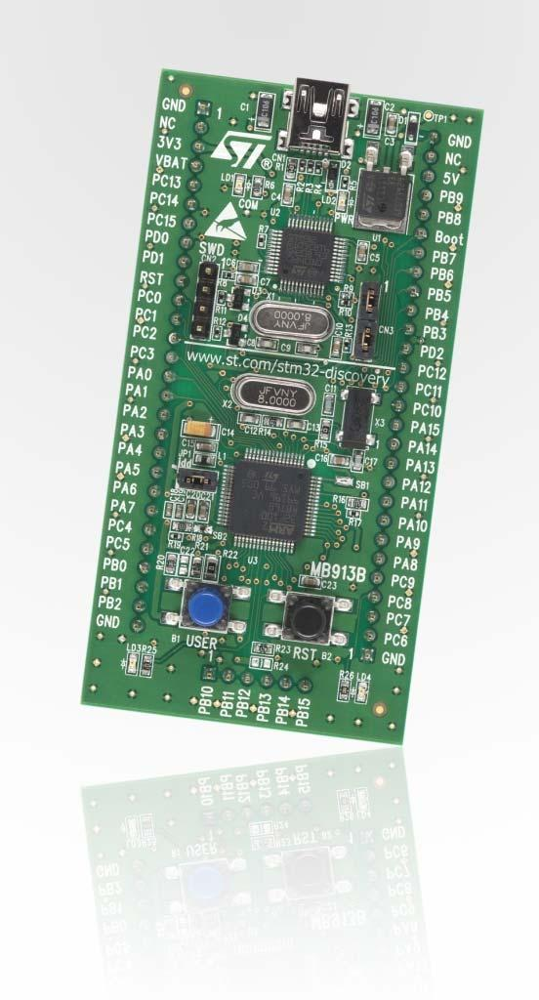

.. _stm32vl_disco_board:

ST STM32VL Discovery
####################

Overview
********

The STM32 Discovery series comes in many varieties, in this case the "Value
Line" STM32F100x SoC series is showcased. Like other Discovery board, an
integrated ST-LINK debugger and programmer is included (V1), but the only
included I/O devices are two user LEDs and one user button.

More information about the board can be found at the `STM32VLDISCOVERY website`_.

Hardware
********

The STM32 Discovery board features:

- On-board ST-LINK/V1 with selection mode switch to use the kit as a standalone
  ST-LINK/V1 (with SWD connector for programming and debugging)
- Board power supply: through USB bus or from an external 5 V supply voltage
- External application power supply: 3 V and 5 V
- Four LEDs:

    - LD1 (red) for 3.3 V power on
    - LD2 (red/green) for USB communication
    - LD3 (green) for PC9 output
    - LD4 (blue) for PC8 output
- Two push buttons (user and reset)
- Extension header for all LQFP64 I/Os for quick connection to prototyping board
  and easy probing

More information about the STM32F100x can be found in the
`STM32F100x reference manual`_ and the `STM32F100x data sheet`_.

Supported Features
==================

The Zephyr stm32vl_disco board configuration supports the following hardware features:

.. list-table:: Supported hardware
   :header-rows: 1

   * - Interface
     - Controller
     - Driver/component
   * - NVIC
     - on-chip
     - nested vector interrupt controller
   * - UART
     - on-chip
     - serial port-polling
       serial port-interrupt
   * - PINMUX
     - on-chip
     - pinmux
   * - GPIO
     - on-chip
     - gpio
   * - CLOCK
     - on-chip
     - reset and clock control
   * - FLASH
     - on-chip
     - flash memory
   * - WATCHDOG
     - on-chip
     - window watchdog
   * - I2C
     - on-chip
     - i2c
   * - SPI
     - on-chip
     - spi
   * - ADC
     - on-chip
     - adc

Other hardware features are not yet supported in this Zephyr port.

The default configuration can be found in the defconfig file:
``boards/arm/stm32vl_disco/stm32vl_disco_defconfig``

Connections and IOs
===================

Each of the GPIO pins can be configured by software as output (push-pull or open-drain), as
input (with or without pull-up or pull-down), or as peripheral alternate function. Most of the
GPIO pins are shared with digital or analog alternate functions. All GPIOs are high current
capable except for analog inputs.

Default Zephyr Peripheral Mapping:
----------------------------------

.. rst-class:: rst-columns

- UART_1_TX : PA9
- UART_1_RX : PA10
- UART_2_TX : PA2
- UART_2_RX : PA3
- UART_3_TX : PB10
- UART_3_RX : PB11
- SPI1_NSS : PA4
- SPI1_SCK : PA5
- SPI1_MISO : PA6
- SPI1_MOSI : PA7
- SPI2_NSS : PB12
- SPI2_SCK : PB13
- SPI2_MISO : PB14
- SPI2_MOSI : PB15
- I2C1_SCL : PB6
- I2C1_SDA : PB7
- I2C2_SCL : PB10
- I2C2_SDA : PB11

For mode details please refer to `STM32VLDISCOVERY board User Manual`_.

Programming and Debugging
*************************

Applications for the ``stm32vl_disco`` board configuration can be built and
flashed in the usual way (see :ref:`build_an_application` and
:ref:`application_run` for more details).

Flashing
========

STM32VLDISCOVERY board includes an ST-LINK/V1 embedded debug tool interface.
This interface is supported by the openocd version included in the Zephyr SDK.

Flashing an application
-----------------------

Here is an example for the :zephyr:code-sample:`blinky` application.

.. zephyr-app-commands::
   :zephyr-app: samples/basic/blinky
   :board: stm32vl_disco
   :goals: build flash

You will see the LED blinking every second.

Debugging
=========

You can debug an application in the usual way.  Here is an example for the
:zephyr:code-sample:`blinky` application.

.. zephyr-app-commands::
   :zephyr-app: samples/basic/blinky
   :board: stm32vl_disco
   :maybe-skip-config:
   :goals: debug

USB mass storage issues
=======================

The ST-LINK/V1 includes a buggy USB mass storage gadget. To connect to the
ST-LINK from Linux, you might need to ignore the device using modprobe
configuration parameters:

.. code-block:: shell

   $ echo "options usb-storage quirks=483:3744:i" | sudo tee /etc/modprobe.d/local.conf
   $ sudo modprobe -r usb-storage

References
**********

.. target-notes::

.. _STM32VLDISCOVERY website:
   https://www.st.com/en/evaluation-tools/stm32vldiscovery.html

.. _STM32F100x reference manual:
   https://www.st.com/resource/en/reference_manual/cd00246267.pdf

.. _STM32F100x data sheet:
   https://www.st.com/resource/en/datasheet/stm32f100cb.pdf

.. _STM32VLDISCOVERY board User Manual:
   https://www.st.com/resource/en/user_manual/cd00267113.pdf
