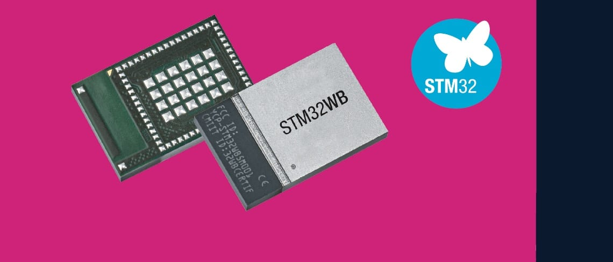

.. _stm32wb5mmg_bluetooth_module:

ST STM32WB5MMG
################

Overview
********

STM32WB5MMG is an ultra-low-power and small form factor certified 2.4 GHz
wireless module. It supports Bluetooth|reg| Low Energy 5.4, Zigbee|reg| 3.0,
OpenThread, dynamic, and static concurrent modes, and 802.15.4 proprietary
protocols. This board support is added in order to make it possible use this
module on other boards as HCI layer (Specefically B-U585I-IOT02A Development board).

STM32WB5MMG supports the following features:

- Bluetooth module in SiP-LGA86 package
- Integrated chip antenna
- Bluetooth|reg| Low Energy 5.4, Zigbee|reg| 3.0, OpenThread certified
  Dynamic and static concurrent modes
- IEEE 802.15.4-2011 MAC PHY Supports 2 Mbits/s
- Frequency band 2402-2480 MHz
- Advertising extension
- Tx output power up to +6 dBm
- Rx sensitivity: -96 dBm (Bluetooth|reg| Low Energy at 1 Mbps), -100 dBm (802.15.4)
- Range: up to 75 meters
- Dedicated Arm|reg| Cortex|reg|-M0+ CPU for radio and security tasks
- Dedicated Arm|reg| Cortex|reg|-M4 CPU with FPU and ART (adaptive real-time accelerator) up to 64 MHz speed
- 1-Mbyte flash memory, 256-Kbyte SRAM
- Fully integrated BOM, including 32 MHz radio and 32 kHz RTC crystals
- Integrated SMPS
- Ultra-low-power modes for battery longevity
- 68 GPIOs
- SWD, JTAG

More information about the board can be found at the `` `STM32WB5MMG on www.st.com`_.

Hardware
********

STM32WB5MMG is an ultra-low-power and small form factor certified 2.4 GHz
wireless module. It supportsBluetooth|reg| Low Energy 5.4, Zigbee|reg| 3.0, OpenThread,
dynamic, and static concurrent modes, and 802.15.4proprietary protocols. Based
on the STMicroelectronics STM32WB55VGY wireless microcontroller,STM32WB5MMG
provides best-in-class RF performance thanks to its high receiver sensitivity
and output power signal. Its low-power features enable extended battery life,
small coin-cell batteries, and energy harvesting. STM32WB5MMG revision Y is
based on cut 2.1 of the STM32WB55VGY microcontroller. Revision X is based on
cut 2.2.

- Ultra-low-power with FlexPowerControl (down to 600 nA Standby mode with RTC and 32KB RAM)
- Core: ARM |reg| 32-bit Cortex |reg|-M4 CPU with FPU, frequency up to 64 MHz
- Radio:

  - 2.4GHz
  - RF transceiver supporting Bluetooth|reg| 5.4
    specification, IEEE 802.15.4-2011 PHY
    and MAC, supporting Thread 1.3 and
  - Zigbee|reg| 3.0
  - RX sensitivity: -96 dBm (Bluetooth |reg| Low
    Energy at 1 Mbps), -100 dBm (802.15.4)
  - Programmable output power up to +6 dBm
    with 1 dB steps
  - Integrated balun to reduce BOM
  - Support for 2 Mbps
  - Support GATT caching
  - Support EATT (enhanced ATT)
  - Support advertising extension
  - Dedicated Arm|reg| 32-bit Cortex|reg| M0+ CPU
    for real-time Radio layer
  - Accurate RSSI to enable power control
  - Suitable for systems requiring compliance
    with radio frequency regulations ETSI EN
    300 328, EN 300 440, FCC CFR47 Part 15
    and ARIB STD-T66

- Clock Sources:

  - 32 MHz crystal oscillator with integrated
    trimming capacitors (Radio and CPU clock)
  - 32 kHz crystal oscillator for RTC (LSE)
  - Internal low-power 32 kHz (±5%) RC (LSI1)
  - Internal low-power 32 kHz (stability
    ±500 ppm) RC (LSI2)
  - Internal multispeed 100 kHz to 48 MHz
    oscillator, auto-trimmed by LSE (better than
    ±0.25% accuracy)
  - High speed internal 16 MHz factory
    trimmed RC (±1%)
  - 2x PLL for system clock, USB, SAI, ADC

- 2x DMA controllers (seven channels each) supporting ADC, SPI, I2C, USART, QSPI, SAI, AES, timers
- 1x USART (ISO 7816, IrDA, SPI master, Modbus and Smartcard mode)
- 1x LPUART (low power)
- Two SPI running at 32 Mbit/s
- 2x I2C (SMBus/PMBus)
- 1x SAI (dual channel high quality audio)
- 1x USB 2.0 FS device, crystal-less, BCD and LPM
- 1x Touch sensing controller, up to 18 sensors
- 1x LCD 8x40 with step-up converter
- 1x 16-bit, four channels advanced timer
- 2x 16-bit, two channels timers
- 1x 32-bit, four channels timer
- 2x 16-bit ultra-low-power timers
- 1x independent Systick
- 1x independent watchdog
- 1x window watchdog
- Up to 72 fast I/Os, 70 of them 5 V-tolerant

- Memories

  - Up to 1 MB flash memory with sector
    protection (PCROP) against R/W
    operations, enabling radio stack and
    application
  - Up to 256 KB SRAM, including 64 KB with
    hardware parity check
  - 20x 32-bit backup register
  - Boot loader supporting USART, SPI, I2C
    and USB interfaces
  - OTA (over the air) Bluetooth® Low Energy
    and 802.15.4 update
  - Quad SPI memory interface with XIP
  - 1 Kbyte (128 double words) OTP

- 4x digital filters for sigma delta modulator
- Rich analog peripherals (down to 1.62 V)

- 12-bit ADC 4.26 Msps, up to 16-bit with
  hardware oversampling, 200 μA/Msps
- 2x ultra-low-power comparator
- Accurate 2.5 V or 2.048 V reference
  voltage buffered output

- Security and ID

 - Secure firmware installation (SFI) for
   Bluetooth|reg| Low Energy and 802.15.4 SW stack
 - 3x hardware encryption AES maximum 256-bit for
   the application, the Bluetooth|reg|
 - Low Energy and IEEE802.15.4
 - Customer key storage/manager services
 - HW public key authority (PKA)
 - Cryptographic algorithms: RSA, Diffie-Helman, ECC over GF(p)
 - True random number generator (RNG)
 - Sector protection against R/W operation (PCROP)
 - CRC calculation unit
 - Die information: 96-bit unique ID
 - IEEE 64-bit unique ID, possibility to derive 802.15.4 64-bit
   and Bluetooth|reg| Low Energy
 - 48-bit EUI

More information about STM32WB55RG can be found here:

- `STM32WB5MMG on www.st.com`_
- `STM32WB5MMG datasheet`_

Supported Features
==================

The Zephyr STM32WB5MMG board configuration supports the following hardware features:

+-----------+------------+-------------------------------------+
| Interface | Controller | Driver/Component                    |
+===========+============+=====================================+
| UART      | on-chip    | serial port-polling;                |
|           |            | serial port-interrupt               |
+-----------+------------+-------------------------------------+
| RADIO     | on-chip    | Bluetooth Low Energy                |
+-----------+------------+-------------------------------------+

Other hardware features are not yet supported on this Zephyr port.

The default configuration can be found in the defconfig file:
``boards/arm/stm32wb5mmg/stm32wb5mmg_defconfig``

Bluetooth and compatibility with STM32WB Copro Wireless Binaries
================================================================

To operate bluetooth on STM32WB5MMG, Cortex-M0 core should be flashed with
a valid STM32WB Coprocessor binaries (either 'Full stack' or 'HCI Layer').
These binaries are delivered in STM32WB Cube packages, under
Projects/STM32WB_Copro_Wireless_Binaries/STM32WB5x/
For compatibility information with the various versions of these binaries,
please check `modules/hal/stm32/lib/stm32wb/hci/README`_
in the hal_stm32 repo.
Note that since STM32WB Cube package V1.13.2, "full stack" binaries are not compatible
anymore for a use in Zephyr and only "HCI Only" versions should be used on the M0
side.

Connections and IOs
===================

Default Zephyr Peripheral Mapping:
----------------------------------

.. rst-class:: rst-columns

- UART_1 TX/RX : PB7/PB6
- LPUART_1 TX/RX : PA3/PA2
- USB : PA11/PA12
- SWD : PA13/PA14

System Clock
------------

STM32WB5MMG System Clock could be driven by internal or external oscillator,
as well as main PLL clock. By default System clock is driven by HSE clock at 32MHz.

Serial Port
-----------

STM32WB5MMG board has 2 (LP)U(S)ARTs. LPUART1 is connected to the main U585I
microcontroller that is used as HCI controller port. USART1 is not connected
to any external pinout, so it is not possible to debug the module directly.
Rather, users can use the available USB port (CN12) to run virtual com port
(VCP) USB stack for the debugging.

Programming and Debugging
*************************

Applications for the ``stm32wb5mmg`` board configuration can be built the
usual way (see :ref:`build_an_application`).

Flashing the module
===================

The onboard ST-Link on the ``b_u585i_iot02a`` board can be used to flash the
STM32WB5MMG module. To do this you should put SW4 on OFF and SW5 on ON mode.
In this case the firmware will be uploaded on the STM32WB5MMG module.

Flashing `hci_uart` application to STM32WB5MMG
----------------------------------------------

Connect the B-U585I-IOT02A to your host computer using the USB port. Put
the SW4 (MCU SWD) in OFF mode and SW5 (SWD BLE) in ON mode. Then build
and flash an application. Here is an example for the
:ref:`hci_uart <bluetooth-hci-uart-sample>` application.

Run a serial host program to connect with your B-U585I-IOT02A board:

.. code-block:: console

   $ minicom -D /dev/ttyACM0

Then build and flash the application for the STM32WB5MMG module.

.. zephyr-app-commands::
   :zephyr-app: samples/bluetooth/hci_uart
   :board: stm32wb5mmg
   :goals: build flash

Next, reverse back the buttons to default mode (SW4 on ON and SW5
on OFF) mode. In this case we will upload the Bluetooth sample on the
main microcontroller.Then, build the bluetooth
:zephyr_file:`samples/bluetooth/observer` demo application for
B-U585I-IOT02A board:

.. zephyr-app-commands::
   :zephyr-app: samples/bluetooth/observer
   :board: b_u585i_iot02a
   :goals: build flash

Rest the board and you should see the following messages on the console:

.. code-block:: console

   Starting Observer Demo
   Started scanning...
   Exiting main thread.
   Device found: 2C:98:F3:64:58:06 (random) (RSSI -82), type 3, AD data len 31
   Device found: CE:5B:9A:87:69:4F (random) (RSSI -80), type 3, AD data len 8
   Device found: 7B:1E:DD:38:23:E1 (random) (RSSI -85), type 0, AD data len 17

Debugging
=========

You can debug an application in the usual way.  Here is an example for the
:ref:`hci_uart <bluetooth-hci-uart-sample>` application.

.. zephyr-app-commands::
   :zephyr-app: samples/bluetooth/observer
   :board: b_u585i_iot02a
   :maybe-skip-config:
   :goals: debug

.. _STM32WB5MMG on www.st.com:
   https://www.st.com/en/microcontrollers-microprocessors/stm32wb5mmg.html

.. _STM32WB5MMG datasheet:
   https://www.st.com/resource/en/datasheet/stm32wb5mmg.pdf
.. _modules/hal/stm32/lib/stm32wb/hci/README:
  https://github.com/zephyrproject-rtos/hal_stm32/blob/main/lib/stm32wb/hci/README
