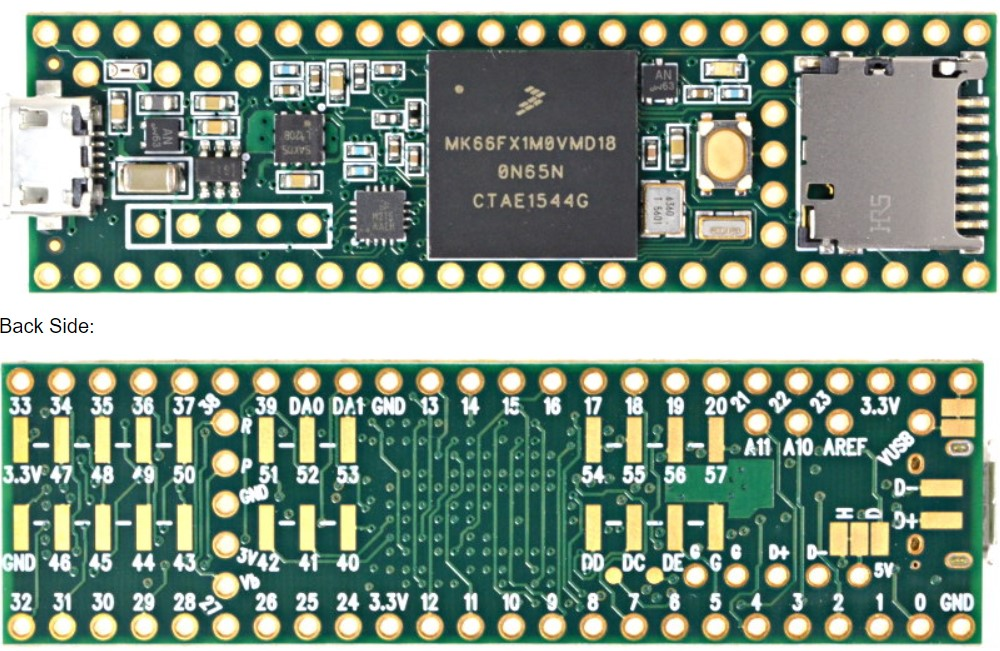

.. _teensy_explorer:

Teensy 3.5/3.6
##############

Overview
********

Teensy 3.6 and Teensy 3.5  is an ultra-low-cost development platform for the Kinetis MK64 and MK66 series

- Form-factor has pin headers to attach additional I/O

Hardware
********

- MK64FN1M0VLL12 MCU (120 MHz, 512 KB flash memory, 256 KB RAM, low-power,
  crystal-less USB, and 100 Low profile Quad Flat Package (LQFP))
- Dual role USB interface with micro-B USB connector

- Ethernet
- SDHC

For more information about the K64F,K66F SoC and Teensy board:

- `Teensy Website`_

Supported Features
==================

The Teensy 3.5/6 board configuration supports the following hardware features:

+-----------+------------+-------------------------------------+
| Interface | Controller | Driver/Component                    |
+===========+============+=====================================+
| NVIC      | on-chip    | nested vector interrupt controller  |
+-----------+------------+-------------------------------------+
| SYSTICK   | on-chip    | systick                             |
+-----------+------------+-------------------------------------+
| PINMUX    | on-chip    | pinmux                              |
+-----------+------------+-------------------------------------+
| GPIO      | on-chip    | gpio                                |
+-----------+------------+-------------------------------------+
| I2C       | on-chip    | i2c                                 |
+-----------+------------+-------------------------------------+
| SPI       | on-chip    | spi                                 |
+-----------+------------+-------------------------------------+
| WATCHDOG  | on-chip    | watchdog                            |
+-----------+------------+-------------------------------------+
| ADC       | on-chip    | adc                                 |
+-----------+------------+-------------------------------------+
| PWM       | on-chip    | pwm                                 |
+-----------+------------+-------------------------------------+
| ETHERNET  | on-chip    | ethernet                            |
+-----------+------------+-------------------------------------+
| UART      | on-chip    | serial port-polling;                |
|           |            | serial port-interrupt               |
+-----------+------------+-------------------------------------+
| FLASH     | on-chip    | soc flash                           |
+-----------+------------+-------------------------------------+
| USB       | on-chip    | USB device                          |
+-----------+------------+-------------------------------------+
| CAN       | on-chip    | can                                 |
+-----------+------------+-------------------------------------+
| RTC       | on-chip    | rtc                                 |
+-----------+------------+-------------------------------------+

The default configuration can be found in the defconfig file:

	``boards/arm/teensy_explorer/teensy_explorer_defconfig``

Other hardware features are not currently supported by the port.

Connections and IOs
===================

The Teensy Board does not contain any specific I/O, except
for the SDHC and the single LED.

+-------+-----------------+---------------------------+
| Name  | Function        | Usage                     |
+=======+=================+===========================+
| PTB5  | GPIO            | Red LED                   |
+-------+-----------------+---------------------------+

System Clock
============

The K64F SoC is configured to use the 16 MHz external oscillator on the board
with the on-chip PLL to generate a 120 MHz system clock.

The K66F SoC is configured to use the 16 MHz external oscillator on the board
with the on-chip PLL to generate a 180 MHz system clock.  Additionally, the 
internal IRC48 clock is used for USB

Serial Port
===========

The K64F SoC has six UARTs. One is configured for the console, another for BT
HCI, and the remaining are not used.

USB
===

The K64F SoC has a USB OTG (USBOTG) controller that supports both
device and host functions through its micro USB connector (K64F USB).
Only USB device function is supported in Zephyr at the moment.

Programming and Debugging
*************************

Build and flash applications as usual (see :ref:`build_an_application` and
:ref:`application_run` for more details).

Configuring a Debug Probe
=========================

Debugging the Teensy is not supported unless you wish to modify your
hardware. A quick Google search will show the options.

Flashing
========

Flashing the teensy is done with the PJRC 'teensy_loader_cli' application

