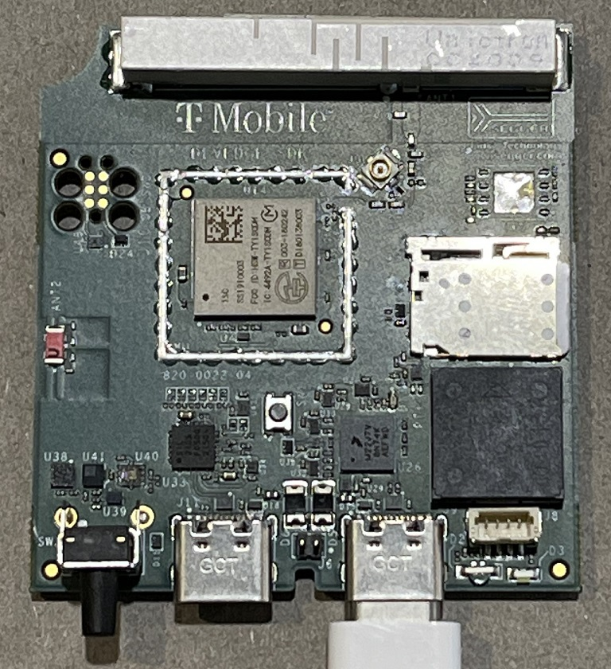

.. _tmo_dev_edge:

EFM32 tmo_dev_edge
#####################

Overview
********

The EFM32 tmo_dev_edge is based on the EFM32 Pearl Gecko Starter Kit
(EFM32PG-STK3402A) which contains an MCU from the EFM32PG family built
on an ARM® Cortex®-M4F processor with excellent low power capabilities.

Hardware
********

- Advanced Energy Monitoring provides real-time information about the energy
  consumption of an application or prototype design.
- Ultra low power 128x128 pixel Memory-LCD
- 2 user buttons, 2 LEDs and a touch slider
- Humidity, temperature, and inductive-capacitive metal sensor
- On-board Segger J-Link USB debugger

For more information about the EFM32PG SoC and EFM32PG-STK3402A board:

- `EFM32PG Website`_
- `EFM32PG12 Datasheet`_
- `EFM32PG12 Reference Manual`_
- `DevEdge IoT Developer Kit Documentation`_

Supported Features
==================

The efm32pg_stk3402a board configuration supports the following hardware features:

+-----------+------------+-------------------------------------+
| Interface | Controller | Driver/Component                    |
+===========+============+=====================================+
| MPU       | on-chip    | memory protection unit              |
+-----------+------------+-------------------------------------+
| NVIC      | on-chip    | nested vector interrupt controller  |
+-----------+------------+-------------------------------------+
| SYSTICK   | on-chip    | systick                             |
+-----------+------------+-------------------------------------+
| COUNTER   | on-chip    | rtcc                                |
+-----------+------------+-------------------------------------+
| FLASH     | on-chip    | flash memory                        |
+-----------+------------+-------------------------------------+
| GPIO      | on-chip    | gpio                                |
+-----------+------------+-------------------------------------+
| UART      | on-chip    | serial port-polling;                |
|           |            | serial port-interrupt               |
+-----------+------------+-------------------------------------+
| I2C       | on-chip    | i2c port-polling                    |
+-----------+------------+-------------------------------------+
| WATCHDOG  | on-chip    | watchdog                            |
+-----------+------------+-------------------------------------+
| TRNG      | on-chip    | true random number generator        |
+-----------+------------+-------------------------------------+

The default configuration can be found in the defconfig file:

	``zephyr/boards/arm/tmo_dev_edge/tmo_dev_edge_defconfig``

Other hardware features are currently not supported by the port.

Connections and IOs
===================

The EFM32PG12 SoC has twelve GPIO controllers (PORTA to PORTL), but only seven
are currently enabled (PORTA, PORTB, PORTC, PORTD, PORTF, PORTJ and PORTK) for
the tmo_dev_edge board.

In the following table, the column **Name** contains pin names. For example, PE2
means pin number 2 on PORTE, as used in the board's datasheets and manuals.

+-------+-----+-------------+-------------------------------------+
| Name  | LOC | Function    | Usage                               |
+=======+=====+=============+=====================================+
| PC7   |  12 | GPIO        | LED_0 White                         |
+-------+-----+-------------+-------------------------------------+
| PC8   |  12 | GPIO        | LED_1 Red                           |
+-------+-----+-------------+-------------------------------------+
| PC9   |  12 | GPIO        | LED_2 Green                         |
+-------+-----+-------------+-------------------------------------+
| PC10  |  12 | GPIO        | LED_3 Blue                          |
+-------+-----+-------------+-------------------------------------+
| PC11  |  16 | GPIO        | PWM Buzzer                          |
+-------+-----+-------------+-------------------------------------+
| PB13  |   9 | GPIO        | User Push Button 0 - GPIO_EM4WU     |
+-------+-----+-------------+-------------------------------------+
| PF4   |  28 | UART_TX     | UART TX ublox,zoem8                 |
+-------+-----+-------------+-------------------------------------+
| PF5   |  28 | UART_RX     | UART RX ublox,zoem8                 |
+-------+-----+-------------+-------------------------------------+
| PD12  |  20 | UART_TX     | UART TX ublox,zoem8                 |
+-------+-----+-------------+-------------------------------------+
| PD13  |  20 | UART_RX     | UART RX ublox,zoem8                 |
+-------+-----+-------------+-------------------------------------+
| PD11  |  15 | UART_CTS    | UART CTS ublox,zoem8                |
+-------+-----+-------------+-------------------------------------+
| PD10  |  13 | UART_RTS    | UART RTS ublox,zoem8                |
+-------+-----+-------------+-------------------------------------+
| PI0   |   3 | SPI SCK     | SPI Clock                           |
+-------+-----+-------------+-------------------------------------+
| PI2   |   6 | SPI MISO    | SPI Master In Slave Out             |
+-------+-----+-------------+-------------------------------------+
| PI3   |   8 | SPI MOSI    | SPI Master Out Slave In             |
+-------+-----+-------------+-------------------------------------+
| PC0   |  16 | SPI SCK     | SPI Clock                           |
+-------+-----+-------------+-------------------------------------+
| PC2   |  19 | SPI MISO    | SPI Master In Slave Out             |
+-------+-----+-------------+-------------------------------------+
| PC3   |  21 | SPI MOSI    | SPI Master Out Slave In             |
+-------+-----+-------------+-------------------------------------+
| PB11  |   6 | UART_TX     | UART_TX console LEU0_TX             |
+-------+-----+-------------+-------------------------------------+
| PB12  |   6 | UART_RX     | UART_RX console LEU0_RX             |
+-------+-----+-------------+-------------------------------------+
| PA1   |   1 | I2C_SDA     | ENV_I2C_SDA I2C0_SDA                |
+-------+-----+-------------+-------------------------------------+
| PA0   |  31 | I2C_SCL     | ENV_I2C_SCL I2C0_SCL                |
+-------+-----+-------------+-------------------------------------+
| PJ15  |  12 | I2C_SDA     | ENV_I2C_SDA I2C1_SDA                |
+-------+-----+-------------+-------------------------------------+
| PJ14  |  10 | I2C_SCL     | ENV_I2C_SCL I2C1_SCL                |
+-------+-----+-------------+-------------------------------------+

System Clock
============

The EFM32PG SoC is configured to use the 38.4 MHz external oscillator on the
board.

Serial Port
===========

The EFM32PG SoC has four USARTs and one Low Energy UART (LEUART).

Programming and Debugging
*************************

.. note::
   Before using the kit the first time, you should update the J-Link firmware
   from `J-Link-Downloads`_

Flashing
========

A `J-Link`_ serial and debug adaptor is required. The adaptor provides:

Flashing an application to tmo_dev_edge
------------------------------------------

The sample application :ref:`hello_world` is used for this example.
Build the Zephyr kernel and application:

.. zephyr-app-commands::
   :zephyr-app: samples/hello_world
   :board: tmo_dev_edge
   :goals: build

Connect the tmo_dev_edge to your host computer using the USB port and you
should see 4 USB serial connections

Use a USB-A to Mini-USB cable to connect to the UARTs on the board.

Open a serial terminal (minicom, putty, etc.) with the following settings:

- Port: 2nd of 4
- Speed: 9600
- Data: 8 bits
- Parity: None
- Stop bits: 1

Reset the board and you'll see the following message on the corresponding serial port
terminal session:

.. code-block:: console

   Hello World! arm

Fixtures implemented on the tmo_dev_edge board
-------------------------------------------------

The picture of this board above shows a Saleae probe connected between PK0 and PK1
test points on the 820-0013-00_silabs_cpu_board_2021-03-22 feather board. These are
unused GPIO pins that form a fixture for the following tests:

/tests/drivers/gpio/gpio_basic_api - gpio_loopback
tests/drivers/regulator/fixed - regulator_loopback

The Twister tests can be run from the boards folder as follows:

.. code-block:: console

   ../../../../zephyr/scripts/twister --device-testing \
                                      --hardware-map tmo_dev_edge-map.yml \
                                      --load-tests tmo_dev_edge-testplan.json

2 of 8 regulator tests are still failing (due to 9600 baud issues), but the gpio tests work fine.

.. _DevEdge IoT Developer Kit Documentation:
   https://devedge.t-mobile.com/documentation-hub/iot-developer-kit/getting-started

.. _EFM32PG Website:
   https://www.silabs.com/products/mcu/32-bit/efm32-pearl-gecko

.. _EFM32PG12 Datasheet:
   https://www.silabs.com/documents/public/data-sheets/efm32pg12-datasheet.pdf

.. _EFM32PG12 Reference Manual:
   https://www.silabs.com/documents/public/reference-manuals/efm32pg12-rm.pdf

.. _J-Link:
   https://www.segger.com/jlink-debug-probes.html

.. _J-Link-Downloads:
   https://www.segger.com/downloads/jlink
