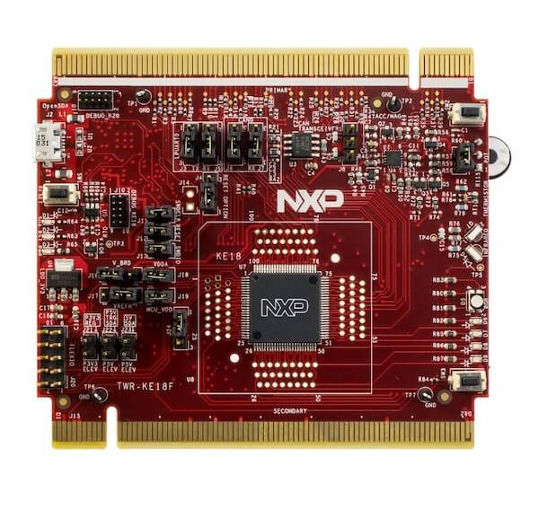

.. _twr_ke18f:

NXP TWR-KE18F
#############

Overview
********

The TWR-KE18F is a development board for NXP Kinetis KE1xF 32-bit
MCU-based platforms. The onboard OpenSDAv2 serial and debug adapter,
running an open source bootloader, offers options for serial
communication, flash programming, and run-control debugging.

   TWR-KE18F (Credit: NXP)

Hardware
********

- MKE18F512VLL16 MCU (up to 168 MHz, 512 KB flash memory, 64 KB RAM,
  and 100 Low profile Quad Flat Package (LQFP))
- 3.3 V or 5 V MCU operation
- 6-axis FXOS8700CQ digital accelerometer and magnetometer
- RGB LED
- Four user LEDs
- Two user push-buttons
- Potentiometer
- Thermistor
- Infrared port (IrDA)
- CAN pin header
- Flex I/O pin header

For more information about the KE1xF SoC and the TWR-KE18F board, see
these NXP reference documents:

- `KE1xF Website`_
- `KE1xF Datasheet`_
- `KE1xF Reference Manual`_
- `TWR-KE18F Website`_
- `TWR-KE18F User Guide`_
- `TWR-KE18F Schematics`_

Supported Features
==================

The twr_ke18f board configuration supports the following hardware
features:

+-----------+------------+-------------------------------------+
| Interface | Controller | Driver/Component                    |
+===========+============+=====================================+
| NVIC      | on-chip    | nested vector interrupt controller  |
+-----------+------------+-------------------------------------+
| SYSTICK   | on-chip    | systick                             |
+-----------+------------+-------------------------------------+
| PINMUX    | on-chip    | pinmux                              |
+-----------+------------+-------------------------------------+
| GPIO      | on-chip    | gpio                                |
+-----------+------------+-------------------------------------+
| UART      | on-chip    | serial port-polling;                |
|           |            | serial port-interrupt               |
+-----------+------------+-------------------------------------+
| FLASH     | on-chip    | soc flash                           |
+-----------+------------+-------------------------------------+
| RTC       | on-chip    | rtc                                 |
+-----------+------------+-------------------------------------+
| I2C(M)    | on-chip    | i2c                                 |
+-----------+------------+-------------------------------------+
| SENSOR    | off-chip   | fxos8700 polling;                   |
|           |            | trigger supported with H/W mods     |
|           |            | explained below;                    |
+-----------+------------+-------------------------------------+
| SPI(M)    | on-chip    | spi                                 |
+-----------+------------+-------------------------------------+
| ADC       | on-chip    | adc                                 |
+-----------+------------+-------------------------------------+
| CAN       | on-chip    | can                                 |
+-----------+------------+-------------------------------------+
| WDT       | on-chip    | watchdog                            |
+-----------+------------+-------------------------------------+
| PWM       | on-chip    | pwm                                 |
+-----------+------------+-------------------------------------+

The default configuration can be found in the defconfig file:
``boards/arm/twr_ke18f/twr_ke18f_defconfig``.

Other hardware features are not currently supported by the port.

System Clock
============

The KE18 SoC is configured to use the 8 MHz external oscillator on the
board with the on-chip PLL to generate a 120 MHz system clock.

Serial Port
===========

The KE18 SoC has three UARTs. UART0 is configured for the console. The
remaining UARTs are not used.

Accelerometer and magnetometer
==============================

The TWR-KE18F board by default only supports polling the FXOS8700
accelerometer and magnetometer for sensor values
(``CONFIG_FXOS8700_TRIGGER_NONE=y``).

In order to support FXOS8700 triggers (interrupts) the 0 ohm resistors
``R47`` and and ``R57`` must be mounted on the TWR-KE18F board. The
devicetree must also be modified to describe the FXOS8700 interrupt
GPIOs:

.. code-block:: none

  /dts-v1/;

  &fxos8700 {
          int1-gpios = <&gpioa 14 0>;
          int2-gpios = <&gpioc 17 0>;
  };

Finally, a trigger option must be enabled in Kconfig (either
``FXOS8700_TRIGGER_GLOBAL_THREAD=y`` or
``FXOS8700_TRIGGER_OWN_THREAD=y``).

Programming and Debugging
*************************

Build and flash applications as usual (see :ref:`build_an_application` and
:ref:`application_run` for more details).

Configuring a Debug Probe
=========================

A debug probe is used for both flashing and debugging the board. This board is
configured by default to use the :ref:`opensda-daplink-onboard-debug-probe`.

Early versions of this board have an outdated version of the OpenSDA bootloader
and require an update. Please see the `DAPLink Bootloader Update`_ page for
instructions to update from the CMSIS-DAP bootloader to the DAPLink bootloader.

Option 1: :ref:`opensda-daplink-onboard-debug-probe` (Recommended)
------------------------------------------------------------------

Install the :ref:`pyocd-debug-host-tools` and make sure they are in your search
path.

Follow the instructions in :ref:`opensda-daplink-onboard-debug-probe` to program
the `OpenSDA DAPLink TWR-KE18F Firmware`_.

Option 2: :ref:`opensda-jlink-onboard-debug-probe`
--------------------------------------------------

Install the :ref:`jlink-debug-host-tools` and make sure they are in your search
path.

Follow the instructions in :ref:`opensda-jlink-onboard-debug-probe` to program
the `OpenSDA J-Link Firmware for TWR-KE18F`_.

Add the argument ``-DOPENSDA_FW=jlink`` when you invoke ``west build`` to
override the default runner from pyOCD to J-Link:

.. zephyr-app-commands::
   :zephyr-app: samples/hello_world
   :board: twr_ke18f
   :gen-args: -DOPENSDA_FW=jlink
   :goals: build

Configuring a Console
=====================

Regardless of your choice in debug probe, we will use the OpenSDA
microcontroller as a usb-to-serial adapter for the serial console.

Connect a USB cable from your PC to J2.

Use the following settings with your serial terminal of choice (minicom, putty,
etc.):

- Speed: 115200
- Data: 8 bits
- Parity: None
- Stop bits: 1

Flashing
========

Here is an example for the :ref:`hello_world` application.

.. zephyr-app-commands::
   :zephyr-app: samples/hello_world
   :board: twr_ke18f
   :goals: flash

Open a serial terminal, reset the board (press the SW1 button), and you should
see the following message in the terminal:

.. code-block:: console

   ***** Booting Zephyr OS v1.14.0-xxx-gxxxxxxxxxxxx *****
   Hello World! twr_ke18f

Debugging
=========

Here is an example for the :ref:`hello_world` application.

.. zephyr-app-commands::
   :zephyr-app: samples/hello_world
   :board: twr_ke18f
   :goals: debug

Open a serial terminal, step through the application in your debugger, and you
should see the following message in the terminal:

.. code-block:: console

   ***** Booting Zephyr OS v1.14.0-xxx-gxxxxxxxxxxxx *****
   Hello World! twr_ke18f

.. _TWR-KE18F Website:
   https://www.nxp.com/TWR-KE18F

.. _TWR-KE18F User Guide:
   https://www.nxp.com/docs/en/user-guide/TWRKE18FUG.pdf

.. _TWR-KE18F Schematics:
   https://www.nxp.com/webapp/Download?colCode=TWR-KE18F-SCH-DESIGNFILES

.. _KE1xF Website:
   https://www.nxp.com/products/processors-and-microcontrollers/arm-based-processors-and-mcus/kinetis-cortex-m-mcus/e-series5v-robustm0-plus-m4/kinetis-ke1xf-168mhz-performance-with-can-5v-microcontrollers-based-on-arm-cortex-m4:KE1xF

.. _KE1xF Datasheet:
   https://www.nxp.com/docs/en/data-sheet/KE1xFP100M168SF0.pdf

.. _KE1xF Reference Manual:
   https://www.nxp.com/docs/en/reference-manual/KE1xFP100M168SF0RM.pdf

.. _DAPLink Bootloader Update:
   https://os.mbed.com/blog/entry/DAPLink-bootloader-update/

.. _OpenSDA DAPLink TWR-KE18F Firmware:
   https://www.nxp.com/support/developer-resources/run-time-software/kinetis-developer-resources/ides-for-kinetis-mcus/opensda-serial-and-debug-adapter:OPENSDA#TWR-KE18F

.. _OpenSDA J-Link Firmware for TWR-KE18F:
   https://www.segger.com/downloads/jlink/OpenSDA_TWR-KE18F
