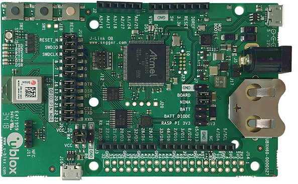

.. _ubx_ninab3_nrf52840:

u-blox EVK-NINA-B3
##################

Overview
********

The u-blox EVK-NINA-B30 Development Kit hardware provides support for the
u-blox NINA-B30x Bluetooth 5.0 module, based on the Nordic Semiconductor
nRF52840 ARM Cortex-M4F CPU and the following devices:

* :abbr:`ADC (Analog to Digital Converter)`
* CLOCK
* FLASH
* :abbr:`GPIO (General Purpose Input Output)`
* :abbr:`I2C (Inter-Integrated Circuit)`
* :abbr:`MPU (Memory Protection Unit)`
* :abbr:`NVIC (Nested Vectored Interrupt Controller)`
* :abbr:`PWM (Pulse Width Modulation)`
* RADIO (Bluetooth Low Energy and 802.15.4)
* :abbr:`RTC (nRF RTC System Clock)`
* Segger RTT (RTT Console)
* :abbr:`SPI (Serial Peripheral Interface)`
* :abbr:`UART (Universal asynchronous receiver-transmitter)`
* :abbr:`USB (Universal Serial Bus)`
* :abbr:`WDT (Watchdog Timer)`

     EVK-NINA-B3 (Credit: u-blox AG)

More information about the EVK-NINA-B3 and the NINA-B30x modules
can be found at the `u-blox website`_.

Hardware
********

The NINA-B30x on the EVK-NINA-B30x contains an internal high-frequency
oscillator at 32MHz as well as a low frequency (slow) oscillator
of 32.768kHz.

Supported Features
==================

The ubx_evkninab3_nrf52840 board configuration supports the following
hardware features:

+-----------+------------+----------------------+
| Interface | Controller | Driver/Component     |
+===========+============+======================+
| ADC       | on-chip    | adc                  |
+-----------+------------+----------------------+
| CLOCK     | on-chip    | clock_control        |
+-----------+------------+----------------------+
| FLASH     | on-chip    | flash                |
+-----------+------------+----------------------+
| GPIO      | on-chip    | gpio                 |
+-----------+------------+----------------------+
| I2C(M)    | on-chip    | i2c                  |
+-----------+------------+----------------------+
| MPU       | on-chip    | arch/arm             |
+-----------+------------+----------------------+
| NVIC      | on-chip    | arch/arm             |
+-----------+------------+----------------------+
| PWM       | on-chip    | pwm                  |
+-----------+------------+----------------------+
| RADIO     | on-chip    | Bluetooth,           |
|           |            | IEEE 802.15.4        |
+-----------+------------+----------------------+
| RTC       | on-chip    | system clock         |
+-----------+------------+----------------------+
| RTT       | Segger     | console              |
+-----------+------------+----------------------+
| SPI(M/S)  | on-chip    | spi                  |
+-----------+------------+----------------------+
| UART      | on-chip    | serial               |
+-----------+------------+----------------------+
| USB       | on-chip    | usb                  |
+-----------+------------+----------------------+
| WDT       | on-chip    | watchdog             |
+-----------+------------+----------------------+

Other hardware features have not been enabled yet for this board.
See the `u-blox website`_ for a complete list of EVK-NINA-B30x
hardware features.

Connections and IOs
===================

LED
---

* LED0 (red) = P0.13
* LED1 (green) = P0.25
* LED2 (blue) = P1.00

Push buttons
------------

* BUTTON1 = SW1 = P0.25
* BUTTON2 = SW2 = P0.2
* BOOT = SW0 = boot/reset

External Connectors
-------------------

.. note::
	The pin numbers noted below are referenced to
	the pin 1 markings on the EVK-NINA-B30x
	for each header

Arduino Headers
---------------

Power (J1)

+-------+--------------+-------------------------+
| PIN # | Signal Name  | NINA-B30x Functions     |
+=======+==============+=========================+
| 1     | N/C          | N/A                     |
+-------+--------------+-------------------------+
| 2     | VDD_IO       | N/A                     |
+-------+--------------+-------------------------+
| 3     | RESET        | P0.18 / RESET           |
+-------+--------------+-------------------------+
| 4     | 3V3          | N/A                     |
+-------+--------------+-------------------------+
| 5     | 5V0          | N/A                     |
+-------+--------------+-------------------------+
| 6     | GND          | N/A                     |
+-------+--------------+-------------------------+
| 7     | GND          | N/A                     |
+-------+--------------+-------------------------+
| 8     | VIN          | N/A                     |
+-------+--------------+-------------------------+

Analog in (J2)

+-------+--------------+-------------------------+
| PIN # | Signal Name  | NINA-B30x Functions     |
+=======+==============+=========================+
| 1     | A0           | P0.04 / AIN2            |
+-------+--------------+-------------------------+
| 2     | A1           | P0.30 / AIN6            |
+-------+--------------+-------------------------+
| 3     | A2           | P0.05 / AIN3            |
+-------+--------------+-------------------------+
| 4     | A3           | P0.02 / AIN0            |
+-------+--------------+-------------------------+
| 5     | A4           | P0.28 / AIN4            |
+-------+--------------+-------------------------+
| 6     | A5           | P0.03 / AIN1            |
+-------+--------------+-------------------------+

Digital I/O (J3)

+-------+--------------+-------------------------+
| PIN # | Signal Name  | NINA-B30x Functions     |
+=======+==============+=========================+
| 8     | D7           | P0.10                   |
+-------+--------------+-------------------------+
| 7     | D6           | P0.09                   |
+-------+--------------+-------------------------+
| 6     | D5           | P0.11                   |
+-------+--------------+-------------------------+
| 5     | D4           | P0.13                   |
+-------+--------------+-------------------------+
| 4     | D3           | P0.31                   |
+-------+--------------+-------------------------+
| 3     | D2           | P1.12                   |
+-------+--------------+-------------------------+
| 2     | D1 (TX)      | P1.13                   |
+-------+--------------+-------------------------+
| 1     | D0 (RX)      | P0.29                   |
+-------+--------------+-------------------------+

Digital I/O (J4)

+-------+--------------+-------------------------+
| PIN # | Signal Name  | NINA-B30x Functions     |
+=======+==============+=========================+
| 10    | SCL          | P0.24                   |
+-------+--------------+-------------------------+
| 9     | SDA          | P0.16                   |
+-------+--------------+-------------------------+
| 8     | N/C          | N/A                     |
+-------+--------------+-------------------------+
| 7     | GND          | N/A                     |
+-------+--------------+-------------------------+
| 6     | D13 (SCK)    | P0.07                   |
+-------+--------------+-------------------------+
| 5     | D12 (MISO)   | P1.00                   |
+-------+--------------+-------------------------+
| 4     | D11 (MOSI)   | P0.15                   |
+-------+--------------+-------------------------+
| 3     | D10 (SS)     | P0.14                   |
+-------+--------------+-------------------------+
| 2     | D9           | P0.12                   |
+-------+--------------+-------------------------+
| 1     | D8           | P1.09                   |
+-------+--------------+-------------------------+

Programming and Debugging
*************************

Applications for the ``ubx_evkninab3_nrf52840`` board configuration can be
built and flashed in the usual way (see :ref:`build_an_application`
and :ref:`application_run` for more details); however, the standard
debugging targets are not currently available.

Flashing
========

Follow the instructions in the :ref:`nordic_segger` page to install
and configure all the necessary software. Further information can be
found in :ref:`nordic_segger_flashing`. Then build and flash
applications as usual (see :ref:`build_an_application` and
:ref:`application_run` for more details).

Here is an example for the :ref:`hello_world` application.

First, run your favorite terminal program to listen for output.

.. code-block:: console

   $ minicom -D <tty_device> -b 115200

Replace :code:`<tty_device>` with the port where the EVK-NINA-B30x
can be found. For example, under Linux, :code:`/dev/ttyACM0`.

Then build and flash the application in the usual way.

.. zephyr-app-commands::
   :zephyr-app: samples/hello_world
   :board: ubx_evkninab3_nrf52840
   :goals: build flash

Debugging
=========

Refer to the :ref:`nordic_segger` page to learn about debugging
u-blox boards with a Segger J-LINK-OB IC.

Testing the LEDs and buttons in the EVK-NINA-B30x
*************************************************

There are 2 samples that allow you to test that the buttons
(switches) and LEDs on the board are working properly with Zephyr:

.. code-block:: console

   samples/basic/blinky
   samples/basic/button

You can build and flash the examples to make sure Zephyr is running correctly on
your board. The button and LED definitions can be found in
:zephyr_file:`boards/arm/ubx_evkninab3_nrf52840/ubx_ninab3_nrf52840.dts`.

Using UART1
***********

The following approach can be used when an application needs to use
more than one UART for connecting peripheral devices:

1. Add device tree overlay file to the main directory of your application:

   .. code-block:: devicetree

      &pinctrl {
         uart1_default: uart1_default {
            group1 {
               psels = <NRF_PSEL(UART_TX, 0, 14)>,
                       <NRF_PSEL(UART_RX, 0, 16)>;
            };
         };
         /* required if CONFIG_PM_DEVICE=y */
         uart1_sleep: uart1_sleep {
            group1 {
               psels = <NRF_PSEL(UART_TX, 0, 14)>,
                       <NRF_PSEL(UART_RX, 0, 16)>;
               low-power-enable;
            };
         };
      };

      &uart1 {
        compatible = "nordic,nrf-uarte";
        current-speed = <115200>;
        status = "okay";
        pinctrl-0 = <&uart1_default>;
        pinctrl-1 = <&uart1_sleep>;
        pinctrl-names = "default", "sleep";
      };

   In the overlay file above, pin P0.16 is used for RX and P0.14 is used for TX

2. Use the UART1 as ``DEVICE_DT_GET(DT_NODELABEL(uart1))``

Overlay file naming
===================

The file has to be named ``<board>.overlay`` and placed in the app main directory to be
picked up automatically by the device tree compiler.

Selecting the pins
==================

Pins can be configured in the board pinctrl file. To see the available mappings,
open the data sheet for the NINA-B3 at `u-blox website`_, Section 3 'Pin definition'.
In the table 7 select the pins marked 'GPIO_xx'.  Note that pins marked as 'Radio sensitive pin'
can only be used in under-10KHz applications. They are not suitable for 115200 speed of UART.

.. note:
  Pins are defined according to the "nRF52" pin number, not the module pad number.

References
**********

.. target-notes::

.. _u-blox website: https://www.u-blox.com/en/product/nina-b3-series-open-cpu
