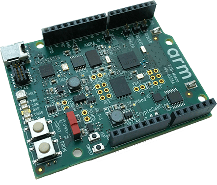

.. _v2m_musca_board:

ARM V2M Musca
##############

Overview
********

The v2m_musca board configuration is used by Zephyr applications that run on
the V2M Musca board. It provides support for the Musca ARM Cortex-M33 CPU and
the following devices:

- Nested Vectored Interrupt Controller (NVIC)
- System Tick System Clock (SYSTICK)
- Cortex-M System Design Kit GPIO
- Cortex-M System Design Kit UART

More information about the board can be found at the `V2M Musca Website`_.

Hardware
********

ARM V2M MUSCA provides the following hardware components:

- ARM Cortex-M33
- ARM IoT Subsystem for Cortex-M33
- Memory

  - 128KB SRAM
  - 2MB of external SRAM
  - 8MB of external QSPI flash.

- Debug

  - JTAG, SWD & 4 bit TRACE
  - DAPLink with a virtual UART port

- Arduino interface

  - 16 3V3 GPIO.
  - UART.
  - SPI.
  - I2C.
  - I2S.
  - 3-channel PWM.
  - 6-channel analog interface.

- On-board Peripherals

  - User RGB LED
  - Gyro sensor
  - Combined ADC/DAC/temperature sensor

User push buttons
=================

The v2m_musca board provides the following user push buttons:

- PBON power on/off.
- nSRST: Cortex-M33 system reset and CoreSight debug reset.
- ISP: Updates DAPLink firmware.
- HWRST: Resets DAPLink.

Supported Features
===================

The v2m_musca board configuration supports the following hardware features:

+-----------+------------+-------------------------------------+
| Interface | Controller | Driver/Component                    |
+===========+============+=====================================+
| NVIC      | on-chip    | nested vector interrupt controller  |
+-----------+------------+-------------------------------------+
| SYSTICK   | on-chip    | systick                             |
+-----------+------------+-------------------------------------+
| UART      | on-chip    | serial port-polling;                |
|           |            | serial port-interrupt               |
+-----------+------------+-------------------------------------+
| PINMUX    | on-chip    | pinmux                              |
+-----------+------------+-------------------------------------+
| GPIO      | on-chip    | gpio                                |
+-----------+------------+-------------------------------------+
| WATCHDOG  | on-chip    | watchdog                            |
+-----------+------------+-------------------------------------+
| TIMER     | on-chip    | timer                               |
+-----------+------------+-------------------------------------+

Other hardware features are not currently supported by the port.
See the `V2M Musca Website`_ for a complete list of V2M Musca board hardware
features.

The default configuration can be found in the defconfig file:
``boards/arm/v2m_musca/v2m_musca_defconfig``.

Interrupt Controller
====================

Musca is a Cortex-M33 based SoC and has 15 fixed exceptions and 77 IRQs.

A Cortex-M33-based board uses vectored exceptions. This means each exception
calls a handler directly from the vector table.

Zephyr provides handlers for exceptions 1-7, 11, 12, 14, and 15, as listed
in the following table:

+------+------------+----------------+--------------------------+
| Exc# | Name       | Remarks        | Used by Zephyr Kernel    |
+======+============+================+==========================+
|  1   | Reset      |                | system initialization    |
+------+------------+----------------+--------------------------+
|  2   | NMI        |                | system fatal error       |
+------+------------+----------------+--------------------------+
|  3   | Hard fault |                | system fatal error       |
+------+------------+----------------+--------------------------+
|  4   | MemManage  | MPU fault      | system fatal error       |
+------+------------+----------------+--------------------------+
|  5   | Bus        |                | system fatal error       |
+------+------------+----------------+--------------------------+
|  6   | Usage      | Undefined      | system fatal error       |
|      | fault      | instruction,   |                          |
|      |            | or switch      |                          |
|      |            | attempt to ARM |                          |
|      |            | mode           |                          |
+------+------------+----------------+--------------------------+
|  7   | SecureFault| Unauthorized   | system fatal error       |
|      |            | access to      |                          |
|      |            | secure region  |                          |
|      |            | from ns space  |                          |
+------+------------+----------------+--------------------------+
|  8   | Reserved   |                | not handled              |
+------+------------+----------------+--------------------------+
|  9   | Reserved   |                | not handled              |
+------+------------+----------------+--------------------------+
| 10   | Reserved   |                | not handled              |
+------+------------+----------------+--------------------------+
| 11   | SVC        |                | context switch and       |
|      |            |                | software interrupts      |
+------+------------+----------------+--------------------------+
| 12   | Debug      |                | system fatal error       |
|      | monitor    |                |                          |
+------+------------+----------------+--------------------------+
| 13   | Reserved   |                | not handled              |
+------+------------+----------------+--------------------------+
| 14   | PendSV     |                | context switch           |
+------+------------+----------------+--------------------------+
| 15   | SYSTICK    |                | system clock             |
+------+------------+----------------+--------------------------+
| 16   | Reserved   |                | not handled              |
+------+------------+----------------+--------------------------+
| 17   | Reserved   |                | not handled              |
+------+------------+----------------+--------------------------+
| 18   | Reserved   |                | not handled              |
+------+------------+----------------+--------------------------+

Pin Mapping
===========

The ARM V2M Musca Board has 4 GPIO controllers. These controllers are
responsible for pin-muxing, input/output, pull-up, etc.

All GPIO controller pins are exposed via the following sequence of pin numbers:

- Pins 0 - 15 are for GPIO 0
- Pins 16 - 31 are for GPIO 1

Mapping from the ARM V2M Musca Board pins to GPIO controllers:

.. rst-class:: rst-columns

   - D0 : P0_0
   - D1 : P0_1
   - D2 : P0_2
   - D3 : P0_3
   - D4 : P0_4
   - D5 : P0_5
   - D6 : P0_6
   - D7 : P0_7
   - D8 : P0_8
   - D9 : P0_9
   - D10 : P0_10
   - D11 : P0_11
   - D12 : P0_12
   - D13 : P0_13
   - D14 : P0_14
   - D15 : P0_15
   - D16 : P1_0
   - D17 : P1_1
   - D18 : P1_2
   - D19 : P1_3
   - D20 : P1_4
   - D21 : P1_5
   - D22 : P1_6
   - D23 : P1_7
   - D24 : P1_8
   - D25 : P1_9
   - D26 : P1_10
   - D27 : P1_11
   - D28 : P1_12
   - D29 : P1_13
   - D30c : P1_14
   - D31 : P1_15

Peripheral Mapping:

.. rst-class:: rst-columns

   - UART_0_RX : D0
   - UART_0_TX : D1
   - SPI_0_CS : D10
   - SPI_0_MOSI : D11
   - SPI_0_MISO : D12
   - SPI_0_SCLK : D13
   - I2C_0_SCL : D14
   - I2C_0_SDA : D15
   - UART_1_RX : D16
   - UART_1_TX : D17
   - SPI_1_CS : D18
   - SPI_1_MOSI : D19
   - SPI_1_MISO : D20
   - SPI_1_SCK : D21
   - I2C_1_SDA : D22
   - I2C_1_SCL : D23

For mode details please refer to `Musca Technical Reference Manual (TRM)`_.

RGB LED
============

Musca has a built-in RGB LED connected to GPIO[4:2] pins.

- Red LED connected at GPIO[2] pin,with optional PWM0.
- Green LED connected at GPIO[3] pin,with optional PWM0.
- Blue LED connected at GPIO[4] pin,with optional PWM0.

.. note:: The SCC registers select the functions of pins GPIO[4:2].

System Clock
============

V2M Musca has a 32.768kHz crystal clock. The clock goes to a PLL and is
multiplied to drive the Cortex-M33 processors and SSE-200 subsystem. The
default is 50MHz but can be increased to 170MHz maximum for the secondary
processor (CPU1) via software configuration. The maximum clock frequency
for the primary processor (CPU0) is 50MHz.

Serial Port
===========

The ARM Musca processor has two UARTs. Both the UARTs have only two wires for
RX/TX and no flow control (CTS/RTS) or FIFO. The Zephyr console output, by
default, uses UART1.

Security components
===================

- Implementation Defined Attribution Unit (`IDAU`_).  The IDAU is used to define
  secure and non-secure memory maps.  By default, all of the memory space is
  defined to be secure accessible only.
- Secure and Non-secure peripherals via the Peripheral Protection Controller
  (PPC).  Peripherals can be assigned as secure or non-secure accessible.
- Secure boot.
- Secure `AMBA®`_ interconnect.

Serial Configuration Controller (SCC)
=====================================

The ARM Musca test chip implements a Serial Configuration Control (SCC)
register. The purpose of this register is to allow individual control of
clocks, reset-signals and interrupts to peripherals, and pin-muxing.

QSPI boot memory
================
Normal Musca-A test chip boot operation is from external QSPI 8MB flash memory.
Only the lowest 256KB of QSPI memory is directly accessible.
More memory is accessible through indirect addressing.

Programming and Debugging
*************************

Musca supports the v8m security extension, and by default boots to the secure
state.

When building a secure/non-secure application, the secure application will
have to set the idau/sau and mpc configuration to permit access from the
non-secure application before jumping.

The following system components are required to be properly configured during the
secure firmware:

- AHB5 TrustZone Memory Protection Controller (MPC).
- AHB5 TrustZone Peripheral Protection Controller (PPC).
- Implementation-Defined Attribution Unit (IDAU).

For more details please refer to `Corelink SSE-200 Subsystem`_.

Flashing
========

DAPLink
---------

V2M Musca provides:

- A USB connection to the host computer, which exposes a Mass Storage and an
  USB Serial Port.
- A Serial Flash device, which implements the USB flash disk file storage.
- A physical UART connection which is relayed over interface USB Serial port.

This interfaces are exposed via DAPLink which provides:

- Serial Wire Debug (SWD).
- USB Mass Storage Device (USBMSD).
- UART.
- Remote reset.

For more details please refer
to the `DAPLink Website`_.

Building a secure only application
----------------------------------

You can build applications in the usual way. Here is an example for
the :ref:`hello_world` application.

.. zephyr-app-commands::
   :zephyr-app: samples/hello_world
   :board: v2m_musca
   :goals: build

Open a serial terminal (minicom, putty, etc.) with the following settings:

- Speed: 115200
- Data: 8 bits
- Parity: None
- Stop bits: 1

Reset the board, and you should see the following message on the corresponding
serial port:

.. code-block:: console

   Hello World! arm

Building a secure/non-secure with Trusted Firmware
--------------------------------------------------

The process requires five steps:

1. Build Trusted Firmware (tfm).
2. Import it as a library to the Zephyr source folder.
3. Build Zephyr with a non-secure configuration.
4. Merge the two binaries together and sign them.
5. Concatenate the bootloader with the signed image blob.

In order to build tfm please refer to `Trusted Firmware M Guide`_.
Follow the build steps for AN521 target while replacing the platform with
``-DTARGET_PLATFORM=MUSCA_A`` and compiler (if required) with ``-DCOMPILER=GCC``

Copy over tf-m as a library to the zephyr project source and create a shortcut
for the secure veneers.

.. code-block:: bash

   cp -r install/ $ZEPHYR_PROJECT/src/ext
   cp $ZEPHYR_PROJECT/src/ext/install/export/tfm/veneers/s_veneers.o $ZEPHYR_PROJECT/src/ext

Build the Zephyr app in the usual way.

Uploading an application to V2M Musca
-------------------------------------

Applications must be converted to Intel's hex format before being flashed to a
V2M Musca. An optional bootloader can be prepended to the image.
The QSPI flash base address alias is 0x200000.

The image offset is calculated by adding the flash offset to the
bootloader partition size.

A third-party tool (srecord) is used to generate the Intel formatted hex image. For more information
refer to the `Srecord Manual`_.

.. code-block:: bash

   srec_cat $BIN_BOOLOADER -Binary -offset $QSPI_FLASH_OFFSET $BIN_SNS -Binary -offset $IMAGE_OFFSET -o $HEX_FLASHABLE -Intel

   # For a 64K bootloader IMAGE_OFFSET = $QSPI_FLASH_OFFSET + 0x10000
   srec_cat $BIN_BOOLOADER -Binary -offset 0x200000 $BIN_SNS -Binary -offset 0x210000 -o $HEX_FLASHABLE -Intel

   # For a 256K bootloader IMAGE_OFFSET = $QSPI_FLASH_OFFSET + 0x40000
   srec_cat $BIN_BOOLOADER -Binary -offset 0x200000 $BIN_SNS -Binary -offset 0x240000 -o $HEX_FLASHABLE -Intel

Connect the V2M Musca to your host computer using the USB port. You should
see a USB connection exposing a Mass Storage (MBED) and a USB Serial Port.
Copy the generated ``zephyr.hex`` in the MBED drive.

Reset the board, and you should see the following message on the corresponding
serial port:

.. code-block:: console

   Hello World! arm

.. _V2M Musca Website:
   https://developer.arm.com/products/system-design/development-boards/iot-test-chips-and-boards/musca-a-test-chip-board

.. _Musca Technical Reference Manual (TRM):
   http://infocenter.arm.com/help/topic/com.arm.doc.101107_0000_00_en/arm_musca_a_test_chip_and_board_technical_reference_manual_101107_0000_00_en.pdf

.. _DAPLink Website:
   https://github.com/ARMmbed/DAPLink

.. _Cortex M33 Generic User Guide:
   http://infocenter.arm.com/help/topic/com.arm.doc.100235_0004_00_en/arm_cortex_m33_dgug_100235_0004_00_en.pdf

.. _Trusted Firmware M Guide:
   https://git.trustedfirmware.org/trusted-firmware-m.git/about/docs/user_guides/tfm_build_instruction.md

.. _Corelink SSE-200 Subsystem:
   https://developer.arm.com/products/system-design/subsystems/corelink-sse-200-subsystem

.. _Srecord Manual:
   http://srecord.sourceforge.net/man/man1/srec_cat.html

.. _IDAU:
   https://developer.arm.com/products/architecture/cpu-architecture/m-profile/docs/100690/latest/attribution-units-sau-and-idau

.. _AMBA®:
   https://developer.arm.com/products/architecture/system-architectures/amba
