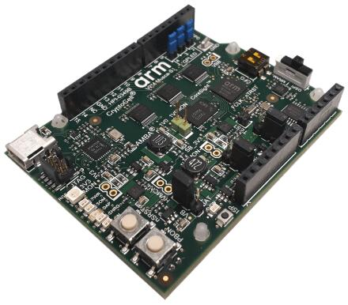
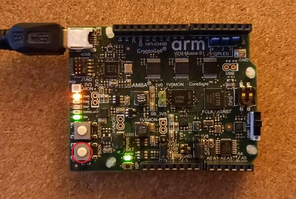

.. _v2m_musca_s1_board:

ARM V2M Musca-S1
################

Overview
********

The v2m_musca_s1 board configuration is used by Zephyr applications that run
on the V2M Musca-S1 board. It provides support for the Musca-S1 ARM Cortex-M33
CPU and the following devices:

- Nested Vectored Interrupt Controller (NVIC)
- System Tick System Clock (SYSTICK)
- Cortex-M System Design Kit GPIO
- Cortex-M System Design Kit UART

More information about the board can be found at the `V2M Musca-S1 Website`_.

Hardware
********

ARM V2M MUSCA-S1 provides the following hardware components:

- ARM Cortex-M33 (with FPU and DSP)
- ARM IoT Subsystem for Cortex-M33
- Memory

  - 512KB on-chip system memory SRAM.
  - 2MB on-chip eMRAM (non-volatile).
  - 32MB of external QSPI flash.

- Debug

  - JTAG, SWD & P-JTAG.
  - DAPLink with a virtual UART port.

- Arduino interface

  - 16 3V3 or 1V8 GPIO.
  - UART.
  - SPI.
  - I2C.
  - I2S.
  - 3-channel PWM.
  - 6-channel analog interface.

- On-board Peripherals

  - User RGB LED.
  - Gyro sensor.
  - Combined ADC/DAC/temperature sensor.

User push buttons
=================

The v2m_musca_s1 board provides the following user push buttons:

- PBON: power on/off.
- nSRST: Cortex-M33 system reset and CoreSight debug reset.
- ISP: Updates DAPLink firmware.

Supported Features
===================

The v2m_musca_s1 board configuration supports the following hardware features:

+-----------+------------+-------------------------------------+
| Interface | Controller | Driver/Component                    |
+===========+============+=====================================+
| NVIC      | on-chip    | nested vector interrupt controller  |
+-----------+------------+-------------------------------------+
| SYSTICK   | on-chip    | systick                             |
+-----------+------------+-------------------------------------+
| UART      | on-chip    | serial port-polling;                |
|           |            | serial port-interrupt               |
+-----------+------------+-------------------------------------+
| PINMUX    | on-chip    | pinmux                              |
+-----------+------------+-------------------------------------+
| GPIO      | on-chip    | gpio                                |
+-----------+------------+-------------------------------------+
| TIMER     | on-chip    | timer                               |
+-----------+------------+-------------------------------------+
| TrustZone | on-chip    | Trusted Firmware-M                  |
+-----------+------------+-------------------------------------+

Other hardware features are not currently supported by the port.
See the `V2M Musca-S1 Website`_ for a complete list of V2M Musca-S1 board
hardware features.

The default configuration can be found in the defconfig file:
``boards/arm/v2m_musca_s1/v2m_musca_s1_defconfig``.

Interrupt Controller
====================

Musca-S1 is a Cortex-M33 based SoC and has 15 fixed exceptions and 77 IRQs.

A Cortex-M33-based board uses vectored exceptions. This means each exception
calls a handler directly from the vector table.

Zephyr provides handlers for exceptions 1-7, 11, 12, 14, and 15, as listed
in the following table:

+------+------------+----------------+--------------------------+
| Exc# | Name       | Remarks        | Used by Zephyr Kernel    |
+======+============+================+==========================+
|  1   | Reset      |                | system initialization    |
+------+------------+----------------+--------------------------+
|  2   | NMI        |                | system fatal error       |
+------+------------+----------------+--------------------------+
|  3   | Hard fault |                | system fatal error       |
+------+------------+----------------+--------------------------+
|  4   | MemManage  | MPU fault      | system fatal error       |
+------+------------+----------------+--------------------------+
|  5   | Bus        |                | system fatal error       |
+------+------------+----------------+--------------------------+
|  6   | Usage      | Undefined      | system fatal error       |
|      | fault      | instruction,   |                          |
|      |            | or switch      |                          |
|      |            | attempt to ARM |                          |
|      |            | mode           |                          |
+------+------------+----------------+--------------------------+
|  7   | SecureFault| Unauthorized   | system fatal error       |
|      |            | access to      |                          |
|      |            | secure region  |                          |
|      |            | from ns space  |                          |
+------+------------+----------------+--------------------------+
|  8   | Reserved   |                | not handled              |
+------+------------+----------------+--------------------------+
|  9   | Reserved   |                | not handled              |
+------+------------+----------------+--------------------------+
| 10   | Reserved   |                | not handled              |
+------+------------+----------------+--------------------------+
| 11   | SVC        |                | system calls, kernel     |
|      |            |                | run-time exceptions,     |
|      |            |                | and IRQ offloading       |
+------+------------+----------------+--------------------------+
| 12   | Debug      |                | system fatal error       |
|      | monitor    |                |                          |
+------+------------+----------------+--------------------------+
| 13   | Reserved   |                | not handled              |
+------+------------+----------------+--------------------------+
| 14   | PendSV     |                | context switch           |
+------+------------+----------------+--------------------------+
| 15   | SYSTICK    |                | system clock             |
+------+------------+----------------+--------------------------+
| 16   | Reserved   |                | not handled              |
+------+------------+----------------+--------------------------+
| 17   | Reserved   |                | not handled              |
+------+------------+----------------+--------------------------+
| 18   | Reserved   |                | not handled              |
+------+------------+----------------+--------------------------+

Pin Mapping
===========

The ARM V2M Musca-S1 board's GPIO controller is responsible for pin-muxing,
input/output, pull-up, etc.
All GPIO controller pins are exposed via pins 0 - 15.

Mapping from the ARM V2M Musca-S1 Board pins to GPIO controller pins:

.. rst-class:: rst-columns

   - D0 : P0_0
   - D1 : P0_1
   - D2 : P0_2
   - D3 : P0_3
   - D4 : P0_4
   - D5 : P0_5
   - D6 : P0_6
   - D7 : P0_7
   - D8 : P0_8
   - D9 : P0_9
   - D10 : P0_10
   - D11 : P0_11
   - D12 : P0_12
   - D13 : P0_13
   - D14 : P0_14
   - D15 : P0_15

Peripheral Mapping:

.. rst-class:: rst-columns

   - UART_0_RX : D0
   - UART_0_TX : D1
   - SPI_0_CS : D10
   - SPI_0_MOSI : D11
   - SPI_0_MISO : D12
   - SPI_0_SCLK : D13
   - I2C_0_SDA : D14
   - I2C_0_SCL : D15

For mode details please refer to `Musca-S1 Technical Reference Manual (TRM)`_.

RGB LED
============

Musca-S1 has a built-in RGB LED connected to GPIO[4:2] pins.

- Red LED connected at GPIO[2] pin,with optional PWM0.
- Green LED connected at GPIO[3] pin,with optional PWM1.
- Blue LED connected at GPIO[4] pin,with optional PWM2.

.. note:: The SCC registers select the functions of pins GPIO[4:2].

System Clock
============

V2M Musca-S1 has a 32.768kHz crystal clock. The clock goes to a PLL and is
multiplied to drive the Cortex-M33 processors and SSE-200 subsystem. The
default is 50MHz but can be increased to 200MHz maximum for the secondary
processor (CPU1) via software configuration. The maximum clock frequency
for the primary processor (CPU0) is 50MHz.

Serial Port
===========

The ARM Musca-S1 processor has two UARTs. Both the UARTs have only two wires
for RX/TX and no flow control (CTS/RTS) or FIFO. The Zephyr console output,
by default, uses UART1.

Security components
===================

- Implementation Defined Attribution Unit (`IDAU`_). The IDAU is used to define
  secure and non-secure memory maps. By default, all of the memory space is
  defined to be secure accessible only.
- Secure and Non-secure peripherals via the Peripheral Protection Controller
  (PPC). Peripherals can be assigned as secure or non-secure accessible.
- Secure boot.
- Secure `AMBA®`_ interconnect.

Serial Configuration Controller (SCC)
=====================================

The ARM Musca-S1 test chip implements a Serial Configuration Control (SCC)
register. The purpose of this register is to allow individual control of
clocks, reset-signals and interrupts to peripherals, and pin-muxing.

Boot memory
================
Normal Musca-S1 test chip boot operation is from 2MB eMRAM by default, and
it offers the fastest boot method. Musca-S1 test chip also support to boot from
32MB off-chip QSPI flash. You can update the DAPLink firmware and set the boot
selector slider switch for either QSPI or eMRAM for booting.

Programming and Debugging
*************************

Musca-S1 supports the v8m security extension, and by default boots to the
secure state.

When building a secure/non-secure application, the secure application will
have to set the IDAU/SAU and MPC configuration to permit access from the
non-secure application before jumping.

The following system components are required to be properly configured during
the secure firmware:

- AHB5 TrustZone Memory Protection Controller (MPC).
- AHB5 TrustZone Peripheral Protection Controller (PPC).
- Implementation-Defined Attribution Unit (IDAU).

For more details please refer to `Corelink SSE-200 Subsystem`_.

Flashing
========

DAPLink
---------

V2M Musca-S1 provides:

- A USB connection to the host computer, which exposes a Mass Storage and an
  USB Serial Port.
- A Serial Flash device, which implements the USB flash disk file storage.
- A physical UART connection which is relayed over interface USB Serial port.

This interfaces are exposed via DAPLink which provides:

- Serial Wire Debug (SWD).
- USB Mass Storage Device (USBMSD).
- UART.
- Remote reset.

For more details please refer
to the `DAPLink Website`_.

Building a secure only application
----------------------------------

You can build applications in the usual way. Here is an example for
the :ref:`hello_world` application.

.. zephyr-app-commands::
   :zephyr-app: samples/hello_world
   :board: v2m_musca_s1
   :goals: build

Open a serial terminal (minicom, putty, etc.) with the following settings:

- Speed: 115200
- Data: 8 bits
- Parity: None
- Stop bits: 1

Uploading an application to V2M Musca-S1
----------------------------------------

To upload the :ref:`hello_world` application to the board, no extra steps are
required. You can directly upload ``build/zephyr/zephyr.hex``, which is
generated by Zephyr's build system.

In other situations, applications must first be converted to Intel's hex
format before being flashed to a V2M Musca-S1. An optional bootloader can also
be prepended to the image.

The eMRAM base address alias is ``0xA000000``, and the QSPI flash base address
alias is ``0x0``. The image offset is calculated by adding the flash offset to the
bootloader partition size (when there is one).

A third-party tool (srecord) can be used to concatenate the images and generate
the Intel formatted hex image.

For more information refer to the `Srecord Manual`_.

.. code-block:: bash

   srec_cat $BIN_BOOTLOADER -Binary -offset $FLASH_OFFSET $BIN_APP -Binary -offset $IMAGE_OFFSET -o zephyr.hex -Intel

   # For a 128K bootloader IMAGE_OFFSET = $FLASH_OFFSET + 0x20000
   srec_cat $BIN_BOOTLOADER -Binary -offset 0xA000000 $BIN_APP -Binary -offset 0xA020000 -o zephyr.hex -Intel

To upload the application, connect the V2M Musca-S1 to your host computer using
the USB port and power-on the board by pressing the PBON button as seen on the
picture above. The 3 LEDs should be lit (PWR, ON and 5VON) and you should see a
USB connection exposing a Mass Storage (MUSCA_S) and a USB Serial Port.
Now copy the generated ``zephyr.hex`` to the MUSCA_S drive.

Reset the board, and if you were building the hello_world application you should
see the following message on the corresponding serial port:

.. code-block:: console

   Musca-S1 Dual Firmware Version 1.9
   *** Booting Zephyr OS build zephyr-v2.4.0-2314-gadc81d188323  ***
   Hello World! musca_s1

Building a secure/non-secure image with Trusted Firmware-M
----------------------------------------------------------

The process requires five steps:

1. Build Trusted Firmware-M (TF-M).
2. Import it as a library to the Zephyr source folder.
3. Build Zephyr with a non-secure configuration.
4. Merge the two binaries together and sign them.
5. Concatenate the bootloader with the signed image blob.

In order to build tfm please refer to `Trusted Firmware-M Guide`_.
Follow the build steps for AN521 target while replacing the platform with
``-DTFM_PLATFORM=musca_s1`` and compiler (if required) with
``-DTFM_TOOLCHAIN_FILE=toolchain_GNUARM.cmake``.

Copy over TF-M as a library to the Zephyr project source and create a shortcut
for the secure veneers and necessary header files. All files are in the install
folder after TF-M built.

Building the TF-M integration sample for Musca-S1
-------------------------------------------------

The TF-M integration samples can be run using the ``v2m_musca_s1_ns``
target. Please make sure all the requirements listed in the sample's
description are met before building.

.. zephyr-app-commands::
   :zephyr-app: samples/tfm_integration/psa_crypto
   :board: v2m_musca_s1_ns
   :goals: build

To upload the build artifact to the board, first connect the Musca-S1 to your
computer using the USB port, press the PBON button, and copy
the ``build/tfm_zephyr.hex`` file onto the MUSCA_S mass storage device.
(For a more detailed description of these steps, please read the 'Uploading
an application to V2M Musca-S1' section.)

Once the file transfer has completed, you may reset the board.

The ``tfm_zephyr.hex`` file was generated by concatenating the signed TF-M and
Zephyr binaries with the MCUboot image, and converting it to Intel's hex format.
These steps are all performed automatically by CMake.

For alternative build options and more information, please read the
corresponding TF-M integration example's README file.

.. _V2M Musca-S1 Website:
   https://developer.arm.com/Tools%20and%20Software/Musca-S1%20Test%20Chip%20Board

.. _Musca-S1 Technical Reference Manual (TRM):
   https://developer.arm.com/documentation/101835/latest

.. _DAPLink Website:
   https://github.com/ARMmbed/DAPLink

.. _Cortex-M33 Generic User Guide:
   https://developer.arm.com/documentation/100235/latest/

.. _Trusted Firmware-M Guide:
   https://tf-m-user-guide.trustedfirmware.org/building/tfm_build_instruction.html

.. _Corelink SSE-200 Subsystem:
   https://developer.arm.com/documentation/dto0051/latest/subsystem-overview/about-the-sse-200

.. _Srecord Manual:
   http://srecord.sourceforge.net/man/man1/srec_cat.html

.. _IDAU:
   https://developer.arm.com/documentation/100690/latest/Attribution-units--SAU-and-IDAU-

.. _AMBA®:
   https://developer.arm.com/architectures/system-architectures/amba
