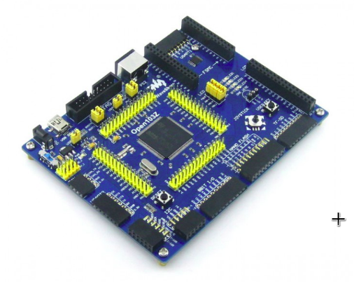

.. _waveshare_open103z_board:

Waveshare Open103Z
##################

Overview
********

The Waveshare Open103Z-64 is a development board equipped with STM32F103ZE MCU.

Hardware
********

The Waveshare Open103Z provides the following hardware components:

.. image:: img/waveshare_connector.PNG
.. image:: img/waveshare_connector_list.PNG

Supported Features
==================

The Waveshare Open103Z configuration supports the following hardware features:

+-----------+------------+--------------------------------------+
| Interface | Controller |      Driver/Component                |
+===========+============+======================================+
| NVIC      | on-chip    | nested vectored interrupt controller |
+-----------+------------+--------------------------------------+
| ADC       | on-chip    | adc                                  |
+-----------+------------+--------------------------------------+
| UART      | on-chip    | serial port                          |
+-----------+------------+--------------------------------------+
| GPIO      | on-chip    | gpio                                 |
+-----------+------------+--------------------------------------+
| FLASH     | on-chip    | flash                                |
+-----------+------------+--------------------------------------+
| SPI       | on-chip    | spi                                  |
+-----------+------------+--------------------------------------+
| I2C       | on-chip    | i2c                                  |
+-----------+------------+--------------------------------------+
| CAN       | on-chip    | can (disabled by default)            |
+-----------+------------+--------------------------------------+
| USB       | on-chip    | usb                                  |
+-----------+------------+--------------------------------------+

Programming and Debugging
*************************

Applications for the ``waveshare_open103z`` board configuration can be built and
flashed in the usual way.

Flashing
========

Build and flash applications as usual. Here is an example for the
:ref:`hello_world` application.

.. zephyr-app-commands::
   :zephyr-app: samples/hello_world
   :board: waveshare_open103z
   :goals: build flash

Debugging
=========

Debug applications as usual. Here is an example for the
:ref:`hello_world` application.

.. zephyr-app-commands::
   :zephyr-app: samples/hello_world
   :board: waveshare_open103z
   :maybe-skip-config:
   :goals: debug

References
**********

.. target-notes::

.. _Waveshare: https://www.waveshare.com/open103z-standard.htm
