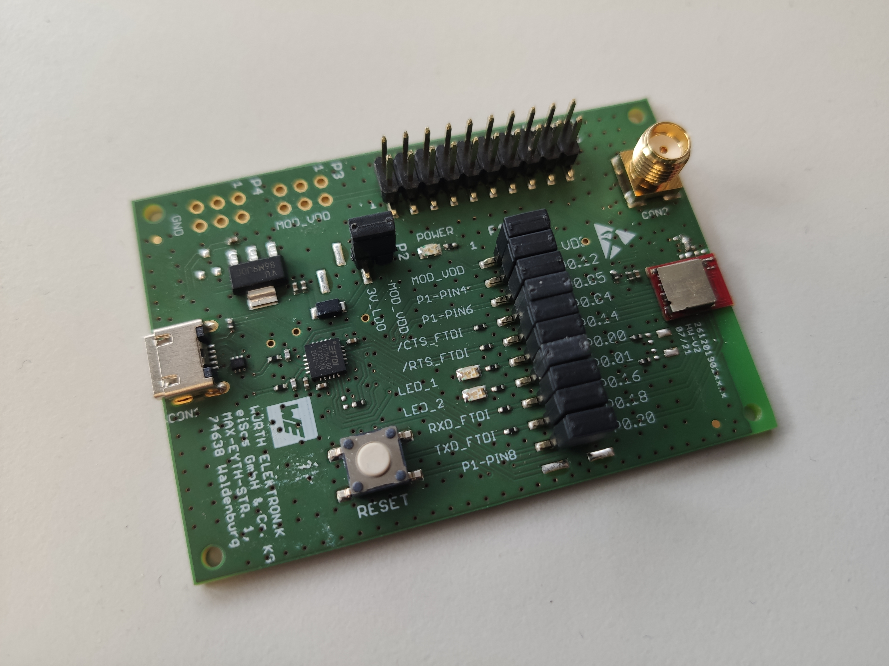

.. _we_ophelia1ev_nrf52805:

Ophelia-I EV NRF52805
#####################

Overview
********

The we_ophelia1ev_nrf52805 board is an evaluation board of the Ophelia-I radio module.
It provides support for the Nordic Semiconductor nRF52805 ARM CPU and
the following devices:

* CLOCK
* FLASH
* :abbr:`GPIO (General Purpose Input Output)`
* :abbr:`I2C (Inter-Integrated Circuit)`
* :abbr:`NVIC (Nested Vectored Interrupt Controller)`
* RADIO (Bluetooth Low Energy)
* :abbr:`RTC (nRF RTC System Clock)`
* Segger RTT (RTT Console)
* :abbr:`SPI (Serial Peripheral Interface)`
* :abbr:`UART (Universal asynchronous receiver-transmitter)`
* :abbr:`WDT (Watchdog Timer)`

     Ophelia-I EV (Credit: Würth Elektronik)

Hardware
********

The Ophelia-I uses the internal low frequency RC oscillator
and provides the so called smart antenna connection, that allows
to choose between the module's integrated PCB antenna and an external
antenna that can be connected to the available SMA connector.

Supported Features
==================

The we_ophelia1ev_nrf52805 board configuration supports the following
hardware features:

+-----------+------------+----------------------+
| Interface | Controller | Driver/Component     |
+===========+============+======================+
| CLOCK     | on-chip    | clock_control        |
+-----------+------------+----------------------+
| FLASH     | on-chip    | flash                |
+-----------+------------+----------------------+
| GPIO      | on-chip    | gpio                 |
+-----------+------------+----------------------+
| I2C(M)    | on-chip    | i2c                  |
+-----------+------------+----------------------+
| MPU       | on-chip    | arch/arm             |
+-----------+------------+----------------------+
| NVIC      | on-chip    | arch/arm             |
+-----------+------------+----------------------+
| RADIO     | on-chip    | Bluetooth            |
+-----------+------------+----------------------+
| RTC       | on-chip    | system clock         |
+-----------+------------+----------------------+
| RTT       | Segger     | console              |
+-----------+------------+----------------------+
| SPI(M/S)  | on-chip    | spi                  |
+-----------+------------+----------------------+
| UART      | on-chip    | serial               |
+-----------+------------+----------------------+
| WDT       | on-chip    | watchdog             |
+-----------+------------+----------------------+

Programming and Debugging
*************************

Flashing
========

Follow the instructions in the :ref:`nordic_segger` page to install
and configure all the necessary software. Further information can be
found in :ref:`nordic_segger_flashing`. Then build and flash
applications as usual (see :ref:`build_an_application` and
:ref:`application_run` for more details).

Here is an example for the :ref:`hello_world` application.

First, run your favorite terminal program to listen for output.

.. code-block:: console

   $ minicom -D <tty_device> -b 115200

Replace :code:`<tty_device>` with the port where the board nRF52 DK
can be found. For example, under Linux, :code:`/dev/ttyACM0`.

Then build and flash the application in the usual way.

.. zephyr-app-commands::
   :zephyr-app: samples/hello_world
   :board: nrf52dk_nrf52832
   :goals: build flash

Debugging
=========

Refer to the :ref:`nordic_segger` page to learn about debugging Nordic boards with a
Segger IC.

References
**********

.. target-notes::

.. _Ophelia-I radio module website: https://www.we-online.com/katalog/de/OPHELIA-I
.. _nRF52805 website: https://www.nordicsemi.com/Products/Low-power-short-range-wireless/nRF52805
