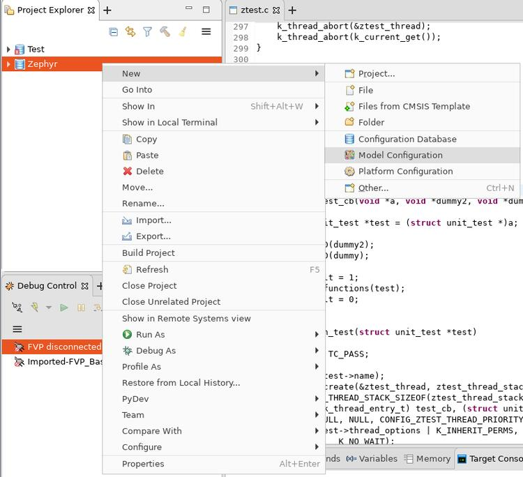

.. _debug_with_arm_ds:

Debug with Arm DS
#################

Install Arm DS
**************

Please refer to the official Arm Development Studio Page [1]_ for details. Here
``Version: 2020.b Build: 2020110909`` is used in the following example.

.. image:: images/version-info.jpg
   :align: center
   :alt: Arm DS Version

Download Arm FVP BaseR AEMv8-R
******************************

Please refer to official FVP page [2]_ for download instructions. Here ``$FVP_D``
is used to indicate which directory is FVP located.

Use DS perspective
******************

From menu choose ``Window -> Perspective -> Open Perspective -> Other...``:

.. image:: images/perspective-choose-other.jpg
   :align: center
   :alt: Arm DS Perspective choose Other...

In the opened window, choose ``Development Studio (default)``:

.. image:: images/perspective-choose-ds.jpg
   :align: center
   :alt: Arm DS Perspective choose DS

Create a new configuration database
***********************************

Create a new configuration database by selecting ``File -> New -> Other... -> Configuration Database``:

.. image:: images/create-new-configuration-database.jpg
   :align: center
   :alt: Arm DS create new configuration database

Choose a name for the database. Here ``Zephyr`` is used:

.. image:: images/create-new-configuration-database_database-name.jpg
   :align: center
   :alt: Arm DS create new configuration database: choose database name

Click ``Finish`` and the new configuration database can be seen in ``Project Explorer``:

.. image:: images/create-new-configuration-database_shown-in-project-explorer.jpg
   :align: center
   :alt: Arm DS create new configuration database: shown in project explorer

Create a new model configuration
********************************

Right click ``Zephyr`` in ``Project Explorer``, choose ``New -> Model Configuration``:

In the opened window:

1. Choose ``Iris`` for ``Model Interface``, then ``Next >``.
2. Choose ``Launch and connect to specific model``, then ``Next >``.
3. Set ``Model Path`` to ``$FVP_D/FVP_BaseR_AEMv8R``, then ``Finish``.

.. image:: images/create-new-model-configuration_model-path.jpg
   :align: center
   :alt: Arm DS create new model configuration: set model path

Then in ``FVP_BaseR_AEMv8R`` tab, change ``ARMAEMv8-R_`` to ``V8R64-Generic``,
click ``Save`` and then click ``Import``:

.. image:: images/create-new-model-configuration_model-use-V8R64-Generic.jpg
   :align: center
   :alt: Arm DS create new model configuration: import

Create a new launch configuration
*********************************

From ``Project Explorer``, right click ``FVP_BaseR_AEMv8R`` and select ``Debug as -> Debug configurations...``:

.. image:: images/create-new-launch-configuration_context-menu.jpg
   :align: center
   :alt: Arm DS create new launch configuration: context menu

Select ``Generic Arm C/C++ Application`` and click ``New launch configuration`` button.
A new configuration named ``New_configuration`` will be created.

1. In ``Connection`` tab:

   - In ``Select target`` box, select ``Imported -> FVP_BaseR_AEMv8R -> Bare Metal Debug -> ARMAEMv8-R_MP_0``
   - In ``Connections`` box, set ``Model parameters`` to::

       -C bp.dram.enable_atomic_ops=1 -C bp.sram.enable_atomic_ops=1 -C bp.refcounter.non_arch_start_at_default=1 -C gic_distributor.GICD_CTLR-DS-1-means-secure-only=1 -C gic_distributor.has-two-security-states=0 -C bp.vis.disable_visualisation=1 -C cluster0.has_aarch64=1 -a /home/fengqi/zephyrproject/build/zephyr/zephyr.elf

     These parameters are passed to ``FVP_BaseR_AEMv8R`` when launches. Run ``FVP_BaseR_AEMv8R --help``
     to see all command line options. Run ``FVP_BaseR_AEMv8R --list-params`` to see all supported parameters.
     The file ``zephyr.elf`` specified by ``-a`` is the binary built from Zephyr.

.. image:: images/create-new-launch-configuration_connection.jpg
   :align: center
   :alt: Arm DS create new launch configuration: connection

2. In ``Files`` tab:

   In ``Files`` box, set ``Load symbols from file`` to full path of ``zephyr.elf`` that you built.

.. image:: images/create-new-launch-configuration_files.jpg
   :align: center
   :alt: Arm DS create new launch configuration: files

3. In ``Debugger`` tab:

   - In ``Run control`` box, check ``Execute debugger commands`` and insert::

       add-symbol-file "/home/fengqi/zephyrproject/build/zephyr/zephyr.elf" EL1S:0

     Replace ``/home/fengqi/zephyrproject/build/zephyr/zephyr.elf`` with your local path.

   - In ``Paths`` box, set ``Source search directory`` to the path to Zephyr source code.

.. image:: images/create-new-launch-configuration_debugger.jpg
   :align: center
   :alt: Arm DS create new launch configuration: debugger

After all these changes are made, click ``Apply``, then click ``Debug``. DS will
launch ``FVP_BaseR_AEMv8R`` and connect to it. You can see a new session is
connected in ``Debug Control`` window.

.. image:: images/DS-debug-working.jpg
   :align: center
   :alt: Arm DS working

References
**********

.. [1] https://developer.arm.com/tools-and-software/embedded/arm-development-studio
.. [2] https://developer.arm.com/tools-and-software/simulation-models/fixed-virtual-platforms/arm-ecosystem-models
