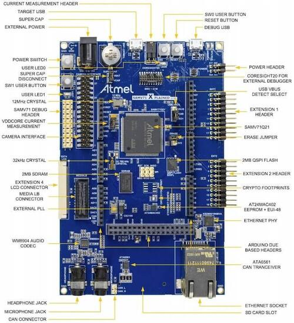

.. _sam_v71_xplained_ultra:

SAM V71(B) Xplained Ultra
#########################

Overview
********

The SAM V71 Xplained Ultra evaluation kit is a development platform to
evaluate the Atmel SAM V71 series microcontrollers. The current version
allows to use both IC variations ATSAMV71Q21A(B).

Hardware
********

- ATSAMV71Q21A(B) ARM Cortex-M7 Processor
- 12 MHz crystal oscillator
- 32.768 kHz crystal oscillator
- Supercap backup
- AT24MAC402 EEPROM
- IS42S16100E 16 Mb SDRAM
- S25FL116K 16 Mb QSPI
- WM8904 low power stereo audio codec
- ATA6561 CAN Transceiver
- SD card connector with SDIO support
- Camera interface connector
- MediaLB connector
- Ethernet port
- Micro-AB USB device
- Micro-AB USB debug interface supporting CMSIS-DAP, Virtual COM Port and Data
  Gateway Interface (DGI)
- JTAG interface connector
- One reset and two user pushbuttons
- Two yellow user LEDs

Supported Features
==================

The sam_v71_xplained_ultra board configuration supports the following hardware
features:

+-----------+------------+-------------------------------------+
| Interface | Controller | Driver/Component                    |
+===========+============+=====================================+
| NVIC      | on-chip    | nested vector interrupt controller  |
+-----------+------------+-------------------------------------+
| SYSTICK   | on-chip    | systick                             |
+-----------+------------+-------------------------------------+
| AFEC      | on-chip    | adc                                 |
+-----------+------------+-------------------------------------+
| CAN FD    | on-chip    | can                                 |
+-----------+------------+-------------------------------------+
| COUNTER   | on-chip    | counter                             |
+-----------+------------+-------------------------------------+
| ETHERNET  | on-chip    | ethernet                            |
+-----------+------------+-------------------------------------+
| GPIO      | on-chip    | gpio                                |
+-----------+------------+-------------------------------------+
| DAC       | on-chip    | dac                                 |
+-----------+------------+-------------------------------------+
| HWINFO    | on-chip    | Unique device serial number         |
+-----------+------------+-------------------------------------+
| I2C       | on-chip    | i2c                                 |
+-----------+------------+-------------------------------------+
| I2S       | on-chip    | i2s                                 |
+-----------+------------+-------------------------------------+
| PWM       | on-chip    | pwm                                 |
+-----------+------------+-------------------------------------+
| SPI       | on-chip    | spi                                 |
+-----------+------------+-------------------------------------+
| UART      | on-chip    | serial port                         |
+-----------+------------+-------------------------------------+
| USART     | on-chip    | serial port                         |
+-----------+------------+-------------------------------------+
| USB       | on-chip    | USB device                          |
+-----------+------------+-------------------------------------+
| WATCHDOG  | on-chip    | watchdog                            |
+-----------+------------+-------------------------------------+
| XDMAC     | on-chip    | dma                                 |
+-----------+------------+-------------------------------------+

Other hardware features are not currently supported by Zephyr.

The default configuration can be found in the Kconfig
:zephyr_file:`boards/atmel/sam/sam_v71_xult/sam_v71_xult_samv71q21_defconfig`.

Connections and IOs
===================

The `SAMV71-XULT User Guide`_ has detailed information about board
connections.

System Clock
============

The SAM V71 MCU is configured to use the 12 MHz external oscillator on the
board with the on-chip PLL to generate a 300 MHz system clock.

Serial Port
===========

The ATSAMV71Q21 MCU has five UARTs and three USARTs. USART1 is configured
for the console and is available as a Virtual COM Port via EDBG USB chip.

Programming and Debugging
*************************

Flashing the Zephyr project onto SAM V71 MCU requires the `OpenOCD tool`_.
By default a factory new SAM V71 chip will boot the `SAM-BA`_ boot loader
located in the ROM, not the flashed image. This is determined by the value
of GPNVM1 (General-Purpose NVM bit 1). The flash procedure will ensure that
GPNVM1 is set to 1 changing the default behavior to boot from Flash.

If your chip has a security bit GPNVM0 set you will be unable to program flash
memory or connect to it via a debug interface. The only way to clear GPNVM0
is to perform a chip erase procedure that will erase all GPNVM bits and the
full contents of the SAM V71 flash memory:

- With the board power off, set a jumper on the J200 header.
- Turn the board power on. The jumper can be removed soon after the power is
  on (flash erasing procedure is started when the erase line is asserted for
  at least 230ms)

Flashing
========

#. Run your favorite terminal program to listen for output. Under Linux the
   terminal should be :code:`/dev/ttyACM0`. For example:

   .. code-block:: console

      $ minicom -D /dev/ttyACM0 -o

   The -o option tells minicom not to send the modem initialization
   string. Connection should be configured as follows:

   - Speed: 115200
   - Data: 8 bits
   - Parity: None
   - Stop bits: 1

#. Connect the SAM V71 Xplained Ultra board to your host computer using the
   USB debug port. Then build and flash the :zephyr:code-sample:`hello_world`
   application.

   .. zephyr-app-commands::
      :zephyr-app: samples/hello_world
      :board: sam_v71_xult/samv71q21
      :goals: build flash

   You should see "Hello World! sam_v71_xult" in your terminal.

#. To use the SoC variation B IC, you need type "sam_v71_xult/samv71q21b".

   .. zephyr-app-commands::
      :zephyr-app: samples/hello_world
      :board: sam_v71_xult/samv71q21b
      :goals: build flash

   You should see "Hello World! sam_v71_xult" in your terminal.

You can flash the image using an external debug adapter such as J-Link
or ULINK, connected to the 20-pin JTAG header. Supply the name of the
debug adapter (e.g., ``jlink``) via an OPENOCD_INTERFACE environment
variable. OpenOCD will look for the appropriate interface
configuration in an ``interface/$(OPENOCD_INTERFACE).cfg`` file on its
internal search path.

Debugging
=========

You can debug an application in the usual way.  Here is an example for the
:zephyr:code-sample:`hello_world` application.

.. zephyr-app-commands::
   :zephyr-app: samples/hello_world
   :board: sam_v71_xult/samv71q21
   :maybe-skip-config:
   :goals: debug

References
**********

SAM V71 Product Page:
    https://www.microchip.com/design-centers/32-bit/sam-32-bit-mcus/sam-v-mcus

.. _SAMV71-XULT User Guide:
    http://ww1.microchip.com/downloads/en/DeviceDoc/Atmel-42408-SAMV71-Xplained-Ultra_User-Guide.pdf

.. _OpenOCD tool:
    http://openocd.org/

.. _SAM-BA:
    https://www.microchip.com/developmenttools/ProductDetails/PartNO/SAM-BA%20In-system%20Programmer
