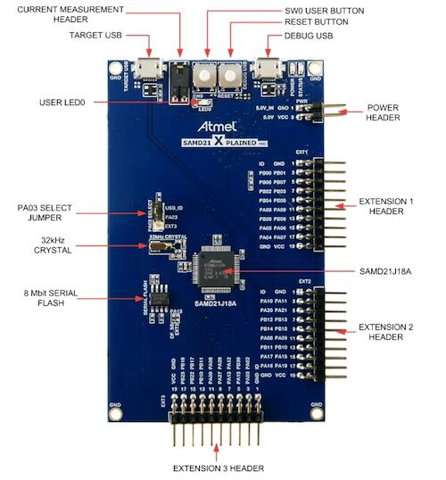

.. zephyr:board:: samd21_xpro

Overview
********

The SAM D21 Xplained Pro evaluation kit is ideal for evaluation and
prototyping with the SAM D21 Cortex®-M0+ processor-based
microcontrollers. The kit includes Atmel's Embedded Debugger (EDBG),
which provides a full debug interface without the need for additional
hardware.

Hardware
********

- SAMD21J18 ARM Cortex-M0+ processor at 48 MHz
- 32.768 kHz crystal oscillator
- 256 KiB flash memory and 32 KiB of RAM
- One yellow user LED
- One mechanical user push button
- One reset button
- On-board USB based EDBG unit with serial console

Supported Features
==================

The samd21_xpro board configuration supports the following hardware
features:

.. list-table::
    :header-rows: 1

    * - Interface
      - Controller
      - Driver / Component
    * - NVIC
      - on-chip
      - nested vector interrupt controller
    * - Flash
      - on-chip
      - Can be used with LittleFS to store files
    * - SYSTICK
      - on-chip
      - systick
    * - WDT
      - on-chip
      - Watchdog
    * - ADC
      - on-chip
      - Analog to Digital Converter
    * - GPIO
      - on-chip
      - I/O ports
    * - PWM
      - on-chip
      - Pulse Width Modulation
    * - USART
      - on-chip
      - Serial ports
    * - I2C
      - on-chip
      - I2C ports
    * - SPI
      - on-chip
      - Serial Peripheral Interface ports
    * - USB
      - on-chip
      - Universal Serial Bus device ports

Other hardware features are not currently supported by Zephyr.

The default configuration can be found in the Kconfig
:zephyr_file:`boards/atmel/sam0/samd21_xpro/samd21_xpro_defconfig`.

Pin Mapping
===========

The SAM D21 Xplained Pro evaluation kit has 3 GPIO controllers. These
controllers are responsible for pin muxing, input/output, pull-up, etc.

For more details please refer to `SAM D21 Family Datasheet`_ and the `SAM D21
Xplained Pro Schematic`_.

Default Zephyr Peripheral Mapping:
----------------------------------
- SERCOM0 USART TX : PA10
- SERCOM0 USART RX : PA11
- SERCOM1 USART TX : PA16
- SERCOM1 USART RX : PA19
- SERCOM2 I2C SDA  : PA08
- SERCOM2 I2C SCL  : PA09
- SERCOM3 USART TX : PA22
- SERCOM3 USART RX : PA23
- SERCOM5 SPI MISO : PB16
- SERCOM5 SPI MOSI : PB22
- SERCOM5 SPI SCK  : PB23
- USB DP           : PA25
- USB DM           : PA24
- GPIO SPI CS      : PB17
- GPIO/PWM LED0    : PB30

System Clock
============

The SAMD21 MCU is configured to use the 32.768 kHz external oscillator
with the on-chip PLL generating the 48 MHz system clock.

Serial Port
===========

The SAMD21 MCU has six SERCOM based USARTs with three configured as USARTs in
this BSP. SERCOM3 is the default Zephyr console.

- SERCOM0 9600 8n1
- SERCOM1 115200 8n1
- SERCOM3 115200 8n1 connected to the onboard Atmel Embedded Debugger (EDBG)

PWM
===

The SAMD21 MCU has 3 TCC based PWM units with up to 4 outputs each and a period
of 24 bits or 16 bits.  If :code:`CONFIG_PWM_SAM0_TCC` is enabled then LED0 is
driven by TCC0 instead of by GPIO.

SPI Port
========

The SAMD21 MCU has 6 SERCOM based SPIs. On the SAM D21 Xplained Pro,
SERCOM5 is connected to an 8 megabit SPI flash.

Programming and Debugging
*************************

The SAM D21 Xplained Pro comes with a Atmel Embedded Debugger (EDBG).  This
provides a debug interface to the SAMD21 chip and is supported by
OpenOCD.

Flashing
========

#. Build the Zephyr kernel and the ``hello_world`` sample application:

   .. zephyr-app-commands::
      :zephyr-app: samples/hello_world
      :board: samd21_xpro
      :goals: build
      :compact:

#. Connect the SAM D21 Xplained Pro to your host computer using the USB debug
   port.

#. Run your favorite terminal program to listen for output. Under Linux the
   terminal should be :code:`/dev/ttyACM0`. For example:

   .. code-block:: console

      $ minicom -D /dev/ttyACM0 -o

   The -o option tells minicom not to send the modem initialization
   string. Connection should be configured as follows:

   - Speed: 115200
   - Data: 8 bits
   - Parity: None
   - Stop bits: 1

#. To flash an image:

   .. zephyr-app-commands::
      :zephyr-app: samples/hello_world
      :board: samd21_xpro
      :goals: flash
      :compact:

   You should see "Hello World! samd21_xpro" in your terminal.

References
**********

.. target-notes::

.. _Microchip Technology:
    http://www.microchip.com/DevelopmentTools/ProductDetails.aspx?PartNO=ATSAMD21-XPRO

.. _SAM D21 Family Datasheet:
    http://ww1.microchip.com/downloads/en/DeviceDoc/SAM-D21-Family-Datasheet-DS40001882C.pdf

.. _SAM D21 Xplained Pro Schematic:
    http://ww1.microchip.com/downloads/en/DeviceDoc/SAMD21-Xplained-Pro_Design-Documentation.zip
