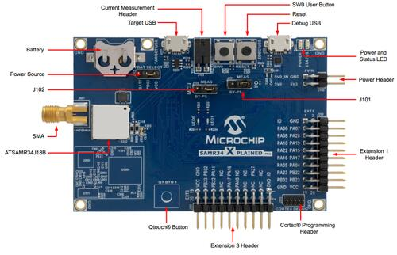

.. zephyr:board:: samr34_xpro

Overview
********

The SAM R34 Xplained Pro evaluation kit is ideal for evaluation and
prototyping with the SAM R34 Cortex®-M0+ processor-based
microcontrollers. The kit includes Atmel’s Embedded Debugger (EDBG),
which provides a full debug interface without the need for additional
hardware.

The SAMR34 and SAMR35 parts are produced as a System-in-Package (SiP),
including both a SAML21 die, and a Semtech SX1276 LoRa radio die.

This board is also referred to as DM320111.

Hardware
********

- SAMR34J18 ARM Cortex-M0+ processor at 48 MHz
- 32.768 kHz crystal oscillator
- 256 KiB flash memory, 32 KiB of SRAM, 8KB Low Power SRAM
- One yellow user LED
- One mechanical user push button
- One reset button
- On-board USB based EDBG unit with serial console

Supported Features
==================

.. zephyr:board-supported-hw::

Pin Mapping
===========

The SAM R34 Xplained Pro evaluation kit has 3 GPIO controllers. These
controllers are responsible for pin muxing, input/output, pull-up, etc.

For more details please refer to `SAM R34 Family Datasheet`_ and the `SAM R34
Xplained Pro Schematic`_.

Default Zephyr Peripheral Mapping:
----------------------------------
- SERCOM0 UART TX  : PA04
- SERCOM0 UART RX  : PA05
- SERCOM1 I2C SDA  : PA16
- SERCOM1 I2C SCL  : PA17
- SERCOM4 SPI MISO : PC19
- SERCOM4 SPI MOSI : PB30
- SERCOM4 SPI SCK  : PC18
- SERCOM4 GPIO CS  : PB31
- SERCOM5 SPI MISO : PB02
- SERCOM5 SPI MOSI : PB22
- SERCOM5 SPI SCK  : PB23
- SERCOM5 GPIO CS0 : PA23
- SERCOM5 GPIO CS1 : PA14
- USB DP           : PA25
- USB DM           : PA24
- GPIO/PWM LED0    : PA19

System Clock
============

The SAMR34 MCU is configured to use the 32.768 kHz external oscillator
with the on-chip PLL generating the 48 MHz system clock.

Serial Port
===========

The SAMR34 MCU has six SERCOM based USARTs with one configured as USART in
this BSP. SERCOM0 is the default Zephyr console.

- SERCOM0 115200 8n1 - connected to the onboard Atmel Embedded Debugger (EDBG)

PWM
===

The SAMR34 MCU has 3 TCC based PWM units with up to 4 outputs each and a period
of 24 bits or 16 bits.  If :code:`CONFIG_PWM_SAM0_TCC` is enabled then LED0 is
driven by TCC0 instead of by GPIO.

SPI Port
========

The SAMR34 MCU has 6 SERCOM based SPIs, with two configured as SPI in this BSP.

- SERCOM4 - connected to the internal LoRa radio
- SERCOM5 - connected to EXT1 and EXT3

Programming and Debugging
*************************

The SAM R34 Xplained Pro comes with a Atmel Embedded Debugger (EDBG).  This
provides a debug interface to the SAMR34 chip and is supported by
OpenOCD.

Flashing
========

#. Build the Zephyr kernel and the ``hello_world`` sample application:

   .. zephyr-app-commands::
      :zephyr-app: samples/hello_world
      :board: samr34_xpro
      :goals: build
      :compact:

#. Connect the SAM R34 Xplained Pro to your host computer using the USB debug
   port.

#. Run your favorite terminal program to listen for output. Under Linux the
   terminal should be :code:`/dev/ttyACM0`. For example:

   .. code-block:: console

      $ picocom -b 115200 /dev/ttyACM0

   - Speed: 115200
   - Data: 8 bits
   - Parity: None
   - Stop bits: 1

#. To flash an image:

   .. zephyr-app-commands::
      :zephyr-app: samples/hello_world
      :board: samr34_xpro
      :goals: flash
      :compact:

   You should see "Hello World! samr34_xpro" in your terminal.

References
**********

.. target-notes::

.. _Microchip website:
    https://www.microchip.com/en-us/development-tool/dm320111

.. _SAM L21 Family Datasheet:
    https://ww1.microchip.com/downloads/en/DeviceDoc/SAM_L21_Family_DataSheet_DS60001477C.pdf

.. _SAM R34 Family Datasheet:
    https://ww1.microchip.com/downloads/en/DeviceDoc/SAM-R34-R35-Low-Power-LoRa-Sub-GHz-SiP-Data-Sheet-DS70005356C.pdf

.. _SAM R34 Xplained Pro Schematic:
    https://ww1.microchip.com/downloads/Secure/en/DeviceDoc/SAMR34_SiP_Reference_Design_Package_V3.0.exe

.. _Semtech SX1276:
    https://www.semtech.com/products/wireless-rf/lora-transceivers/sx1276
