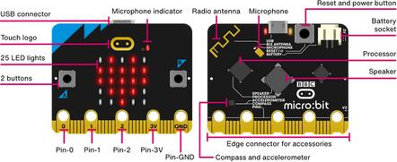

.. _bbc_microbit_v2:

BBC MicroBit V2
#################

Overview
********

The Micro Bit (also referred to as BBC Micro Bit, stylized as micro:bit) is an
ARM-based embedded system designed by the BBC for use in computer education in
the UK.

The board is 4 cm × 5 cm and has an ARM Cortex-M4F processor, accelerometer and
magnetometer sensors, Bluetooth and USB connectivity, a display consisting of
25 LEDs, a microphone, two programmable buttons, and can be powered by either
USB or an external battery pack. The device inputs and outputs are through five
ring connectors that are part of the 23-pin edge connector.

     BBC Micro Bit V2 (Credit: http://microbit.org/)

More information about the board can be found at the `microbit website`_.

Hardware
********

The micro:bit-v2 has the following physical features:

* 25 individually-programmable LEDs
* 2 programmable buttons
* Microphone sensors
* Physical connection pins
* Light and temperature sensors
* Motion sensors (accelerometer and compass)
* Wireless Communication, via Radio and Bluetooth 5
* USB interface

Supported Features
==================

The bbc_microbit_v2 board configuration supports the following
hardware features:

+-----------+------------+----------------------+
| Interface | Controller | Driver/Component     |
+===========+============+======================+
| NVIC      | on-chip    | nested vectored      |
|           |            | interrupt controller |
+-----------+------------+----------------------+
| RTC       | on-chip    | system clock         |
+-----------+------------+----------------------+
| UART      | on-chip    | serial port          |
+-----------+------------+----------------------+
| GPIO      | on-chip    | gpio                 |
+-----------+------------+----------------------+
| FLASH     | on-chip    | flash                |
+-----------+------------+----------------------+
| RADIO     | on-chip    | Bluetooth            |
+-----------+------------+----------------------+

Programming and Debugging
*************************

Flashing
========

Build and flash applications as usual (see :ref:`build_an_application` and
:ref:`application_run` for more details).

Here is an example for the :zephyr:code-sample:`hello_world` application.

First, run your favorite terminal program to listen for output.

.. code-block:: console

   $ minicom -D <tty_device> -b 115200

Replace :code:`<tty_device>` with the port where the micro:bit board
can be found. For example, under Linux, :code:`/dev/ttyACM0`.

Then build and flash the application in the usual way.

.. zephyr-app-commands::
   :zephyr-app: samples/hello_world
   :board: bbc_microbit_v2
   :goals: build flash

References
**********

.. target-notes::

.. _microbit website: http://www.microbit.org/
