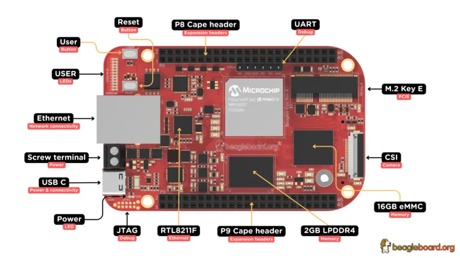

.. _beaglev_fire:

BeagleV®-Fire
#############

Overview
********

BeagleV®-Fire is a revolutionary single-board computer (SBC) powered by the Microchip’s
PolarFire® MPFS025T 5x core RISC-V System on Chip (SoC) with FPGA fabric. BeagleV®-Fire opens up new
horizons for developers, tinkerers, and the open-source community to explore the vast potential of
RISC-V architecture and FPGA technology. It has the same P8 & P9 cape header pins as BeagleBone
Black allowing you to stack your favorite BeagleBone cape on top to expand it’s capability.
Built around the powerful and energy-efficient RISC-V instruction set architecture (ISA) along with
its versatile FPGA fabric, BeagleV®-Fire SBC offers unparalleled opportunities for developers,
hobbyists, and researchers to explore and experiment with RISC-V technology.

Building
========

Applications for the ``beaglev_fire`` board configuration can be built as usual:

.. zephyr-app-commands::
   :zephyr-app: samples/hello_world
   :board: beaglev_fire
   :goals: build

Debugging
=========

In order to upload the application to the device, you'll need OpenOCD and GDB
with RISC-V support.
You can get them as a part of SoftConsole SDK.
Download and installation instructions can be found on
`Microchip's SoftConsole website
<https://www.microchip.com/en-us/products/fpgas-and-plds/fpga-and-soc-design-tools/programming-and-debug/softconsole>`_.

You will also require a Debugger such as Microchip's FlashPro5/6.

Connect to BeagleV-Fire UART debug port using a 3.3v USB to UART bridge.
Now you can run ``tio <port>`` in a terminal window to access the UART debug port connection. Once you
are connected properly you can press the Reset button which will show you a progress bar like:

.. image:: img/board-booting.png
     :align: center
     :alt: beaglev_fire

Once you see that progress bar on your screen you can start pressing any button (0-9/a-z) which
will interrupt the Hart Software Services from booting its payload.

With the necessary tools installed, you can connect to the board using OpenOCD.
from a different terminal, run:

.. code-block:: bash

   <softconsole_path>/openocd/bin/openocd --file \
   <softconsole_path>/openocd/share/openocd/scripts/board/microsemi-riscv.cfg

Leave it running, and in a different terminal, use GDB to upload the binary to
the board. You can use the RISC-V GDB from the Zephyr SDK.
launch GDB:

.. code-block:: bash

   <path_to_zephyr_sdk>/riscv64-zephyr-elf/bin/riscv64-zephyr-elf-gdb

Here is the GDB terminal command to connect to the device
and load the binary:

.. code-block:: bash

   set arch riscv:rv64
   set mem inaccessible-by-default off
   file <path_to_zehyr.elf>
   target extended-remote localhost:3333
   load
   break main
   continue
