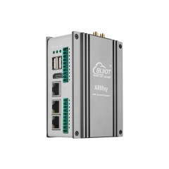

.. Copyright (c) 2026 Chrispine Tinega <dev@chrispinetinega.com>
.. SPDX-License-Identifier: Apache-2.0

.. zephyr:board:: am62x_m4_bl350

Overview
********

The BLIIoT ARMxy BL350 AM62x Cortex-M4F is part of the BL350 series of
Industrial Embedded Controllers powered by the TI Sitara AM62x (AM6254) SoC.
It features a quad-core Cortex-A53 cluster (up to 1.4 GHz) and a dedicated
Cortex-M4F MCU core. Built for robust industrial automation, it supports a
wide operating temperature range of -40°C to 85°C.

The Zephyr port targets the **Cortex-M4F MCU domain**, providing
real-time deterministic performance for industrial I/O control while the main
Cortex-A53 cluster runs Linux. Communication between the two domains is handled
via OpenAMP/RPMsg IPC over a shared DDR carveout.

   BLIIoT BL350 Industrial Controller

Hardware
********

The board is based on the TI AM6254 SoC:

- **CPU (Linux domain):** Quad-core ARM Cortex-A53 @ up to 1.4 GHz
- **MCU (Zephyr domain):** ARM Cortex-M4F @ 400 MHz
- **Memory:**

  - 256 KB MCU SRAM (192 KB I-Code @ ``0x0`` + 64 KB D-Code @ ``0x30000``)
  - Up to 2 GB DDR4 (shared); Linux reserves the following carveouts for M4F:

    - 14 MB M4F region (``0x9cc00000``): resource table in the first 4 KB, code/data after
    - 1 MB IPC/DMA region for OpenAMP vrings (``0x9cb00000``)

  - Up to 8 GB eMMC (Linux)

- **Industrial I/O:** RS232/RS485, CAN FD (×2), DI/DO, RTD, Thermocouple,
  configurable X/Y-Series expansion modules

Supported Features
==================

.. zephyr:board-supported-hw::

Connections and IOs
===================

The BL350 uses X-Series and Y-Series I/O expansion connectors for
RS232/RS485, CAN, DI/DO, RTD, TC, and more. The Zephyr M4F image communicates
with the A53 Linux application layer through the RPMsg IPC channel.

System Clock
------------

The M4F MCU domain runs at a fixed **400 MHz** system clock (derived from the Devicetree).

Serial Port
-----------

The default Zephyr console is routed to the MCU-domain UART (``uart0``) at
115200 8N1. The AM62x main-domain UARTs and other I/O routed to the X/Y-Series
expansion connectors are not enabled in the base board devicetree; enable the
ones your application needs with a devicetree overlay.

Programming and Debugging
*************************

Building
========

Build Zephyr applications for the M4F core using the board qualifier
``am62x_m4_bl350/am6254/m4``:

.. code-block:: console

   west build -b am62x_m4_bl350/am6254/m4 samples/hello_world

Flashing
========

The M4F binary is loaded by the A53 Linux cores using the ``remoteproc``
framework. Transfer the compiled ELF to the target filesystem and start
the core via ``sysfs``:

.. code-block:: console

   # On the target Linux system (as root):
   cp zephyr.elf /lib/firmware/
   echo zephyr.elf > /sys/class/remoteproc/remoteproc1/firmware
   echo start      > /sys/class/remoteproc/remoteproc1/state

To stop the core:

.. code-block:: console

   echo stop > /sys/class/remoteproc/remoteproc1/state

Debugging
=========

Crash and log output from the M4F core is available via the MCU UART
(``/dev/ttyS0`` or similar on the Linux side at 115200 baud).

For JTAG-based debugging, attach an XDS110 or compatible probe to the
AM62x JTAG header and use Code Composer Studio (CCS) or OpenOCD with a
TI-specific target configuration. The M4F core is accessible as the
``Cortex_M4_0`` target within the AM62x debug chain.

References
**********

- `BLIIoT BL350 Product Page <https://bliiot.com/products/industrial-controller-bl350>`_
- `TI AM62x Technical Reference Manual <https://www.ti.com/lit/ug/spruj40c/spruj40c.pdf>`_
- `TI AM62x Datasheet <https://www.ti.com/lit/ds/symlink/am6254.pdf>`_
- `Zephyr remoteproc documentation <https://docs.zephyrproject.org/latest/services/ipc/openamp.html>`_
