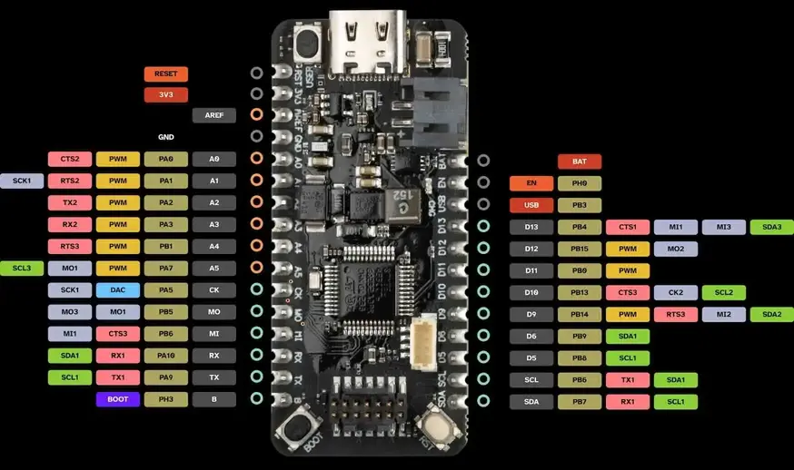

.. zephyr:board:: cygnet

Overview
********

The Blues Cygnet board features an ARM Cortex-M4 based STM32L433CC MCU
with a wide range of connectivity support and configurations. Here are
some highlights of the Cygnet board:

- STM32L4 microcontroller in LQFP48 package
- Adafruit Feather connector
- User LED
- User push-button
- USB Type-C connector

More information about the board can be found at the `Blues Cygnet website`_.

Hardware
********

The STM32L433CC SoC provides the following hardware IPs:

- Ultra-low-power with FlexPowerControl (down to 28 nA Standby mode and 84
  |micro| A/MHz run mode)
- Core: ARM |reg| 32-bit Cortex |reg| -M4 CPU with FPU, frequency up to 80 MHz,
  100DMIPS/1.25DMIPS/MHz (Dhrystone 2.1)
- Clock Sources:

  - 32 kHz crystal oscillator for RTC (LSE)
  - Internal 16 MHz factory-trimmed RC ( |plusminus| 1%)
  - Internal low-power 32 kHz RC ( |plusminus| 5%)
  - Internal multispeed 100 kHz to 48 MHz oscillator, auto-trimmed by
    LSE (better than |plusminus| 0.25 % accuracy)
  - 2 PLLs for system clock, USB, audio, ADC

- RTC with HW calendar, alarms and calibration
- 11x timers:

  - 1x 16-bit advanced motor-control
  - 1x 32-bit and 2x 16-bit general purpose
  - 2x 16-bit basic
  - 2x low-power 16-bit timers (available in Stop mode)
  - 2x watchdogs
  - SysTick timer

- Up to 21 fast I/Os, most 5 V-tolerant
- Memories

  - Up to 256 KB single bank Flash, proprietary code readout protection
  - 64 KB of SRAM including 16 KB with hardware parity check

- Rich analog peripherals (independent supply)

  - 1x 12-bit ADC 5 MSPS, up to 16-bit with hardware oversampling, 200
    |micro| A/MSPS
  - 2x 12-bit DAC output channels, low-power sample and hold
  - 1x operational amplifiers with built-in PGA
  - 2x ultra-low-power comparators

- 17x communication interfaces

  - USB 2.0 full-speed crystal less solution with LPM and BCD
  - 1x SAI (serial audio interface)
  - 3x I2C FM+(1 Mbit/s), SMBus/PMBus
  - 4x USARTs (ISO 7816, LIN, IrDA, modem)
  - 1x LPUART (Stop 2 wake-up)
  - 3x SPIs (and 1x Quad SPI)
  - CAN (2.0B Active)

- 14-channel DMA controller
- True random number generator
- CRC calculation unit, 96-bit unique ID
- Development support: serial wire debug (SWD), JTAG, Embedded Trace Macrocell*

More information about STM32L433CC can be found here:

- `STM32L433CC on www.st.com`_
- `STM32L432 reference manual`_

Supported Features
==================

.. zephyr:board-supported-hw::

.. note:: CAN feature requires a CAN transceiver.

Connections and IOs
===================

The Cygnet board has 6 GPIO controllers. These controllers are responsible for pin muxing,
input/output, pull-up, etc.

Available pins
--------------

For more details please refer to `Blues Cygnet User Manual`_.

Default Zephyr Peripheral Mapping
---------------------------------

- LPUART_1_TX : PB11
- LPUART_1_RX : PB10
- UART_1_TX : PA9
- UART_1_RX : PA10
- I2C_1_SCL : PB6
- I2C_1_SDA : PB7
- PWM_2_CH1 : PA0
- SPI_1: SCK/MISO/MOSI : PA5/PA6/PB5

System Clock
------------

The Cygnet board System Clock could be driven by internal or external oscillator,
as well as main PLL clock. By default System clock is driven by PLL clock at 80MHz,
driven by 16MHz high speed internal oscillator.

Serial Port
-----------

The Cygnet board has 4 U(S)ARTs and 1 LPUART. The Zephyr console output is assigned
to LPUART1. Default settings are 115200 8N1.

Programming and Debugging
*************************

The Cygnet board requires an ST-LINK embedded debug tool in order to be programmed and debugged.

Applications for the ``cygnet`` board configuration can be built and
flashed in the usual way (see :ref:`build_an_application` and
:ref:`application_run` for more details).

Flashing
========

The board is configured to be flashed using west `STM32CubeProgrammer`_ runner,
so its :ref:`installation <stm32cubeprog-flash-host-tools>` is required.

Alternatively, OpenOCD or JLink can also be used to flash the board using
the ``--runner`` (or ``-r``) option:

.. code-block:: console

   $ west flash --runner openocd
   $ west flash --runner jlink

Flashing an application to Cygnet
---------------------------------

Connect the Cygnet to the ST-LINK debugger, then run a serial host program to connect with your Cygnet board.

.. code-block:: console

   $ picocom /dev/ttyACM0 -b 115200

Now build and flash an application. Here is an example for
:zephyr:code-sample:`hello_world`.

.. zephyr-app-commands::
   :zephyr-app: samples/hello_world
   :board: cygnet
   :goals: build flash

You should see the following message on the console:

.. code-block:: console

   $ Hello World! cygnet

Debugging
=========

You can debug an application in the usual way.  Here is an example for the
:zephyr:code-sample:`hello_world` application.

.. zephyr-app-commands::
   :zephyr-app: samples/hello_world
   :board: cygnet
   :maybe-skip-config:
   :goals: debug

References
**********

.. target-notes::

.. _Blues Cygnet website:
   https://www.blues.dev/

.. _Blues Cygnet User Manual:
   https://dev.blues.io/feather-mcus/cygnet/cygnet-introduction/

.. _STM32L433CC on www.st.com:
   https://www.st.com/en/microcontrollers-microprocessors/stm32l433cc.html

.. _STM32L432 reference manual:
   https://www.st.com/resource/en/reference_manual/dm00151940.pdf

.. _STM32CubeProgrammer:
   https://www.st.com/en/development-tools/stm32cubeprog.html
