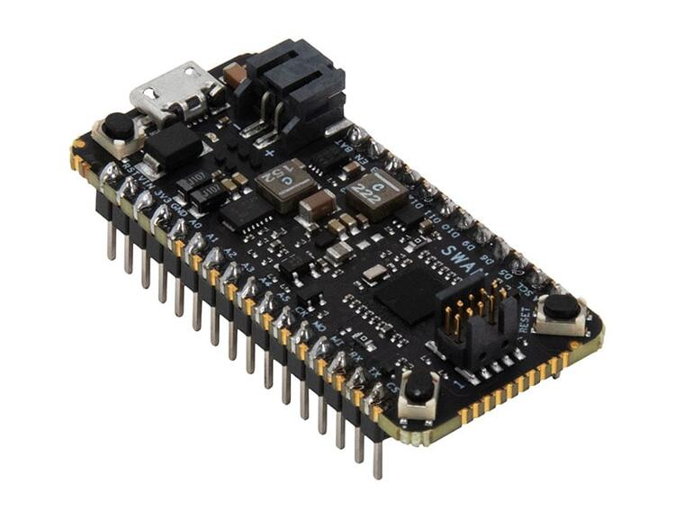

.. _swan_r5_board:

Blues Wireless Swan
###################

Overview
********

Swan is a low-cost embeddable STM32L4-based microcontroller designed to
accelerate the development and deployment of battery-powered solutions.
It is especially useful for applications requiring large memory or a high
degree of I/O expandability at an affordable cost, such as edge inferencing
and remote monitoring.

Uniquely for Feather-compatible boards, Swan is designed to satisfy
developers' needs that span from early prototyping through high-volume
deployment. Developers may begin to use Swan in conjunction with
Adafruit's myriad sensors and FeatherWing-compatible carriers.
Due to its novel design, for high-volume deployment the low-cost Swan
can also be soldered directly to a parent PCB integrating those sensors,
utilizing the full range of Swan's I/O capabilities.

The board has three independent power options---USB, Battery, or Line
power---and provides a software-switchable 2 Amp regulator for powering external
sensors. When operating in its low-power operating mode, the entire Swan
board commonly draws only about 8uA while retaining all of its memory,
making it quite suitable for battery-powered devices.

The Swan board features an ARM Cortex-M4 based STM32L4R5ZI MCU
with a wide range of connectivity support and configurations. Here are
some highlights of the board:

- STM32 microcontroller in WLCSP144 package
- 2MB of flash and 640KB of RAM
- Two types of extension resources:

  - Adafruit Feather-compatible connectivity
  - Access to 36 additional STM32 pins (beyond the Feather pins) via 0.05" castellated edge headers

- On-board ST-LINKV3 debugger/programmer with SWD connector

- One Red User LED (LD1)
- Two push-buttons: USER and RESET

- Castellated-edge access to 55 GPIO ports including:

  - 8 analog
  - 16 digital
  - 4x I2C, 3x SPI
  - USB OTG full speed
  - 1x 14-channel DMA
  - tRNG
  - 12-bit ADC, 2 x 12-bit DAC
  - low-power RTC, and CRC calculation peripherals

More information about the board can be found at the `Swan Product Page`_.

Hardware
********

The STM32L4R5ZI SoC provides the following hardware IPs:

- Ultra-low-power with FlexPowerControl (down to 130 nA Standby mode
  and 100 uA/MHz run mode)
- Core: ARM |reg| 32-bit Cortex |reg|-M4 CPU with FPU, adaptive
  real-time accelerator (ART Accelerator) allowing 0-wait-state
  execution from Flash memory, frequency up to 120 MHz, MPU, 150
  DMIPS/1.25 DMIPS/MHz (Dhrystone 2.1), and DSP instructions

- Memories

  - 2-Mbyte Flash, 2 banks read-while-write, proprietary code readout protection
  - 640 Kbytes of SRAM including 64 Kbytes with hardware parity check
  - External memory interface for static memories supporting SRAM,
    PSRAM, NOR, NAND and FRAM memories
  - 2 x OctoSPI memory interface

- True random number generator
- CRC calculation unit, 96-bit unique ID
- Development support: serial wire debug (SWD), JTAG, Embedded Trace
  Macrocell (ETM)

More information about Swan can be found here:

- `Swan Quickstart Guide`_
- `Swan Datasheet`_

Supported Features
==================

The Zephyr Swan board configuration supports the following
hardware features:

+-----------+------------+-------------------------------------+
| Interface | Controller | Driver/Component                    |
+===========+============+=====================================+
| NVIC      | on-chip    | nested vector interrupt controller  |
+-----------+------------+-------------------------------------+
| UART      | on-chip    | serial port-polling;                |
|           |            | serial port-interrupt               |
+-----------+------------+-------------------------------------+
| PINMUX    | on-chip    | pinmux                              |
+-----------+------------+-------------------------------------+
| GPIO      | on-chip    | gpio                                |
+-----------+------------+-------------------------------------+
| I2C       | on-chip    | i2c                                 |
+-----------+------------+-------------------------------------+
| PWM       | on-chip    | pwm                                 |
+-----------+------------+-------------------------------------+
| SPI       | on-chip    | spi                                 |
+-----------+------------+-------------------------------------+
| USB       | on-chip    | usb                                 |
+-----------+------------+-------------------------------------+
| ADC       | on-chip    | adc                                 |
+-----------+------------+-------------------------------------+

Other hardware features are not yet supported on this Zephyr port.

The default configuration can be found in the defconfig file:
:zephyr_file:`boards/blues/swan_r5/swan_r5_defconfig`

Connections and IOs
===================

Default Zephyr Peripheral Mapping:
----------------------------------

.. rst-class:: rst-columns

- A0 : PA3
- A1 : PA1
- A2 : PC3
- A3 : PC1
- A4 : PC4
- A5 : PC5
- D4 : PE3
- D5 : PE11
- D6 : PE9
- D9 : PD15
- D10 : PA4
- D11 : PA7
- D12 : PA6
- D13 : PA5
- UART_1_TX : PA9
- UART_1_RX : PA10
- UART_2_TX : PA2
- UART_2_RX : PD6
- UART_3_TX : PB10
- UART_3_RX : PB11
- LPUART_TX : PG7
- LPUART_RX : PG8
- I2C_1_SCL : PB6
- I2C_1_SDA : PB7
- I2C_2_SCL : PF1
- I2C_2_SDA : PF0
- I2C_3_SCL : PC0
- I2C_3_SDA : PC9
- SPI_1_NSS : PA4
- SPI_1_SCK : PA5
- SPI_1_MISO : PA6
- SPI_1_MOSI : PA7
- SPI_2_NSS : PD0
- SPI_2_SCK : PD1
- SPI_2_MISO : PB14
- SPI_2_MOSI : PB15
- SPI_3_NSS : PA15
- SPI_3_SCK : PC10
- SPI_3_MISO : PC11
- SPI_3_MOSI : PC12
- PWM_2_CH1 : PA0
- USER_PB : PC13
- LD1 : PE2
- USB DM : PA11
- USB DP : PA12
- ADC1 : PA1

System Clock
------------

Swan System Clock could be driven by internal or external
oscillator, as well as main PLL clock. By default, the System clock is
driven by the PLL clock at 80MHz, driven by a 16MHz high speed
internal oscillator.

Serial Port
-----------

Swan has 4 U(S)ARTs. The Zephyr console output is
assigned to LPUART.  Default settings are 115200 8N1.

Programming and Debugging
*************************

Connect Swan to your host computer using the USB port.
Then build and flash an application. Here is an example for the
:zephyr:code-sample:`hello_world` application.

Run a serial host program to connect with your Swan:

.. code-block:: console

   $ minicom -D /dev/ttyACM0

Then build and flash the application.

.. zephyr-app-commands::
   :zephyr-app: samples/hello_world
   :board: swan_r5
   :goals: build flash

You should see the following message on the console:

.. code-block:: console

   Hello World! arm

References
**********

.. _Swan Product Page:
   https://blues.io/products/swan

.. _Swan Quickstart Guide:
   https://dev.blues.io/start/swan/swan-quickstart

.. _Swan Datasheet:
   https://dev.blues.io/hardware/swan-datasheet/
