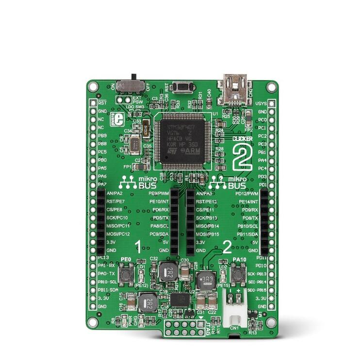

.. _mikroe_clicker_2:

MikroE Clicker 2 for STM32
##########################

Overview
********
MikroE Clicker 2 for STM32 is a development board containing an `STM32F407`_
microcontroller. It is equipped with two mikrobus sockets and furthermore has
two headers for general signal break out.
The board also has battery connection and a battery management unit on board.
It can be powered either from a battery pack, such as a LiPo or from USB.
The board is equipped with a 25MHz crystal as well as a 32.768kHz clock crystal.

   Clicker 2 For STM32 (Credit: MikroElektronika d.o.o.)

Hardware
********
The Clicker 2 board contains the following connections:

  - Two MikroBUS connectors
  - Two headers with general connections

Furthermore the board contains two LEDs and two push buttons that are connected
to the microcontroller.

Supported Features
==================
The Zephyr MikroE Clicker 2 configuration supports the following hardware features:

+-----------+------------+-------------------------------------+
| Interface | Controller | Driver/Component                    |
+===========+============+=====================================+
| NVIC      | on-chip    | nested vector interrupt controller  |
+-----------+------------+-------------------------------------+
| UART      | on-chip    | serial port-polling;                |
|           |            | serial port-interrupt               |
+-----------+------------+-------------------------------------+
| PINMUX    | on-chip    | pinmux                              |
+-----------+------------+-------------------------------------+
| I2C       | on-chip    | i2c                                 |
+-----------+------------+-------------------------------------+
| SPI       | on-chip    | spi                                 |
+-----------+------------+-------------------------------------+
| ADC       | on-chip    | adc                                 |
+-----------+------------+-------------------------------------+
| USB       | on-chip    | usb                                 |
+-----------+------------+-------------------------------------+

Other hardware features have not been enabled yet for this board.

The default configuration can be found in the defconfig file:

	``boards/arm/mikroe_clicker_2/mikroe_clicker_2_defconfig``

Connections and IOs
===================

The two mikroBUS interfaces are aliased in the device tree so that their
peripherals can be accessed using ``mikrobus_N_INTERFACE`` so e.g. the spi on
bus 2 can be found by the alias ``mikrobus_2_spi``. The counting corresponds
with the marking on the board.

For connections on the edge connectors, please refer to `Clicker 2 for STM32 User Manual`_.

Programming and Debugging
*************************
Applications for the ``mikroe_clicker_2`` board configuration can
be built and flashed in the usual way (see :ref:`build_an_application` and
:ref:`application_run` for more details).

Flashing
========
The initial state of the board is set to lock.
When you flash, it will fail with the message:

.. code-block:: console

   Error: stm32x device protected

Unlocking with openocd makes it possible to flash.

.. code-block:: console

   $ openocd -f /usr/share/openocd/scripts/interface/stlink-v2.cfg \
       -f /usr/share/openocd/scripts/target/stm32f4x.cfg -c init\
       -c "reset halt" -c "stm32f4x unlock 0" -c "reset run" -c shutdown

Here is an example for the :ref:`hello_world` application.

.. zephyr-app-commands::
   :zephyr-app: samples/hello_world
   :board: mikroe_clicker_2
   :goals: build flash

You should see the following message on the console:

.. code-block:: console

   Hello World! mikroe_clicker_2

Debugging
=========

You can debug an application in the usual way.  Here is an example for the
:ref:`hello_world` application.

.. zephyr-app-commands::
   :zephyr-app: samples/hello_world
   :board: mikroe_clicker_2
   :maybe-skip-config:
   :goals: debug

References
**********
.. _Clicker 2 website:
    https://www.mikroe.com/clicker-2-stm32f4
.. _Clicker 2 for STM32 User Manual:
    https://download.mikroe.com/documents/starter-boards/clicker-2/stm32f4/clicker2-stm32-manual-v100.pdf
.. _STM32F407VG Website:
    https://www.st.com/content/st_com/en/products/microcontrollers-microprocessors/stm32-32-bit-arm-cortex-mcus/stm32-high-performance-mcus/stm32f4-series/stm32f407-417/stm32f407vg.html
.. _STM32F407:
    https://www.st.com/resource/en/datasheet/stm32f407vg.pdf
