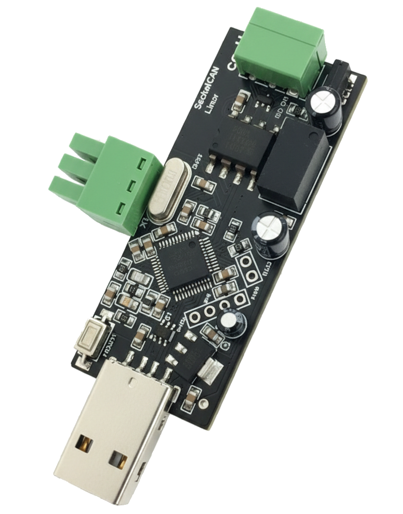

.. zephyr:board:: usbcan

Overview
********

The USBCAN isolated  is an open-source USB to CAN 2.0B adapter board. 
********

       USBCAN 2.0

The USBCAN board is equipped with a STM32F072CB microcontroller 

Supported Features
==================

.. zephyr:board-supported-hw::

System Clock
============

The STM32F072CB PLL is driven by an external crystal oscillator (HSE) running at 8 MHz and
configured to provide a system clock of 48 MHz.

Programming and Debugging
*************************

.. zephyr:board-supported-runners::

Build and flash applications as usual (see :ref:`build_an_application` and
:ref:`application_run` for more details).

If flashing via USB DFU, short pins ``Boot0``  to the USBCAN board in
order to enter the built-in DFU mode.

Here is an example for the :zephyr:code-sample:`blinky` application.

.. zephyr-app-commands::
   :zephyr-app: samples/basic/blinky
   :board: usbcan
   :goals: flash

.. _USBCAN iso website: can-module.com
