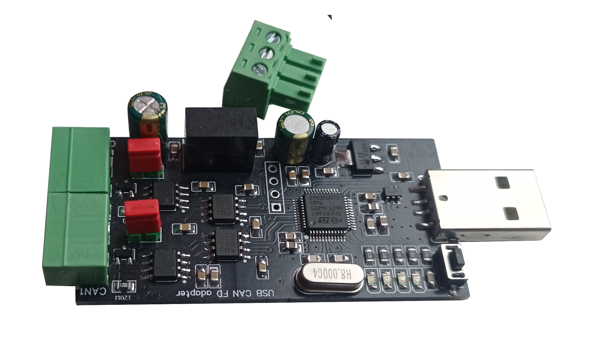

.. zephyr:board:: usbcanfd_Oleksii_g473

USBCANFD DUAl 
######################

Adapter USBCANFD  2ch. up to 8 Mbps 
can-module.com

      USBCANFD DUAl (2ch.canfd)

https://github.com/AlekseyMamontov/CANnectivity-CANFD-adapters

Default Zephyr Peripheral Mapping:
----------------------------------

.. rst-class:: rst-columns

- CAN_RX/BOOT0 : PB8
- CAN_TX : PB9
- CAN_RX2: PB5
- CAN_TX2: PB6

- ledRX : PA6
- LedTX : PA5
- ledRX2 : PA4
- LedTX2 : PA2

- USB_DN : PA11
- USB_DP : PA12

- SWDIO : PA13
- SWCLK : PA14
- NRST : PG10

System Clock
------------
The FDCAN1,FDCAN2  peripheral is driven by PLLQ, which has 80 MHz frequency.

.. _STM32G4 reference manual:
   https://www.st.com/resource/en/reference_manual/rm0440-stm32g4-series-advanced-armbased-32bit-mcus-stmicroelectronics.pdf

.. _STM32CubeProgrammer:
   https://www.st.com/en/development-tools/stm32cubeprog.html
