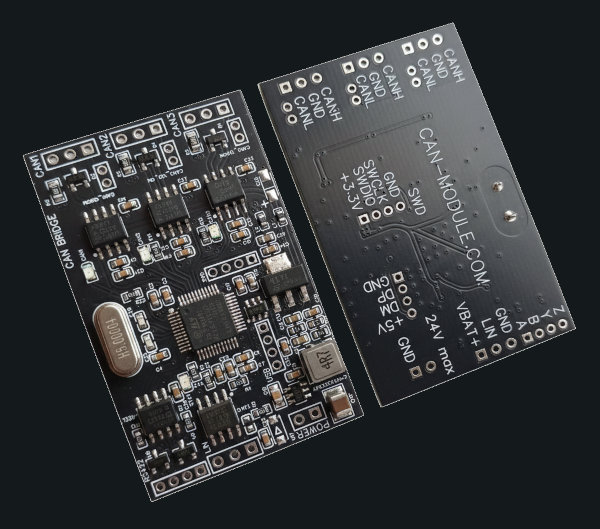

.. zephyr:board:: canBridge_Oleksii_g473

USB CANFD Bridge
################

CAN Bridge & USBCANFD 3ch. up to 5 Mbps + RS422
canmodule.com

   CanBridge 3ch CANFD

https://github.com/AlekseyMamontov/CANnectivity-CANFD-adapters

Overview
--------
The canBridge is a powerful 3-channel CAN FD bridge and USB adapter based on the STM32G473.

Default Zephyr Peripheral Mapping:
----------------------------------

- CAN_RX1 : PB8
- CAN_TX1 : PB9
- CAN_RX2 : PB5
- CAN_TX2 : PB6
- CAN_RX3 : PB4
- CAN_TX3 : PB3
- ledCAN1 : PC13
- ledCAN2 : PB7
- ledCAN3 : PA15
- ledSTAT : PA5
- USB_DN : PA11
- USB_DP : PA12
- RS422_TX : PA2
- RS422_RX : PA3
- SWDIO : PA13
- SWCLK : PA14
- NRST : PG10

System Clock
------------
The FDCAN1, FDCAN2, and FDCAN3 peripherals are driven by PLLQ, which has 80 MHz frequency.

.. _STM32G473 on www.st.com:
   https://www.st.com/en/microcontrollers-microprocessors/stm32g473.html

.. _STM32G4 reference manual:
   https://www.st.com/resource/en/reference_manual/rm0440-stm32g4-series-advanced-armbased-32bit-mcus-stmicroelectronics.pdf

.. _STM32CubeProgrammer:
   https://www.st.com/en/development-tools/stm32cubeprog.html
