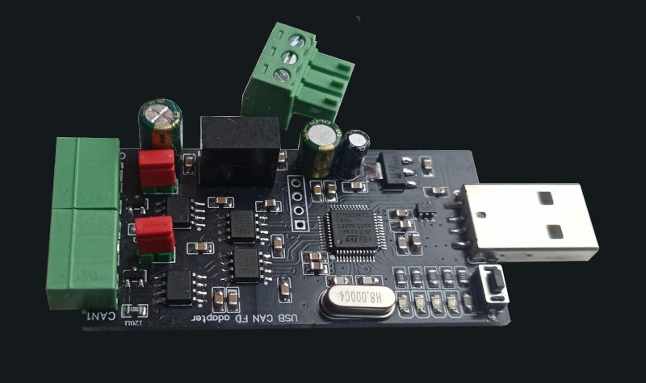

.. zephyr:board:: usbcanfd_oleksii_g473

USBCANFD DUAL
#############

The USBCANFD DUAL is a 2-channel CAN-FD adapter supporting speeds up to 8 Mbps from can-module.com.

   USBCANFD DUAL (2-channel CAN-FD)

Hardware and source code details can be found at the `CANnectivity-CANFD-adapters GitHub <https://github.com/AlekseyMamontov/CANnectivity-CANFD-adapters>`_.

Default Zephyr Peripheral Mapping
---------------------------------

.. rst-class:: rst-columns

- CAN_RX1/BOOT0 : PB8
- CAN_TX1 : PB9
- CAN_RX2 : PB5
- CAN_TX2 : PB6
- ledRX1 : PA6
- ledTX1 : PA5
- ledRX2 : PA4
- ledTX2 : PA2
- USB_DN : PA11
- USB_DP : PA12
- SWDIO : PA13
- SWCLK : PA14
- NRST : PG10

System Clock
------------

The FDCAN1 and FDCAN2 peripherals are driven by PLLQ, which has a frequency of 80 MHz.

References
----------

.. _STM32G4 reference manual:
   https://www.st.com/resource/en/reference_manual/rm0440-stm32g4-series-advanced-armbased-32bit-mcus-stmicroelectronics.pdf

.. _STM32CubeProgrammer:
   https://www.st.com/en/development-tools/stm32cubeprog.html
