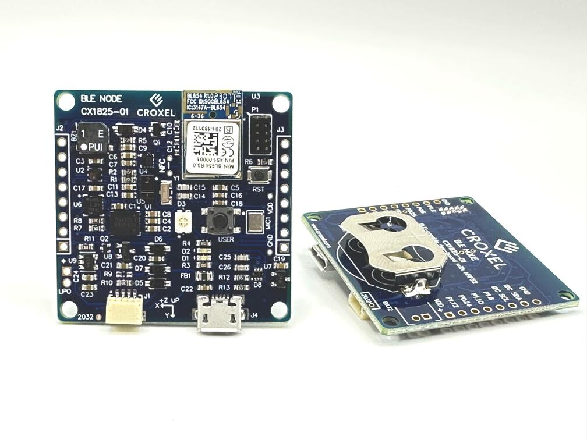

.. _croxel_cx1825_nrf52840:

CX1825 nRF52840
###############

Overview
********

Croxel's `CX1825 Bluetooth Prototyping board`_ provides support for the Nordic
Semiconductor nRF52840 ARM Cortex-M4F CPU and the following devices:

* :abbr:`ADC (Analog to Digital Converter)`
* CLOCK
* FLASH
* :abbr:`GPIO (General Purpose Input Output)`
* :abbr:`I2C (Inter-Integrated Circuit)`
* :abbr:`MPU (Memory Protection Unit)`
* :abbr:`NVIC (Nested Vectored Interrupt Controller)`
* :abbr:`PWM (Pulse Width Modulation)`
* RADIO (Bluetooth Low Energy and 802.15.4)
* :abbr:`RTC (nRF RTC System Clock)`
* Segger RTT (RTT Console)
* :abbr:`SPI (Serial Peripheral Interface)`
* :abbr:`USB (Universal Serial Bus)`
* :abbr:`WDT (Watchdog Timer)`

     Croxel's CX1825 Bluetooth Prototyping board (Credit: Croxel)

Hardware
********

- Ezurio's BL654 (nRF52840 ARM Cortex-M4F processor at 64MHz)
- 1 MB flash memory and 256 KB of SRAM
- Coin-cell retainer for Lithium coincell batteries
- 2 Discrete LEDs (Red and Green)
- User Button
- Reset Button
- Accelerometer (LIS3DH)
- Ambient & RGB Light and Proximity Sensor (APDS9960)
- Temperature and Humidity Sensor (HTS221)
- Barometric Pressure sensor (LPS22H)
- Hall Effect Switch (MLX90248)
- RGB LED with Charge-Pump driver (LP5521)
- Digital Microphone
- Beeper
- QWIIC connector supporting expansion for I2C devices
- USB Connector for data and power
- 16-pin Expansion connector
- SWD Connector

Supported Features
==================

- Discrete LEDs (red and green)
- Buttons (User and Reset)
- Sensors (Accelerometer, Light, Temperature and Humidity, Pressure and Hall-Effect sensors)
- Beeper
- Radio (Bluetooth, IEEE 802.15.4)
- SOC peripherals (ADC, Clock, Flash, GPIO, I2C, MPU, NVIC, PWM, Radio, RTC, SPI, USB, WDT)

Future Feature Support
======================

- RGB LED (Charge-Pump driver not implemented)
- Microphone

Connections and IOs
===================

Croxel's CX1825 Bluetooth Prototyping board has detailed information
about the board (`schematic`_)

LEDs
----

- LED1 (red) = P0.8
- LED2 (green) = P0.12

Digital Inputs
--------------

- User Button = P1.16
- Reset Button = P0.18
- Hall-Effect Switch = P0.15

Programming and Debugging
*************************

Applications for the ``croxel_cx1825/nrf52840`` board configuration
can be built and flashed in the usual way (see :ref:`build_an_application`
and :ref:`application_run` for more details).

Flashing
========

Flashing Zephyr onto the ``croxel_cx1825_nrf52840`` board requires
an external programmer. The programmer is attached to the SWD header.

Build the Zephyr kernel and the :zephyr:code-sample:`blinky` sample application.

   .. zephyr-app-commands::
      :zephyr-app: samples/basic/blinky
      :board: croxel_cx1825/nrf52840
      :goals: build
      :compact:

Flash the image.

   .. zephyr-app-commands::
      :zephyr-app: samples/basic/blinky
      :board: croxel_cx1825/nrf52840
      :goals: flash
      :compact:

You should see the red LED blink.

References
**********

.. target-notes::

.. _CX1825 Bluetooth Prototyping board:
    https://croxel.com/ble

.. _schematic:
    https://croxeldata.s3.amazonaws.com/cx1825/CX1825-01_SCH_200424A.PDF
