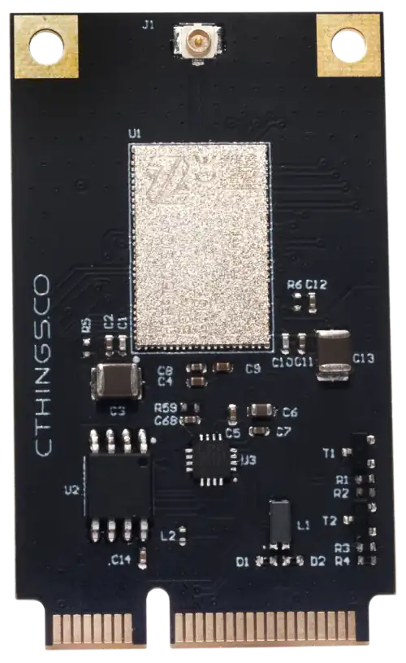

.. zephyr:board:: ctcc

Overview
********

Connectivity Cards come with either M.2 or mPCIe form factor with various SoCs, enabling different
radio interfaces.

* The Connectivity Card nRF52840 enables BLE and IEEE 802.15.4 over mPCIe or M.2
  using USB device with on-board nRF52840 SoC

* The Connectivity Card nRF9161 enables LTE-M/NB-IoT and DECT NR+ over mPCIe or M.2
  using on-board USB-UART converter

Connectivity Card has following features:

* CLOCK
* FLASH
* :abbr:`GPIO (General Purpose Input Output)`
* :abbr:`MPU (Memory Protection Unit)`
* :abbr:`NVIC (Nested Vectored Interrupt Controller)`
* RADIO (Bluetooth Low Energy and 802.15.4) (only nRF52840)
* RADIO (LTE-M/NB-IoT and DECT NR+) (only nRF9161)
* :abbr:`RTC (nRF RTC System Clock)`
* :abbr:`USB (Universal Serial Bus)` (only nRF52840)
* :abbr:`UARTE (Universal asynchronous receiver-transmitter with EasyDMA)` (only nRF9161)
* :abbr:`WDT (Watchdog Timer)`

.. figure:: img/ctcc_nrf52840_mpcie.webp
     :align: center
     :alt: CTCC nRF52840 mPCIe

     ctcc/nrf52840 mPCie board

.. figure:: img/ctcc_nrf52840_m2.webp
     :align: center
     :alt: CTCC nRF52840 M.2

     ctcc/nrf52840 M.2 board

     ctcc/nrf9161 mPCIe board

More information about the board can be found at the
`Connectivity Cards Website`_ and for SoC information: `Nordic Semiconductor Infocenter`_.

Hardware
********

* The ``ctcc/nrf52840`` board target has one external oscillator of the 32.768 kHz.
* The ``ctcc/nrf9161`` board target has one external SPI NOR 64Mbit memory and one on-board USB-UART
  converter (CP210X).

Supported Features
==================

.. zephyr:board-supported-hw::

Connections and IOs
===================

LED
---

Note that boards do not have on-board LEDs, however they expose
LED signals on mPCIe/M.2 pins.

nRF52840:

* LED1 = P0.23
* LED2 = P0.22

nRF9161:

* LED1 = P0.11
* LED2 = P0.12

Programming and Debugging
*************************

Applications for ``ctcc`` boards can be
built in the usual way (see :ref:`build_an_application` for more details).

Flashing
========

The board supports the following programming options:

1. Using an external :ref:`debug probe <debug-probes>`
2. Using `MCUboot`_ with MCUmgr support

Below instructions are provided for ``ctcc/nrf52840``, to use ``nrf9161`` target, the USB device configs have
to be replaced with UART configurations.

Option 1: Using an External Debug Probe
---------------------------------------

Connectivity Card can be programmed using an external debug probe (Segger J-Link) by connecting
to on-board SWD test pads.

For Segger J-Link debug probes, follow the instructions in the
:ref:`nordic_segger` page to install and configure all the necessary
software. Further information can be found in :ref:`nordic_segger_flashing`.

Then build and flash applications as usual (see :ref:`build_an_application` and
:ref:`application_run` for more details).

Here is an example for the :zephyr:code-sample:`usb-cdc-acm-console` application which prints out
logs on emulated USB port.

.. zephyr-app-commands::
   :zephyr-app: samples/subsys/usb/console
   :board: ctcc/nrf52840
   :goals: build flash

Option 2: Using MCUboot with MCUmgr support
-------------------------------------------

It is also possible to use the MCUboot bootloader with :ref:`mcu_mgr` support to flash
Zephyr applications.

Install a MCUmgr-compatible tool from :ref:`supported list <mcumgr_tools_libraries>`
and make sure MCUboot's ``imgtool`` is available for signing your binary
for MCUboot as described on :ref:`west-sign`.

#. Compile MCUboot as a Zephyr application with ``MCUmgr`` support.

   .. tabs::

      .. group-tab:: nRF52840

         To build the MCUboot:

         .. zephyr-app-commands::
            :app: mcuboot/boot/zephyr
            :board: ctcc/nrf52840
            :build-dir: mcuboot
            :goals: build

      .. group-tab:: nRF9161

         To build the MCUboot:

         .. zephyr-app-commands::
            :app: mcuboot/boot/zephyr
            :board: ctcc/nrf9161
            :build-dir: mcuboot
            :goals: build

#. Flash it onto the board as described in Option 1.

#. Flash other Zephyr application over USB using :ref:`MCUmgr-compatible tool <mcumgr_tools_libraries>` and reset target to boot into the image.

   .. tabs::

      .. group-tab:: nRF52840

         Build the blinky example with MCUboot support:

         .. zephyr-app-commands::
            :zephyr-app: samples/basic/blinky
            :board: ctcc/nrf52840
            :goals: build
            :gen-args: -DCONFIG_BOOTLOADER_MCUBOOT=y -DCONFIG_MCUBOOT_SIGNATURE_KEY_FILE=\"path/to/mcuboot/boot/root-rsa-2048.pem\"

      .. group-tab:: nRF9161

         Build the blinky example with MCUboot support:

         .. zephyr-app-commands::
            :zephyr-app: samples/basic/blinky
            :board: ctcc/nrf9161
            :goals: build
            :gen-args: -DCONFIG_BOOTLOADER_MCUBOOT=y -DCONFIG_MCUBOOT_SIGNATURE_KEY_FILE=\"path/to/mcuboot/boot/root-rsa-2048.pem\"

.. note::

   In all examples it is assumed to use default :file:`root-rsa-2048.pem` file from ``mcuboot/boot``
   directory. Providing certificate in build args produces signed binary automatically.
   Do not use this certificate in your production firmware!

Debugging
=========

These boards do not have an on-board J-Link debug IC, however
instructions from the :ref:`nordic_segger` page also apply to them,
with the additional step of connecting an external debugger.

To test flashed software, plug in ``ctcc`` card to mPCIe/M.2 slot or use mPCIe/M.2 adapter to USB and plug such adapter to USB port.

   * For ``ctcc/nrf52840`` check on Linux system by entering ``lsusb`` command if the following device appears: ``NordicSemiconductor MCUBOOT`` or ``NordicSemiconductor USB-DEV`` (when booted into blinky example).
   * For ``ctcc/nrf9161`` it's not possible to see a change in ``lsusb`` due to the on-board USB-UART converter. Intead, connect to the UART console using a terminal emulation program of your choice.

References
**********

.. target-notes::

.. _Connectivity Cards Website:
   https://cthings.co/products/connectivity-cards
.. _Nordic Semiconductor Infocenter:
   https://infocenter.nordicsemi.com
.. _MCUboot:
   https://github.com/zephyrproject-rtos/mcuboot
