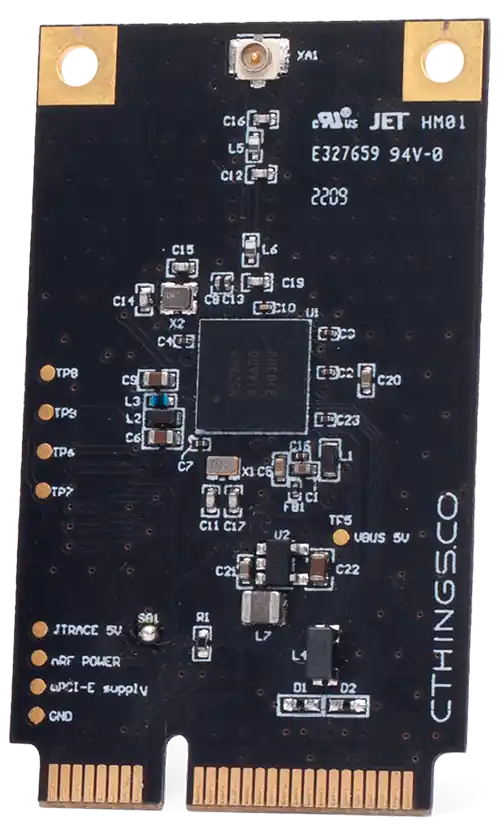

.. _ctcc_nrf52840:

CTHINGS.CO Connectivity Card nRF52840
#####################################

Overview
********

The Connectivity Card nRF52840 enables BLE and IEEE 802.15.4 connectivity
over mPCIe or M.2 using USB port with on-board nRF52840 SoC.

This board has following features:

* CLOCK
* FLASH
* :abbr:`GPIO (General Purpose Input Output)`
* :abbr:`MPU (Memory Protection Unit)`
* :abbr:`NVIC (Nested Vectored Interrupt Controller)`
* RADIO (Bluetooth Low Energy and 802.15.4)
* :abbr:`RTC (nRF RTC System Clock)`
* :abbr:`USB (Universal Serial Bus)`
* :abbr:`WDT (Watchdog Timer)`

     ctcc/nrf52840 mPCie board

.. figure:: img/ctcc_nrf52840_m2.webp
     :align: center
     :alt: CTCC nRF52840 M.2

     ctcc/nrf52840 M.2 board

More information about the board can be found at the
`ctcc_nrf52840 Website`_ and for SoC information: `Nordic Semiconductor Infocenter`_.

Hardware
********

The ``ctcc/nrf52840`` board target has one external oscillator of the 32.768 kHz.

Supported Features
==================

The ``ctcc/nrf52840`` board target supports the following
hardware features:

+-----------+------------+----------------------+
| Interface | Controller | Driver/Component     |
+===========+============+======================+
| CLOCK     | on-chip    | clock_control        |
+-----------+------------+----------------------+
| FLASH     | on-chip    | flash                |
+-----------+------------+----------------------+
| GPIO      | on-chip    | gpio                 |
+-----------+------------+----------------------+
| MPU       | on-chip    | arch/arm             |
+-----------+------------+----------------------+
| NVIC      | on-chip    | arch/arm             |
+-----------+------------+----------------------+
| RADIO     | on-chip    | Bluetooth,           |
|           |            | ieee802154           |
+-----------+------------+----------------------+
| RTC       | on-chip    | system clock         |
+-----------+------------+----------------------+
| USB       | on-chip    | usb                  |
+-----------+------------+----------------------+
| WDT       | on-chip    | watchdog             |
+-----------+------------+----------------------+

Connections and IOs
===================

LED
---

Note that board does not have on-board LEDs, however it exposes
LED signals on mPCIe/M.2 pins.

* LED1 = P0.23
* LED2 = P0.22

Programming and Debugging
*************************

Applications for the ``ctcc/nrf52840`` board target can be
built in the usual way (see :ref:`build_an_application` for more details).

Flashing
========

The board supports the following programming options:

1. Using an external :ref:`debug probe <debug-probes>`
2. Using MCUboot with DFU support

Option 1: Using an External Debug Probe
---------------------------------------

Connectivity Card can be programmed using an external debug probe (Segger J-Link) by connecting
to on-board SWD test pads.

For Segger J-Link debug probes, follow the instructions in the
:ref:`nordic_segger` page to install and configure all the necessary
software. Further information can be found in :ref:`nordic_segger_flashing`.

Then build and flash applications as usual (see :ref:`build_an_application` and
:ref:`application_run` for more details).

Here is an example for the :zephyr:code-sample:`usb-cdc-acm-console` application which prints out
logs on emulated USB port.

.. zephyr-app-commands::
   :zephyr-app: samples/subsys/usb/console
   :board: ctcc/nrf52840
   :goals: build flash

Debugging
=========

The ``ctcc/nrf52840`` board target does not have an on-board J-Link debug IC, however
instructions from the :ref:`nordic_segger` page also apply to this board,
with the additional step of connecting an external debugger.

Option 2: Using MCUboot with DFU support
----------------------------------------

It is also possible to use the MCUboot bootloader with DFU support to flash
Zephyr applications. You need to flash MCUboot with DFU support and fill in slot0 with
some application one-time using Option 1. Then you can re-flash an application using DFU utility
by loading images to slot1. Note, it's not possible to have only MCUboot and load directly
software to slot0 due to DFU implementation in Zephyr, which for present slot0 and slot1 in flash
map, it assumes only slot1 partition as writeable.

Install ``dfu-util`` first and make sure MCUboot's ``imgtool`` is
available for signing your binary for MCUboot as described on :ref:`west-sign`.

Next, do the **one-time setup** to flash MCUboot with DFU support.
We'll assume you've cloned the `MCUboot`_ as a submodule when initializing
Zephyr repositories using :ref:`west` tool.

#. Compile MCUboot as a Zephyr application with DFU support.

   .. zephyr-app-commands::
      :app: mcuboot/boot/zephyr
      :board: ctcc/nrf52840
      :build-dir: mcuboot
      :goals: build
      :gen-args: -DCONFIG_BOOT_USB_DFU_WAIT=y

#. Flash it onto the board as described in Option 1.

#. Flash other Zephyr application to fill in slot0 e.g:

   .. zephyr-app-commands::
      :zephyr-app: samples/subsys/usb/dfu
      :board: ctcc/nrf52840
      :build-dir: dfu
      :goals: build
      :gen-args: -DCONFIG_BOOTLOADER_MCUBOOT=y -DCONFIG_MCUBOOT_SIGNATURE_KEY_FILE=\"path/to/mcuboot/boot/root-rsa-2048.pem\"

You can now flash a Zephyr application to the board using DFU util.
As an example we'll use the :zephyr:code-sample:`usb-cdc-acm-console` sample.

   .. zephyr-app-commands::
      :zephyr-app: samples/subsys/usb/console
      :board: ctcc/nrf52840
      :goals: build flash
      :gen-args: -DCONFIG_BOOTLOADER_MCUBOOT=y -DCONFIG_MCUBOOT_SIGNATURE_KEY_FILE=\"path/to/mcuboot/boot/root-rsa-2048.pem\"

.. note::

   In all examples it is assumed to use default :file:`root-rsa-2048.pem` file from ``mcuboot/boot``
   directory. Providing certificate in build args produces signed binary automatically.
   Do not use this certificate in your production firmware!

#. Plug in ``ctcc/nrf52840`` card to mPCIe/M.2 slot or use mPCIe/M.2 adapter to USB
   and plug such adapter to USB port.

   You should see ``NordicSemiconductor MCUBOOT`` or ``NordicSemiconductor Zephyr DFU sample``
   (if you flashed ``dfu`` sample to slot0) device once plugging it into host
   USB port. You can check that on Linux system by entering ``lsusb`` command.

   To check if DFU device is visible you can enter ``sudo dfu-util -l`` command. Once the
   device is visible you can flash Zephyr image using DFU util: ``sudo dfu-util --alt 1 --download build/zephyr/zephyr.signed.bin``

References
**********

.. target-notes::

.. _ctcc_nrf52840 Website:
   https://cthings.co/products/connectivity-cards
.. _Nordic Semiconductor Infocenter:
   https://infocenter.nordicsemi.com
.. _MCUboot:
   https://github.com/JuulLabs-OSS/mcuboot
