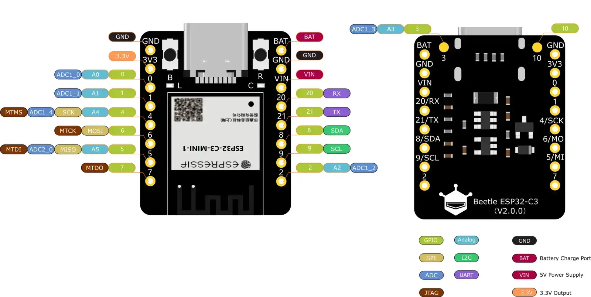

.. zephyr:board:: beetle_esp32c3

Overview
********

The `DFRobot Beetle ESP32-C3`_ board, mainly intended for IoT
applications, is based on the ESP32-C3 WiFi/Bluetooth
dual-mode chip from Espressif.

Hardware
********

This board is based on the ESP32-C3 with 4MB of flash, WiFi and BLE support.
It has an USB-C port for programming and debugging, built-in battery
charging management function via TP4057 chip and 13 IO ports.

.. include:: ../../../espressif/common/soc-esp32c3-features.rst
   :start-after: espressif-soc-esp32c3-features

Supported Features
==================

.. zephyr:board-supported-hw::

Connections and IOs
===================

   Beetle ESP32-C3 Pinout

For more details please refer to `DFRobot Beetle ESP32-C3 Wiki`_

System Requirements
*******************

.. include:: ../../../espressif/common/system-requirements.rst
   :start-after: espressif-system-requirements

Programming and debugging
*************************

.. zephyr:board-supported-runners::

.. include:: ../../../espressif/common/building-flashing.rst
   :start-after: espressif-building-flashing

Debugging
=========

.. include:: ../../../espressif/common/openocd-debugging.rst
   :start-after: espressif-openocd-debugging

References
**********

.. target-notes::

.. _`DFRobot Beetle ESP32-C3`: https://www.dfrobot.com/product-2566.html

.. _`DFRobot Beetle ESP32-C3 Wiki`: https://wiki.dfrobot.com/SKU_DFR0868_Beetle_ESP32_C3
