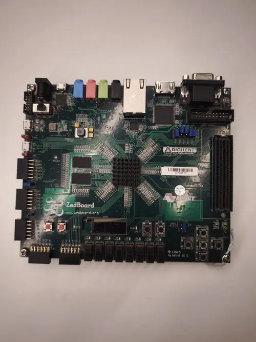

.. zephyr:board:: zedboard

Avnet ZedBoard
##############

Overview
********

The `Avnet ZedBoard`_ (Zynq Evaluation and Development board) is a low-cost development board for
the Xilinx Zynq-7000 All Programmable SoC. It is built around the XC7Z020 device, which combines a
dual-core ARM Cortex-A9 processor with Xilinx 7-series Field Programmable Gate Array (FPGA) logic
on a single die. The board is co-developed by Avnet, Digilent, Xilinx, and ARM.

   Avnet ZedBoard (Credit: Avnet)

Hardware
********

Supported Features
==================

.. zephyr:board-supported-hw::

Programming and Debugging
*************************

The Zynq-7000 series SoC needs to be initialized prior to running a Zephyr application. This can be
achieved in a number of ways (e.g. using the Xilinx First Stage Boot Loader (FSBL), the Xilinx
Vivado generated ``ps_init.tcl`` JTAG script, Das U-Boot Secondary Program Loader (SPL), ...).

The instructions here use the U-Boot SPL. For further details and instructions for using Das U-Boot
with Xilinx Zynq-7000 series SoCs, see the following documentation:

- `Das U-Boot Website`_
- `Using Distro Boot With Xilinx U-Boot`_

Building Das U-Boot
===================

Clone and build Das U-Boot for the Avnet ZedBoard:

.. code-block:: console

   git clone -b v2026.04 https://source.denx.de/u-boot/u-boot.git
   cd u-boot
   make distclean
   make xilinx_zynq_virt_defconfig
   export PATH=/path/to/zephyr-sdk/arm-zephyr-eabi/bin/:$PATH
   export CROSS_COMPILE=arm-zephyr-eabi-
   export DEVICE_TREE="zynq-zed"
   make

Running an Application
======================

Load and run a Zephyr application via U-Boot from an SD card. Build the
:zephyr:code-sample:`hello_world` application:

.. zephyr-app-commands::
   :zephyr-app: samples/hello_world
   :board: zedboard
   :goals: build

Copy ``u-boot/spl/boot.bin``, ``u-boot/u-boot.img``, and ``build/zephyr/zephyr.bin`` to a FAT32
formatted microSD card, insert the card in the SD slot on the ZedBoard, ensure the board is
configured for ``SD`` boot (set the JP7-JP11 jumpers accordingly), and turn on the board.

Once U-Boot is done initializing, load and run the Zephyr application. The caches are turned off
because Zephyr expects to bring up the MMU and caches itself:

.. code-block:: console

   Zynq> fatload mmc 0 0x100000 zephyr.bin
   Zynq> dcache off
   Zynq> icache off
   Zynq> go 0x100000
   ## Starting application at 0x00100000 ...
   *** Booting Zephyr OS vx.xx.x-xxx-gxxxxxxxxxxxx ***
   Hello World! zedboard

.. note::

   Only SD-card boot via U-Boot has been verified on this board. JTAG-based
   ``west flash`` / ``west debug`` are not yet supported.

.. _Avnet ZedBoard:
   https://www.avnet.com/wps/portal/us/products/avnet-boards/avnet-board-families/zedboard/

.. _Das U-Boot Website:
   https://www.denx.de/wiki/U-Boot

.. _Using Distro Boot With Xilinx U-Boot:
   https://xilinx-wiki.atlassian.net/wiki/spaces/A/pages/749142017/Using+Distro+Boot+With+Xilinx+U-Boot
