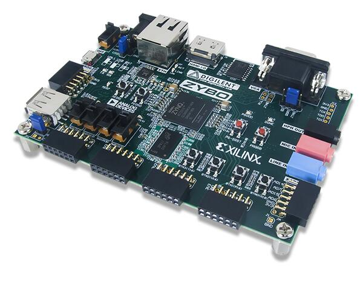

.. _zybo:

Digilent Zybo
#############

Overview
********

The `Digilent Zybo`_ (ZYnq BOard) is a feature-rich, ready-to-use embedded software and digital
circuit development board. It is built around the Xilinx Zynq-7000 family, which is based on the
Xilinx All Programmable System-on-Chip (AP SoC) architecture. This architecture tightly integrates a
dual-core ARM Cortex-A9 processor with Xilinx 7-series Field Programmable Gate Array (FPGA) logic.

   Digilent (Credit: Digilent)

Hardware
********

Supported Features
==================

The zybo board configuration supports the following hardware features:

+------------+------------+-------------------------------------+
| Interface  | Controller | Driver/Component                    |
+============+============+=====================================+
| GICv1      | on-chip    | ARM generic interrupt controller v1 |
+------------+------------+-------------------------------------+
| ARCH TIMER | on-chip    | ARM architected timer               |
+------------+------------+-------------------------------------+
| PINCTRL    | on-chip    | pinctrl                             |
+------------+------------+-------------------------------------+
| GPIO       | on-chip    | gpio                                |
+------------+------------+-------------------------------------+
| UART       | on-chip    | serial port-polling;                |
|            |            | serial port-interrupt               |
+------------+------------+-------------------------------------+

The default configuration can be found in
:zephyr_file:`boards/digilent/zybo/zybo_defconfig`

Other hardware features are not currently supported by the port.

Programming and Debugging
*************************

The Zynq-7000 series SoC needs to be initialized prior to running a Zephyr application. This can be
achieved in a number of ways (e.g. using the Xilinx First Stage Boot Loader (FSBL), the Xilinx
Vivado generated ``ps_init.tcl`` JTAG script, Das U-Boot Secondary Program Loader (SPL), ...).

The instructions here use the U-Boot SPL. For further details and instructions for using Das U-Boot
with Xilinx Zynq-7000 series SoCs, see the following documentation:

- `Das U-Boot Website`_
- `Using Distro Boot With Xilinx U-Boot`_

Building Das U-Boot
===================

Clone and build Das U-Boot for the Digilent Zybo:

.. code-block:: console

   git clone -b v2022.04 https://source.denx.de/u-boot/u-boot.git
   cd u-boot
   make distclean
   make xilinx_zynq_virt_defconfig
   export PATH=/path/to/zephyr-sdk/arm-zephyr-eabi/bin/:$PATH
   export CROSS_COMPILE=arm-zephyr-eabi-
   export DEVICE_TREE="zynq-zybo"
   make

Flashing
========

Here is an example for running the :ref:`hello_world` application via JTAG.

Ensure the board is configured for JTAG boot, open a serial terminal, turn on/reset the board (press
the ``PS-SRST`` button), and initialize the Zynq-7000 series SoC by uploading and running the U-Boot
SPL via JTAG.

Next, upload and run the Zephyr application:

.. zephyr-app-commands::
   :zephyr-app: samples/hello_world
   :board: zybo
   :goals: flash

You should see the following message in the terminal:

.. code-block:: console

   *** Booting Zephyr OS vx.xx.x-xxx-gxxxxxxxxxxxx ***
   Hello World! zybo

Another option is to load and run the :ref:`hello_world` application via U-Boot. Copy
``u-boot/spl/boot.bin``, ``u-boot/u-boot.img``, and ``zephyr/zephyr.bin`` to a FAT32 formatted
microSD card, insert the card in the ``SD MICRO`` slot on the Zybo board, ensure the board is
configured for ``SD`` boot, and turn on the board.

Once U-boot is done initializing, load an run the Zephyr application:

.. code-block:: console

   Zynq> fatload mmc 0 0x0 zephyr.bin
   817120 bytes read in 56 ms (13.9 MiB/s)
   Zynq> go 0x0
   ## Starting application at 0x00000000 ...
   *** Booting Zephyr OS vx.xx.x-xxx-gxxxxxxxxxxxx ***
   Hello World! zybo

Debugging
=========

Here is an example for the :ref:`hello_world` application.

Ensure the board is configured for JTAG boot, open a serial terminal, turn on/reset the board (press
the ``PS-SRST`` button), and initialize the Zynq-7000 series SoC by uploading and running the U-Boot
SPL via JTAG.

Next, upload and debug the Zephyr application:

.. zephyr-app-commands::
   :zephyr-app: samples/hello_world
   :board: zybo
   :goals: debug

Step through the application in your debugger, and you should see the following message in the
terminal:

.. code-block:: console

   *** Booting Zephyr OS vx.x.x-xxx-gxxxxxxxxxxxx ***
   Hello World! zybo

.. _Digilent Zybo:
   https://digilent.com/reference/programmable-logic/zybo/start

.. _Das U-Boot Website:
   https://www.denx.de/wiki/U-Boot

.. _Using Distro Boot With Xilinx U-Boot:
   https://xilinx-wiki.atlassian.net/wiki/spaces/A/pages/749142017/Using+Distro+Boot+With+Xilinx+U-Boot
